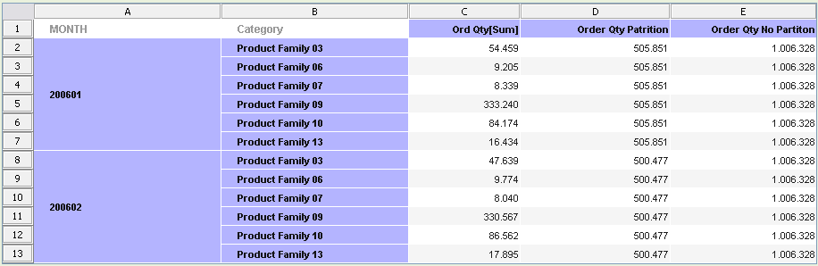
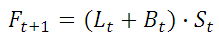
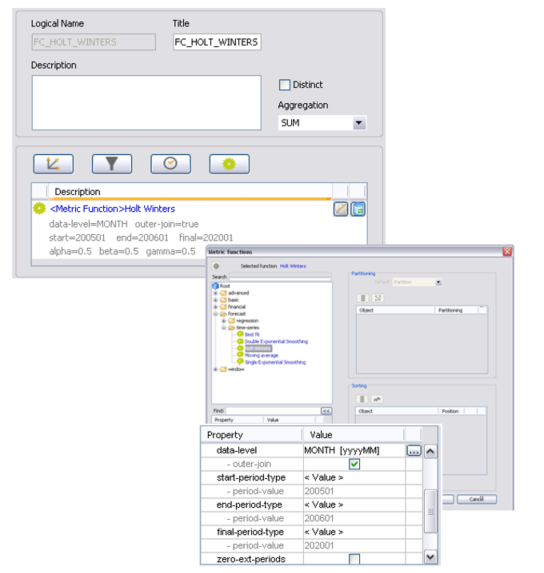
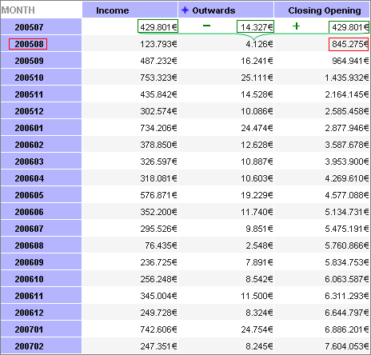

# Metrics

Metrics are those objects which perform quantitative analyses:

* For example, for a turnover analysis, you must use a Metric that provides the sum aggregation of the individual invoices.
* A turnover analysis relative to the previous year is only possible if you use a Metric that can _sample_ (e.g. for each month, the sale of the month itself but from the previous year).

Therefore the metrics process, in a more or less complex manner, the _quantitative_ values in the data warehouse, to present them in the report.

DAC provides numerous ways to manipulate these _quantitative_ values, such as:

* set various types of [primary aggregate](metrics.md#primary-aggregation) such as sum, average, maximum, count, etc. In addition in DAC it is also possible to define different operations for the [secondary aggregates](metrics.md#secondary-aggregation);
* applying a filter (like the last quarter or a particular region);
* select a time rule, among those available on the system, as a way to obtain, for example, the data of the previous year or month, or from the beginning of the year to today's date, and so on;
* choose among the functions supported by DAC to obtain:
  * the best/worst values or the classification with the methods such as the rank, the tile, etc. (advanced functions)
  * incremental sums, previous or subsequent values, etc. (functions on data windows)
  * forecasting assessments, by applying regression rules or time series;
* exploit the ROLAP approach to find the data efficiently, with the dimensioning.

The quantitative dimensions on which to perform analyses, such as turnover, is information in the fact table.

Let us remember that these are the tables used in the mapping of the **cubes**. The **measures** necessary for the analysis are defined in the cubes (_see_ _Cubes and measures_ chap.)..png>)

When a Cube is created, the Metrics are also created. They aggregate the sum of the measures selected in the Cube itself, and take the name of First Level Metrics.

All the other processing types, applied to each measure, are instead called advanced metrics.

Finally the metric combinations, through mathematical operations or SQL instructions, are called composite metrics.

Metrics can also be formatted with different colors depending on the pertinent interval of the Metric values.

A graph format can also be chosen for the Metric, such as an indicator, bar or graph.

Other customizations of the metrics concern:

* managing the null values of the Metrics (at both database and datamart level)
* managing the visibility of the Metric for the end users if you want to prevent its use when reports are created or modified, and at the same time make it visible in the reports published on DAC
* disabling Security Filters on particular dimensional levels (particularly useful for showing users the incidence on the total of data pertinent to them, for which they do not have read permission)

The metric management takes place in a window (Metrics Wizard) accessed from the menu item:

**Data Model >> Metrics Management** or from the.png>) button on the main bar.

.png>)

The Metrics created in the system are to the left (**Metrics** panel). The details of each Metric are shown on the right when it is selected.

There are three types of Metrics:

* First Level
* Advanced
* Composite

_**First Level**_ and _**Advanced**_ Metrics are hierarchically divided according to the layout indicated in the figure.

Both the folders consist of **CUBE** and **MEASURE** elements. Therefore, for each measure, the related **METRICS** are listed.

As you can see, each element (CUBES, MEASURES and METRICS) is depicted with a specific icon.

CREATING A METRIC involves valuing the following fields:

* **Logical name:** only used by the system
* **Display name:** to define the name to be shown in the report
* **Description**: for the developer's notes
* **Aggregation:** to select the type of primary aggregation you want to set

**Note:**

_We strongly advise against using the same title, even if the system allows it._

_The system warns you when you assign a name that was already used for another Metric by highlighting it in yellow. A tooltip also informs you that the name entered is a duplicate._

_If a Metric with a duplicated name is used in a formula (in Composite Metrics), it will be displayed as the logical name and not the title._

.png>)

The metrics may be cataloged in folders and subfolders: for the First Level, Advanced and Composite metrics, the folder is created by clicking on the measure with the right button of the mouse. The system activates the pop-up menu containing the create new folder item.

By dragging the metrics it is possible to move them into the subfolders you created.

.png>)

A pop-up menu can be activated (right-click) on Metrics, for the functions of:

* edit as copy (not available for the first level metrics)
* exchange of the logical name
* object information

The _**Edit as copy**_ function creates a new metric of the same type. However, the logical name and title must be changed since the system requests that the metrics be univocal.

The _**Logical name exchange**_ function exchanges the logical name between two Metrics.

The first Metric is the one used to recall the function. A warning message opens and after you close it, you can select the second Metric.

At the end of this operation, you will find the metrics with the logical names exchanged and all the references to them present in the system (e.g. reports, filters, indicators) will be automatically updated.

When _**object information**_ is requested, a window opens listing the objects used by the Metric. It indicates the type, name and ID.

## First Level Metrics

The **First Level** metrics are associated with the measures chosen in the cube. These are created by the system, at the same time of creating the cube, which generates the sum aggregation metrics of the measures of the cube.

It is not possible to delete a first level metric: to delete one it is necessary to edit the affected cube, access the step of the measure selection (see _Cubes and measures_ chap._)_ and deselect those that you do not want to use anymore.

For example, in the Orders cube, the SALES QTY and SALES VAL measures were chosen.

.png>)

DAC automatically generates First Level Metrics, that is the sum aggregation (SUM) of the respective column of the Fact Table.

You can make the following modifications on First Level Metrics:

* to the **Display name**
* to the [For](/broken/pages/-MfHs_PiXlCm3eSy1MKC#_Formattazione_delle_metriche)mat
* to the Secondary aggregation

However, we do not advise editing this type of metric, apart from the title. If necessary, you can always recreate a first level metric through the advanced metrics: just select the SUM values (sum) in the primary aggregation field, then make any modifications.

## Advanced Metrics

Advanced Metrics set the functions available on DAC for the measures defined on Cubes. The functions are divided into:

the figure.0‑1

* First Level Aggregation (different from the sum and average of the first level metrics);
* Secondary Aggregation different from the default one;
* Dimensioning;
* Direct filter;
* Time functions;
* Other Functions available on DAC.

Advanced Metric functions are applied to the field associated with the measure selected.

.png>)

You can create an **Advanced** Metric by right-clicking on the measure, and selecting “Create Advanced Metric” (see the next example).

Step 1: **Start Creating an Advanced Metric**

.png>)

_Below is an example of the initial steps required to create an Advanced Metric on the sold quantity measure._

* _Select the measure to apply the processing functions to (Sales Qty)._
* _click with the right button of the mouse_
* _select the Create advanced metric item_

Step 2: **Functions Applied to Advanced Metrics**

.png>)

_When you create an Advanced Metric on the quantity sold, it means that a function will be defined to be applied to the field associated with this measure._

_In this example, the quantity sold is associated with the QTY\_SOLD field in the SM\_FACT\_SALES Fact Table._

_Any function chosen will be applied to the values of this field._

_So the primary SUM aggregation (default) will result in the sum of the SM\_FACT\_SALES and SALES\_QTY, aggregated for the dimensions chosen in the report._

## Composite Metrics

The **Composite** metrics are created starting from simple (first level) or advanced metrics in the application and may combine numeric values, constants, mathematical operators and logics, relating to SQL syntax or to SQL extended to the property language of the database.

The functions supported by DAC may also be applied to the composite metrics.

The creation of a **Composite** metric takes place by clicking with the right button on the _Composite_ folder and selecting the “Create composite metric” item.

When you make the request to create the Composite Metric, fields are enabled for defining the Metric. This is where you also enter the **Formula** used to calculate the Metric values, in addition to the logical name and title.

.png>)

All Metrics defined (First Level, Advanced or Composite) can be used in the formula. Simply double-click on the one you want to use to move it to the formula area. The Metrics entered are called Component Metrics.

The operators and the brackets will help the user correctly write a formula allowing him to enter the correct spacing. For this reason, we recommend using this method as much as possible when writing a formula.

Whether or not this method is used, the green check button will let the user control the syntactic correctness.

In a formula of a composite metric it is also possible to use some parameters which show the dimensional levels in a report:

* **%REPORT\_LEVELS%**: shows the names of all levels in the report containing the Metric (see the example below)
* **%SELECT\_LEVELS%**: shows the names of the levels on the rows of the report
* **%PAGE\_BY\_LEVELS%** shows the names of the levels in page-by in the report
* **%PAGE\_BY\_FILTER\_LEVELS%**: shows all the levels in page-by in the report for which a value different from ‘\[Total]’ was selected

Step 1: **Creating a Composite Metric**

.png>).png>)

_The following example defines a standard Metric which shows the weight of the actual sales relative to the budget (Actual versus Budget) and which consists in turn of two Metrics._

_These two Metrics are those of the first level (Qty sold and Budget qty), both with sum aggregation._

_By selecting the 2 abovementioned metrics (Qty sold and budget qty) in the tree of the metrics and clicking twice on each of them, these are reported in the formula area._

Step 2: **Composite Metric with SQL FORMULATION**

.png>)

_In the following example a composite metric is defined, created with the SQL language._

_The composite metric QTA\_Sales\_case\_when is defined, as shown in the figure, which will put._

_all sales below 500, to 0_

_those between 500 and 600, to 1_

_leave the others unaltered_

_To see the behavior of the Composite Metric, a report is built with the Metric just defined and the First Level Metric it contains._

Step 3: **Example of a Report with a Composite Metric**

.png>)

_In the figure you can see how the values Sales Qty – case when respect the formulation of the composite metric._

Step 1: **Using LEVELS parameters in Composite Metrics**

.png>)

_Let us define a composite metric simply containing the %REPORT\_LEVELS% parameter. The parameter is entered manually in the bottom white area reserved for creating the formula. Another three metrics with the parameters will be defined in the same way: %SELECT\_LEVELS%, %PAGE\_BY\_LEVELS%, %PAGE\_BY\_FILTER\_LEVELS%._

_Then the four Metrics are indicated in a report (figure below)._

Step 2: **Using LEVELS Parameters in Composite Metrics**

.png>)

_In the report the following levels have been entered:_

_Product on rows, Business Unit and Month for the page-bys._

_The composite metrics created previously will show the following information:_

_Select Level: \[Product] information relating to the Dimension entered on the rows_

_Page by Filter Levels: \[Business\_Unit]\[Month] The report was filtered in the page by for the business levels_

_Page-by Level: \[Business\_Unit]\[Month] levels in the page-by_

_Report Levels: \[Product] \[Business\_Unit]\[Month] total levels in the report._

## Formatting Metrics

Customization of the metrics format establishes:

* a style for the values
* a formatting depending on a threshold value
* a decoration through indicators, bars and reports

When you enter modify Metric in the **Metric management** window, the _**Metric Format**_ button accesses the Metric format setting window.

.png>)

Metric formatting can also be defined at **application level.** DAC sets the formatting of the decimal and thousand separator _depending_ on the _language_ selected by the user on DAC.

### Style for the Values

The global formatting parameters are established in the right section of the Metric folder:

* _**size**_ of the character)
* number of decimal places (_**Decimal Digits**_)
* thousand separator (_**Grouping char**_) and the decimal places (_**Decimal Separator**_)
* character to be entered after the value, for example for the currency or percentage (_**Additional char**_)

You can display Component Metrics from Composite Metrics. This function may be disabled through the _**drillable**_ property (_Format_ group).

Example:Drillable Property

.png>)

_This example shows a Composite Metric (Act Vs. LY) with the drillable property enabled (default behavior). Note that by selecting +, the report also indicates the Component Metrics used to calculate the Composite Metric._

**Property on the thousand decimal separators (compared to the user language)**

### Separator Characters Depending on the Language of the Web User

From the **Application>>Application Properties** menu item access the properties window at application level. the _**Format-as-local**_ property is in the _Metric_ section.

When exporting a report in CSV or EXCEL, on which this property has been enabled or the local format applied, the formatting might not be maintained when:

• for EXCEL, the cells of the spreadsheet are set as numerals;

• for CSV, the data setting in the "_Csv export settings_" is different, since the latter always has a higher priority compared to the metrics formatting.

We recommend formatting and setting the files with the proper format.

Property on the Thousand Decimal Separators (compared to the user language)

.png>)

_The example shows the application of the Format-as-local property._

_This property is enabled in the Metric of the report in the figure (if the language is set to Italian, the Metric appears with the period as thousand separator. If it is changed to English, the thousand separator is automatically replaced with a comma)._

### Formatting Compared to the Threshold Values

Different colors can be defined based on the value assumed by the Metric:

* **Positive values** if they exceed a positive threshold, defined in the _Metric Positive_ _folder_ _(**Threshold**_)
* **Negative values** if lower than a negative threshold, defined in the _Metric Negative folder_ _(**Threshold**_)
* **Central values** those ranging between the positive and negative threshold

Each of the three types of values assumes the color (_**Background, Foreground**_) and style (_**Bold, Italic, Underlined**_) set in the respective folder. Central values inherit the style and colors set in the _Metric folder._

**Note:** _The underlined style is not visible on DAC, but only on DAC._

.png>)

The color of the metric may be extended to the entire row of the report, by selecting the _**expand-row**_ property of the _Format_ group. This property is only applied when the Metrics of the report are on columns.

.png>)

The _**Active Formatting**_ check conditions the coloring of the style by priority threshold values relative to report level formatting (see _Report Administrator,_ _Table layout section_, _Formatting example \<Body Metrics> section_). By default, the check is deselected.

An additional _**three intervals**_ [_with higher priority are also available_](/broken/pages/-MfHs_PiXlCm3eSy1MKC#metric_format3). These are characterized by:

.png>)

* the high and low thresholds, set in _**from-value**_ and _**to-value**_ respectively
* the color of the background and the character (_**background**_ and _**foreground**_)

Each of these intervals is enabled on the respective conditio&#x6E;_-\[i] items_ which appear in the _Property_ pane (_Conditions_ group).

These intervals prevail over those set by the positive, negative and central thresholds.

**Note:** _For empty cells, you can set the_ _**from-value**_ _property to “null”. This setting allows you to format all cells without a value._

Color and style settings for the three types of Metrics (positive, negative and central) are also provided at application level. Simply access the property window using the **Application>> Properties** menu item. In the _Metric>>Positive_ and _Metric>>Negative_ section, set:

* background color (_**backGroundColor**_)
* color of the character (_**foreGroundColor**_)
* style of the character:
  * italics (_**fontStyle**_) enabled (<_italic>)_ or disabled (_\<normal>_)
  * bold (_**fontWeight**_) enabled (<_bold>)_ or disabled (_\<normal>_)
  * underlined (_**textDecoration**_) enabled (<_Underline>)_ or disabled (_\<None>_)

### Format with Decoration

You _**define the decoration of Metrics**_ (only visible from DAC) in the _**decoration**_ property of the _Format_ group. This is to depict the Metric using:**:**

* bars (_\<Bar>_)
* indicators (_\<Indicator>_)
* reports (_\<Report>_)
* the value _\<None>_

### Decorate Using Bars

You can personalize the property of bars on the maximum value (**target**).

The bar color inherits the background color of the central Metrics.

Step 1: Decorate Using Bars

.png>)

_This example shows a Metric (Sales Qty) with the bar decoration._

.png>)_You select the background color to be attributed to the bar. The 200 target provides you with a good resolution for comparing the bars with each other. The Metric on DAC is shown at the bottom._

### Decorate Using Indicators

To be able to represent a metric through an indicator you must set the typical parameters of this object (see _Dashboard and Indicators Administrator, Indicators chap._):

* the style of the indicator (_**indicator-style**_) – is selected from a list
* the minimum (_**min)**_, maximum (_**max**_) thresholds and the ones for the central zone (_**max-threshold**_ and _**min – treshold**_)
* the dimension (_**size**_)
* the direction of the objective, if it is positive for high values or negative for low values (_**inverted**_)
* show/hide the value of the Metric (**show-value**)

The thresholds may be defined in absolute or dynamic mode:

* in **absolute** mode just enter the value in the respective properties. Default is min: 0, max:100, minthresh:33, maxthresh:66
* in **dynamic** mode, by selecting a metric of the application: the value it assumes inside the report associated with the indicator will be the applied dynamic threshold

Select the metric by opening a window with the metrics of the application (see the figure below).

.png>)

**Note:** _The background of the indicator is always transparent._

Step 1: Decorate Using Indicators

.png>)

_In the example below, the Act Vs LY Metric was depicted with the indicator._

_An arrow was chosen as style, whose dimensions were set in consideration of the height of the row (size property). The value of the Metric is also displayed (show-value)._

_The direction of the objective was not inverted and therefore, the setting of the thresholds establishes that:_

* _the values between min and min-thresh will belong to the red zone_
* _those between min-thresh and max-thresh will belong to the yellow zone_
* _finally between max-thresh and max to the green_ _zone_

### Decorate Using Reports

The representation of a metric as report consists of replacing a report with the metric. Therefore, the functions defined in the same metric are not applied when you use this type of format.

Using a report in place of a Metric is very useful when there is a graph form. The graph will present trends depending on the dimensions of the main report.

Example: Decorate Using Reports

.png>)

_In this example the graph entered in the report shows different trends, depending on the value of the Business Unit and Year levels of the main report._

_If you want to edit the graph trend, it must have the same dimensional levels as the report containing it (positioned in page-by)._

This depiction involves the following steps:

1. Create a report (preferably as a graph) that is suitable to _be_ displayed within another report (for example by deleting the legend, title, axes...).

**Note:** _The flash graphs are resized based on the size of their container. Because of this property, if the metric is decorated with a flash graph it is possible to enlarge or reduce the wiDSh of the cell of the report that contains it. The graph will readapt as a result, thus containing all the information._

1. Create a Metric decorated with a report (_**decoration**_ property _= \<Report>_)
2. Associate the report created previously at step 1 (_**report**_ property)
3. Select which dimensional levels of the report must be updated to those of the report that will contain it. A window opens from the _**level-filters**_ property with the report levels. This is where you establish whether each level must be updated (_\<Filter_>) or remain unchanged (_\<Ignore>_)
4. Create a new report, where you enter the decorated metric (created at step 2) and, preferably containing the levels chosen at point 4; this way, the report of the decorated metric is edited by using the values of the main report as filters
5. Through the _**transparency**_ propert&#x79;_**,**_ the crosstab that will be printed inside the cell of the report will have a transparent background color

Step 1: **Creating a Report for the Decorated Metric**

.png>)

_In this example you want to show a graph for the monthly trend of the ordered quantity, compared to the year, the business unit and the product category._

_Create the “Number of Orders” report, where the levels are entered in page by: Category, Business Unit and Year. The Month level and the Ord Qty\[Sum] Metric are entered in rows and columns, respectively._

_Choose the graphical form (_.png>) _button): In the graph leave only the part reserved to the trend, without axes and key:_

_plotAreaMargin = 0,0,0,0._

Step 2: **Creating a Decorated Metric with Report**

.png>)

_After creating the report (step 1) move on to creating the decorated metric (Order 12 month), where the report is associated and is set only for the month level that is not considered in the filters:_

* _Open the window for the Metric format (Format button)_
* _Set decoration to \<Report>_
* _Associate the report of step 1 in report_
* _Set the Filters for the levels (level-filters): select \<Ignore> for the Month level_

Step 3: **Creating a Main Report**

.png>)

_In step 3, create the main report which will contain the decorated Metric. The report will have all the dimensional levels selected as Filter (level-filter) in the previous step._

Step 4: **Creating a Main Report**

.png>)

_The decorated metric is only visible from_ _the web, so access DAC and open the report created in the previous step. Please note that the report shows the graph, where the dimensional levels chosen as filter (level-filter at step 2) modify the trend. The figure shows how, by performing a drill on Business Unit 01, the graphs related to each product family are presented._

## Primary Aggregation

You can use the **Aggregation** drop-down menu to specify the aggregation function to be applied to the Metric, such as the average, sum, minimum or maximum, standard deviation, etc. (other proprietary aggregations of the DBMS of the Data Model are also indicated).

The modification of the primary aggregation is only applicable to the advanced metrics.

.png>)

By predefined setting, DAC creates all the metrics through the SUM aggregation function.

The Distinct checkbox allows you to apply the DISTINCT function to extract distinct (unique) values from within a set of data.

Step 1: **Sales Maximum Advanced Metric**

.png>)

_Create a new Advanced Metric by selecting the folder relating to the sales Cube (Sales Qty) from the Metric menu. Define the new Metric by entering the name of the Metric (Max Sales) in the logical name and title section. Select max from the drop-down menu of the Aggregation section. Save the Metric using the save button._

Step 2: **Report with Advanced Metric**

.png>)

_Build the report containing the dimensions Business Unit and Product, grouped by dimension._

_Enter the base Sales Qty metric which will show the quantities sold for the products belonging to the different Business Units. Enter the Max Sales Metric created previously._

_Note that the highest level (Business Unit 01) shows the value relating to the quantity of product which sold the highest quantity._

## Secondary Aggregation

When data is aggregated, the values of the metrics are recalculated exactly with the same function in which they are defined. You can modify the function to be applied to the aggregated data, because of the secondary aggregation function.

Step 1: Primary Aggregation

.png>)

Let’s take the example of a Metric that calculates the sum of sales and apply it to a report with levels on the business unit and product. The sum of sales is shown for the Product level. When you aggregate the data by business unit, the Metric is recalculated using the same function (Sum) with which they were defined. Thus you obtain the sum of the sales of the products.

You define the secondary aggregation for a Metric as follows:

1. Open the advanced settings window using the _**Advanced**_… (bottom right).
2. Select the Aggregation _rule_ flag.
3. Enter the command for the aggregation function, with the same notation accepted by the RDBMS system of the data warehouse.

**Note:** _Only enter the aggregation function (AVG, MAX, SUM….) without mentioning the Metric (see example below)._

1. If necessary, select the _Distinct_, flag to exclude events with the same value.

.png>)

Step 1: **Secondary Aggregation**

.png>)

_We set the secondary aggregation to calculate the Average of the sales on the products, for each business unit, using the Advanced... button._

_The function established is:_

_for each product it will be necessary to calculate the total value of the sales and subsequently apply the average on the total values. Therefore, for the Average Sales Metric, you will have:_

* _As primary aggregation, the sum applied to the disaggregated data (Product x) and established in the Aggregation field_
* _As secondary aggregation, the average applied to the aggregated data (Business Unit y)._

Step 2: **Secondary Aggregation**

.png>)

_As shown in the figure, the Average sales metric applies to:_

* _the primary aggregation on the product (detailed data), providing the sum of the sales_
* _the secondary aggregation on the business unit (aggregated data), by providing the average of sales, by product._

## Dimensioning

Dimensioning indicates the group level On which the calculation of the associated metric is based. For example, it is possible to choose to perform the calculations at a monthly or annual level, provincial or regional.

To specify dimensioning for an _Advanced_ Metric, you must select the .png>) button.

The system shows the dialog window (Dimensions) which determines the grouping level based on which the Metric is calculated. Double-click on the level involved on the tree on the left.

To remove the selected level, click twice on it in the area to the right of the window.

Once the dimensioning is confirmed (OK button), the system shows the level selected by entering a row in the central panel (description) of the Metric Wizard screen.

.png>)

Dimensioning will not be applied to the Metric if:

* The level of the report is higher than the one of the metric (e.g.: report calculated by month, dimensioning of the metric calculated by day)
* the related dimension is not in the report

You can set more than one dimensioning per metric.

In the central panel, by selecting the first of the two buttons to the right of the defined dimensioning, the system shows the dialogue window to specify whether to group the values of the metric for the dimensioning indicated (_Group values_) and whether to make the metric inherit the filters set in the report where it will be used (_Inherit filters_).

.png>)

### Example of a Dimensioned Metric

This example shows how to create and use a dimensioned advanced metric.

Step 1: **Creating an Advanced Metric that Returns the Quantity Sold by Week**

.png>)

_Create a new advanced metric (Qty For Week), inside the Sales cube folder, which calculates the quantity sold by week._

_Dimensioning by week is performed by accessing the Dimensions panel through the_ .png>) _button and selecting the Week level from the Sales cube._

Step 2: **Creating the Report Using the Dimensioned Metric**

.png>)

_The report in the figure shows the behavior of a metric dimensioned for a level._

_The Week level was entered, together with the hierarchically lower Day level._

_The Sales Qty\[sum] Metric calculates the quantities sold for the respective days of the week._

_The Sales Qty for week metric, created in the previous step, will sum the quantities sold of the days of the week, returning in this way the total of the sales for the week._

### Examples of a Dimensioned Metric with/without Inheritance on the Filters

These examples show the use of the _Group values_ and _Inherit filters properties on a_ report which analyzes for each month the quantities of products sold.

Step 1: **Inherit Filters and Group Values**

.png>)

_Create as first step the Qty Category metric dimensioned by Category. During creation, you establish that the Metric must inherit the Filters ( (Inherit filter= true)) and group the values (Group (value= true)). During the creation of the report, enter a filter which only considers products 120 and 128. As shown in the figure, a quantity equal to 1 was sold for product 120 of Product Family 13 in January 2005. For the month of January 2005, the QTY Category Metric returns the total of the quantity sold for the Product Family 13 (because it is dimensioned by Category) of only products 120 and 128 (it inherits the Filter of the report)._

Step 2: **Verifying the Accuracy of the Previous Report**

.png>)

_The report on the side verifies that the Metric was accurately calculated by highlighting that for January 2005, 4 units for the Product Category were sold among the products specified in the Filter._

Step 1: **Inheriting the Filter Set to False**

.png>)

_As shown in the figure, for product 120 of Product Family 13 in January 2005, a quantity was sold equaling 1, while the QTY Category metric returns for January 2005 the total of the quantity sold for Product Family 13 (since dimensioned by Category) of all the products (since it does not inherit the filter of the report)._

Step 2: **Verifying the Accuracy of the Previous Report**

.png>)

_The report on the side verifies that the Metric was accurately calculated by highlighting that for January 2005, 130 units for the category 02 were sold among all the products of Product Family 13._

### Example of Dimensioned Metrics With/Without Value Grouping

Let’s hypothesize three Advanced Metrics, calculated on the basis of three aggregation levels (Italy, Region and Province) and on the QTY\_SOLD\_Sum First Level Metric of the Sales Cube.

Step 1: **Metric Dimensioned by Region**

.png>)

The first metric, Sales Qty Region, returns the quantity of products sold by region. You define a dimensioned Metric for the Region level.

Step 2: **Dimensioned and Not Grouped Metric**

.png>)

_The second metric, Sales Qty Italy, returns the quantity of product sold for all regions in Italy. You again define a dimensioned Metric for the Region level, and select the Group Values property of the dimensioning._

Step 3: **Creating the Report**

.png>)

_The report uses the two dimensioned metrics, in addition to the first level one._

_Note that the one dimensioned by region provides the total for the provinces of each region, while the one where grouping was disabled (Sales Qty Italy) shows the total for all provinces._

## Direct Filter Association

A Direct Filter associated with a Metric represents a condition when you calculate the Metric. It also implies a restriction in the data extraction criterion which is only applied to the Metric (not to the report containing the Metric).

.png>)

Once you have confirmed the Filter, the system displays the Filter selected by inserting a row in the central panel of the Filters window.

By selecting the .png>) button located on the main screen to the right of the defined filter, the system shows the Properties window which makes the metric inherit the filters available in the report where it will be used (check on the _Inherit filters_ item).

The settings defined for the _Inherit filters_ parameter are displayed in the _Description_ area below the specified filter.

.png>)

Step 1: **Filtered Metric**

.png>)

The following is an example of how you create an Advanced Metric that returns the quantity sold in January 2006.

*
  1. Create a Direct Filter with _MONTH@ID = 200601 condition_
  2. Create an Advanced Metric on the _Sales Qty_ measure (_Sales_ Cube)
  3. Select the filter created at point a
  4. Create a report with the non-filtered Metric (Sales Qty \[Sum]) and the one with the Filter (_Sales Qty (filter_ _January 2006_)

Step 2: **Creating the Report**

.png>)

_Create a report with the first level metric relating to the quantities sold (Sales Qty \[Sum]) and advanced with the direct filter (Sales Qty (filter January 2006) created in the previous step. Note that the quantities sold in January 2006 for products 120,128 and 129 are 10, 9 and 20 units respectively._

Step 3: **Check the Accuracy**

.png>)

_In the report shown in the figure, the correctness of the data is checked._

_Delete the “Sales Qty Filter January 2006” Metric and keep the Sales Qty First Level Metric. This way, the report does not have any filter for the month._

_By introducing the Year level you will notice that in January 2006 for products 120, 128 and 129 the quantities 10, 9 and 20 units respectively. The result is equal to the one of the metric with filter calculated in report 2._

## Time Functions

You can define data aggregation which respects a specific time rule. For example, you can display the aggregated data as compared to the previous year, or the previous period, or aggregated from the first day of the year up to the current day, etc.

The time rules available on DAC are defined for the TIME predefined time dimension (see _Time Dimension_ section)_._ Therefore, you must create and associate this dimension with the Cube to which you want to apply a time calculation.

You can also define customized time rules, starting from the predefined ones.

The report which uses a metric to which a time function is applied must contain at least one level of the TIME dimension.

Once the conditions are met to measure the cube, to apply a time function just create an advanced metric on the same measure, and choose one of the time functions from the window opened with the .png>) button: with a double click, select the function, which is entered in the panel to the right of the window. By closing the window with the OK button, the procedure ends.

.png>)

The functions available and listed in the window are:

* **Last period**

Previous time period compared to the lowest level in the report

_For example if in the report there is the day level, the function presents the data of the previous day, instead if there is the week the data of the previous week is shown, etc._

* **Last year**

This function displays the data relating to the previous year relative to the level in the report.

_For example if there is the month level in the report, the function shows the data relating to the same month, a of the previous year, for the quarter level, instead the data of the same quarter is shown, but of the previous year_

**Last 2 Months, Last 3 Months**

These functions show the data relating to the previous two or three months respectively. The MONTH level must in the report and be the lowest TIME Dimension level entered.

* **MAT**

The function aggregates the data relating to the 12 months before the current one. The MONTH level must be shown in the report and be the lowest TIME Dimension level entered.

* **Last year MAT**

Like MAT, only it is applied to the current month of the previous year.

* **Month to date**

This function aggregates the data from the start of the month to the current date. The DAY level must be in the report.

* **Last year MTD**

Like _Month to date_, only it is applied to the data of the previous year: from the start of the month to today's date of the previous year.

* **Year to date**

This function aggregates the data from the start of the year to the current date. The DAY level must be in the report.

* **Last year YTD**

Like _Year to date_, only it is applied to the data of the previous year: from the start of the previous year to today's date, still referring to the previous year.

* **Year to month**

This function aggregates the data from the start of the year to the current month. The MONTH level must in the report and be the lowest TIME Dimension level entered.

* **Last year YTM**

Like _Year to month_, only it is applied to the data of the previous year: from the start of the previous year to the current month, still referring to the previous year.

The example shows how to use the Last Year time function.

Step 1: Advanced Metric with Time Function

.png>)

_Creating an advanced metric which returns the value of sales of the previous year._

_Select the Sales Val measure (Sales Cube) and create an Advanced Metric._

_Open the window with the list of the time functions by pressing_ .png>)

_Double-click on the Last Year time function._

Step 2: **Report with Time Advanced Metric**

.png>)

_Create a report with the first level metric (Sales Val \[Sum]) and the advanced metric created previously._

_Select the TIME Dimension levels (YEAR and MONTH)._ _Please note that in January 2006 the value of sales is reported relating to the previous year in the same month._

### Custom Time Functions

In addition to the time functions provided in DAC, you can also create customized time functions starting from those that are provided. For example, from the _Last Year_ function it is possible to easily define the one which presents data relating to two or three previous years, or from the _Last Period_, the one which presents the data compared to another time period (previous 5 days, previous 6 months, etc.).

The predefined functions which may be modified are:

* _**Last period**_
* _**Last year**_
* _**Year to month**_
* _**Month to date**_
* _**Year to date**_
* _**Year to month**_

These are listed in the window of the DAC time functions, indicated with the prefix **CUSTOM\_** followed by the function and a progressive: up to three custom functions may be defined for each type.

.png>)

You must enter the data relating to each rule in the time tables or in the transition tables which were generated and populated when the TIME Dimension was created.

The editable functions, with the related reference table, are reported below:

* **CUSTOM\_LP\_\[n]** equivalent to the _Last Period_. The reference tables are all the time tables (LK\_DATE, LK\_MONTH, LK\_QUARTER, LK\_YEAR), since this function takes the data from the TRANS\_PREV field, in all the time tables.

Select the most suitable table based on where you want to apply the function (for example, the reference table for a previous period of 5 days is LK\_DATE).

* **CUSTOM\_LY\_\[n]** equivalent to the _Last Year_. The reference tables are all the time tables (LK\_DATE, LK\_MONTH, LK\_QUARTER, LK\_YEAR), since this function takes the data from the TRANS\_LY field, in all the time tables.
* **CUSTOM\_YTM\_\[n]** equivalent to the _Year to month_. The reference table is TRANS\_YTM
* **CUSTOM\_YTD\_\[n]** equivalent to the _Year to date_. The reference table is the TRANS\_YTD table.
* **CUSTOM\_MTD\_\[n]** equivalent _to the Month to_ date The reference table is TRANS\_MTD

The data relating to the new time rule must be entered in a new column of the reference table, which will have the same name of the function you want to use.

In this example, you want to create a customized function that calculates the quantities sold in the previous three years relative to those examined.

Step 1: **Editing Reference Tables**

.png>)

_The data relating to the previous three years is entered in the LK\_YEAR table, since the function will be used only at an annual level. Create the new column with the same name as the function equivalent to the Last Year: CUSTOM\_LY\_Step 1: Populate the field by calculating the corresponding previous 3 years for each year in the table._

Step 2: **Metric with a Customized Time Function**

.png>)

_Create a new advanced metric Sales L3Y, by associating the custom time function CUSTOM\_LY\_1._

Step 3: **Creating the Report**

.png>)

_Create a new report._

* _Enter the Sales L3Y metric and the first level metric Sales Qty._
* _Enter the Product in the rows and the year in the columns._

_After performing the report, the result will be as shown in the figure._

_For example, the Sales Qty of the previous three years is 590,673 for year 2008. Note that for 2006, the quantity is actually the one indicated in the customized Metric. Just like for 2006, 2007 and 2009._

## Metric Functions

You can apply more complex functions for both Advanced Metrics and Composite Metrics.

The functions are grouped into five families:

* Basic, for the simplest aggregation functions, such as sum, average, maximum, etc., applied however only to the data which respect the partitioning.
* Advanced, where functions with a certain complexity are collected, such as the top, bottom, rank, etc.
* Financial Group for calculating financial functions such as Cash Flow.
* Forecast for the functions which apply typical forecasting algorithms. The forecast group is subdivided in turn into **regression** and **time-series.**
* Window, where the present functions apply to a particular operation, such as aggregations or replacements, among the data belonging to a window, defined in the properties of each function.

To access the _**Metric functions**_ window, press the .png>) button.

.png>)

The selected function is _**applied to a data set**_ defined in the [Pa](/broken/pages/-MfHs_PiXlCm3eSy1MKC#_Partizionamento)rtitionin&#x67;_._ _**The data set may also be**_ _**sorted**_ before applying the function (_Sorting setting)_.

For each function, some properties may be customized, in the section at the bottom left. The **Filter** group properties are always present for all of them:

* **loadingFilter** sets the Filter to be applied to the data used by the functio&#x6E;**.**
* **considerNull** specifies whether the function considers the null values or not (True is the predefined value).

### Partitioning

You define rules in partitioning according to which the system must segment the data, which the function will be applied to.

The selected function can be applied to a different partitioning than the one of the report. The partitioning of the report is defined by the dimensional levels chosen in it.

To define the partitioning, you initially establish whether to consider the report or not:

* in the **Default** field , _Partition_ considers report partitioning, and _No_ _Partition_ ignores it.

If the report is partitioned (_Default set to Partition_), you establish the levels at which partitioning is ignored.

If the partitioning of the report is ignored (_Default to No Partition_), the levels to which partitioning is applied are defined .

.png>)

The partitioning on the dimensions is applied:

Subsequently the selection of the level/dimension may be assigned to each one of the two options: _Partition_ / _No Partition._

The next example explains the use of the partition.

Step 1: **Metric Partitioned by Month**

_Create the first metric called Order Qty Partition._

_Through the_ .png>)_button, access the window of the Metric Functions and select Sum function from the basic folder._

_Define partitioning for the Month dimensional level:_

* _Set by Default to No Partition_
* _Select the Month level from the_ .png>) _button_
* _Set the month level to Partition_

_Create a second Metric called Order Qty No Partition._

_Access the window of the Metric Functions and select Sum function from the basic folder._

_Define that the Metric will not be partitioned for any level by setting the Default to No Partition_**.**

Step 2: **Report with Partitioned and Non-partitioned Metric**

_Create_ _a report containing dimensional levels: Month and Category. For the metrics:_

* _First Level Metric: Order qty_
* _Metric partitioned by month (Sum function): Order Qty Partition_
* _Metric not partitioned (Sum function): Order Qty No Partition_

_The partitioned metric Order Qty Partition will partition the total value of the ordered quantities for the months 200601 and 200602_

_The Order Qty No Partition Metric that is not partitioned will indicate the total of the ordered quantities for all occurrences of the report._

Step 3: **Verifying Data**

_To check the data enter a total at row level. Note that for the first share of the data relating to the month 200601 the quantity equals 505,85Step 1: For the second portion relating to the month 200602, it equals 500,477. These values are reported in the Order Qty Partition partitioned Metric. The total quantities for the two months is 1,006,328. This value is calculated in the Order Qty No Partition Metric._

### Sorting

You can specify the levels and Metrics which are to be sorted in the Sorting pane of the _**Metric Function**_ screen. For each element added to the sorting, level or metric, it is possible to specify:

* **Type of sorting**: ascending or descending
* The **priority in the sorting**: i.e. the assessment order of the element in the sorting: -1 assigns to the element the predefined order in constructing the report. You can set values from -1 to 200.

## Advanced Operations

In the group of advanced functions are those of the calculation:

* best or worst values
* counter
* assigning a rank (Rank or Dense Rank)
* belonging to a tile directly or through a measure (NTile or NTile Size)

### Bottom and Top

The _**Bottom**_ function only displays the **last** n elements contained in the Metric that you are creating.

The value n is set in the _**Limit-number**_ propert&#x79;_**.**_ This property is enabled in the Property _Setting section_ at the time when it is selected.

The _**Top**_ property only displays the _**first**_ n elements, where n is set from the _**Limit-number**_ property _as_ in the _Bottom_ function.

### Counter

You _use_ the _**Counter**_ function for TOP(n) or BOTTOM(n) type calculations or to calculate the best/worst value from among the records. It counts the record (sequential number) relative to the start of the partition. Therefore, the value is applied to the valued record.

Step 1: **Counter Function**

_In the following figure an example is shown of using the Advanced Order QtyTopN metric in which the Counter function of the advanced group with descending sorting by OrderQtySum was applied and with no partitioning. The example report analyzes the order quantities relating to product categories 01 and 02 for the first 6 months of 2006._

_The Order Qty TopN metric counts the data set, assigning to each row a sorted sequence calculated based on the descending order of the base metric ORDER\_QTY\_Sum. Therefore, for April 2005 for product category 01 the highest number of orders was made; while for February 2006 for product category 02 the lowest number of orders was made._

Step 2: **Example of Advanced Metric with Counter Function and Partitioned**

_In the following figure an example is shown of using the Advanced OrderQtyTopN\_P metric in which the Counter function of the advanced group with descending sorting by Order\_QtySum and with partitioning for the Month level._

_The example report analyzes the order quantities relating to product categories 01 and 02 for the first 6 months of 2006. The OrderQtyTopN\_P Metric counts the data set for all months and assigns each row with a sorted sequence calculated based on the descending order of the OrderQty\_Sum base Metric. Thus, the highest number of orders was made in April 2006 for product category 01 and the lowest number of orders was for product category 02. The highest number of orders was made in January 2006 for product category 02 and the lowest number of orders was made for product category 01._

### Rank and Dense Rank

These functions provide the resulting rank compared to the other values of the metric, both starting from the highest values and the lowest values, according to the sorting type chosen for the metric.

The difference between the two functions is the numbering from where to restart counting which finds elements with the same value (therefore with the same rank):

* the **Dense Rank** restarts from the next number (or from the next rank)
* the **Rank** continues from the actual number of positions where the data is.

The example in the figure shows these two cases.

_The following figure shows you an example of how to use the Advanced Rank Sales and Dense Rank Sales Metrics. The Rank and Dense Rank functions were applied to them respectively. Both are set with descending sorting on the Sales\_Sum metric and with no partitioning._

Step 1: **Report Using the Rank and Dense Rank Functions**

_The QtyOrdiniRank metric calculates the ranking of the record compared to the sorted partition descending by Order Qty, skipping the ranks where more than one element has the same value._

_Thus, for March 2006 the same product was calculated for Product Family 10 and 13 since it is the same quantity of orders, but for April 2006 Product Family 03 was assigned a rank of 2 units higher despite it having a order quantity immediately lower than Product Family 13 in March 2006._

_The QtyOrdersDenseRank Metric calculates the ranking of the record relative to the decreasing sorted partition by Order Qty, and does not skip the rankings where more than one element have the same value. Therefore, the same ranking was calculated for the month of March 2006 for Product Families 10 and 13 because they have the same order quantity. For the month of April 2006, Product Family 03 was assigned a position immediately after Product Family 13 of the month of March 2006._

### Ntile

This divides the data set identified by the partition into Tiles (buckets, shares), with an equal number of elements as the value set in the NTileNumber property.

This property sets the number of elements per block.

| **Product** | **Qty** | **Ntile** |
| ----------- | ------- | --------- |
| PRODUCT1    | 100     | 1         |
| PRODUCT2    | 99      | 1         |
| PRODUCT3    | 96      | 2         |
| PRODUCT4    | 80      | 2         |
| PRODUCT5    | 70      | 3         |
| PRODUCT6    | 60      | 3         |

If you set the Ntile function to 2, you would obtain the results shown in the table.

The following figure is an example of how you can use the Advanced QtyOrdersTile Metric. The **NTile** function of the advancedgroup was applied to it with descending sorting by QTY\_ORDERS\_Sum and with no partitioning. The example report analyzes the order quantities relating to all the product categories for the first 6 months of 2006.

Step 1: **Report using NTile Functions**

_The QtyOrdiniTile metric subdivides the data set into blocks consisting of the number of elements indicated in the NTileNumber property of the same metric._

_In the example report (the number of elements per block was set to 5) the system sorts the data in a descending order for the QTA\_ORDINI\_Sum metric assigning to each row the related numbering._

### NTile Size

It subdivides the dataset identified by the partition, in Tile (bucket, shares), with a number of elements where the difference between the maximum value and minimum value is less than the Tile size value.

This function has the following properties:

* **NTileSize**: sets the number of units as the difference between the maximum and minimum value of the elements of a block.
* **extraElementPerTile:** sets an additional number of additional elements which will be considered as belonging to a block.
* **sum-tile-values:** calculates the blocks not based on the original values of the Metric but by previously applying a _running_ _sum_ function.

| **Product** | **Qty** | **NTile size** |
| ----------- | ------- | -------------- |
| PRODUCT1    | 100     | 1              |
| PRODUCT2    | 99      | 1              |
| PRODUCT3    | 96      | 1              |
| PRODUCT4    | 80      | 2              |
| PRODUCT5    | 70      | 3              |

The table shows the result obtained by setting the property NTile Tile size = 10

Please note that for Products 1, 2, 3 a value was associated equal to 1 since these three elements are not decreased by 10 units. The quantity is equal to 80 for Product 4. Therefore the Ntile Size function associates a new position (therefore a value equal to 2) because it decreased by 10 units relative to the previous values. The same situation occurs for PRODUCT5, which has a quantity decreased by 10 units relative to the previous value. In this case, the associated value will be 3 (new position).

The following figure shows an example of how to use the Advanced QtyOrdersNTile\_Size Metric. The **Ntile** **size** function of the advanced group was applied to it with descending sorting by QTY\_ORDERS\_Sum and with no partitioning.

Step 1: **Report with Metric on NTile Size**

_The example report analyzes the order quantities relating to all the product categories for the first 6 months of 2006._

_The QtyOrdiniNTile\_Size metric subdivides the data set into blocks whose elements have a difference between the maximum and minimum value lower than the one indicated in the NTileSize property of the same metric. In the example report (the difference between the maximum and minimum value of the elements of a block was set to 20 units) the system sorts the data in a descending order for the QTA\_ORDINI\_Sum metric by assigning the related numbering to each row._

### Custom Association

This function edits the value of the metric using in the place of the value normally calculated, the one which the metric assumes in the element specified by the association, defined through a SQL query. It has a similar behavior to the time functions.

To clarify this function, we have indicated the standard steps you must follow to create i.e. a Last Year time function.

The Last Year function is an association between a day of the year and the respective one of the previous year. If you were to define the LY function with Custom Association, you would perform the following operations:

1. if there isn’t already one, construct a table (which you will call LK\_ASSOCIATION\_LY) with two fields, one for the day (ID\_DAY) and the other for the day of the previous year (ID\_DAY\_LY)

**Note:** _The table fields must be numeric._

1. the day level is associated with the function level (**levelAssociated**) (which points for example to the table LK\_DATE, column DAY\_ID)
2. write the **sql-formula** for the association that must follow the function (SELECT ID\_DAY, ID\_DAY\_LY FROM LK\_ASSOCIATION\_LY)

Each time you use a metric defined as in the example, the metric will be valued not with the value calculated for the day in the report, but with the value which the metric assumes in the association day (e.g.: in the day “2006/01/01” the value of the metric assumed on the day “2005/01/01” will be present).

If the association returns several values, the value of the Metric will be given by the sum of all the values that the Metric assumes in the corresponding elements of the association.

In the next example you have the detail for the creation of a metric which uses a function of this type, relating to the calculation of the running sum of the sales from the beginning of the month to the day in question (this function coincides with the Month to date, Time functions section)

Step 1: **Creating a Table**

_Construct on the database a table like the one created in the figure, where for each day (ID\_DAY) all the previous days (in ID\_DAY\_MTD) for that month are associated (e.g. for 6 feb 2007 is associated with ID\_DAY\_MTD, from 1 feb 2007 to the same day)._

Step 2: **Metric with Custom Association**

v

_Perform the operations summarized in the figure: create a new metric called Sales Month Beginning. Select the Custom association function in the advanced folder. In the levelAssociated property, select the DAY level (TIME Dimension) that coincides with the one of the table created. Write an sql-formula query._

Step 3: **Metric with Custom Association**

Now generate a report for the sales analysis from the start of the month, compared to the Business Unit. The result is shown in the figure. Please note that the DAY level must be in the repor&#x74;_._

## Forecasting Functions

DAC provides a series of forecasting functions which cover a broad range of standard data trends. Once you have identified the best forecasting function to represent the trend of the measure in question, you can apply it to the measure itself by setting the:

* period of history, characterized by the period for which you have the observation data available
* forecast period, up to where you want to extend the calculation for the forecast data.

You can define time intervals in a fixed or dynamic mode, depending on the current period. By entering a dynamic time interval for the historical data, you have the ability to perform a _rolling forecast_.

The forecast functions are applied by selecting them from the _**Metric Function**_ window, under the _**forecast**_ folder; they are subdivided into two groups:

* **Regression**: which introduce forecasting forms, where linear and non-linear functions approximate the trend of the entire forecast according to parameters _**a**_ and _**b**_, as a function of time _**t**_**.**;

Parameters _**a**_ and _**b**_ are estimated using the method of least squares, which minimizes the deviations between the actual and estimated value. The estimate is performed on the historical data. The available functions are:

*
  * Linear
  * Logarithmic
  * Exponential
  * Quadratic
* **Time-series**: where the functions apply forecasting techniques characterized by smoothing constants ranging between 0 and 1. These assign an exponentially decreasing weight to the observations as they become older. The _smoothing_ constants are:
* **α** for the series level
* **β** for the series trend, which applications the increasing or decreasing trend of the series
* **γ** for the seasonality

If invalid parameters are entered, the system automatically reports the parameters with their default value (0.5).

The available functions are:

*
  * Moving average
  * Single exponential smoothing
  * Double exponential smoothing
  * Triple Exponential Smoothing (_**Holt Winters**_) with multiplicative type seasonality
*
  * Last Actual

Before you apply a forecasting function, you can remove the seasonality effect in the historical series using a Filter that uses a moving average.

This option is requested when you enable the **deseasonalize** property. You define the amplitude of the calculation window for the moving average in the **seasonal-period** parameter, which indicates the seasonality in the historical series. For example, if the data is monthly the seasonality is 12.

Both properties are present for all forecasting functions in the _Forecast_ group.

### Historical and Forecast Period

Before you establish the time intervals for the historical and forecast period, you must set the _**time level**_ to apply the forecasting function to (monthly, weekly, daily, etc.).

In the **data-level** property (_Forecast_ group) select the calculation time level, among the time type dimensional levels.

With the **outer-join** property, you can activate/deactivate the outer-join of the chosen time level.

The time level selected enables the following properties for defining the historical and forecast intervals:

* **start-period-type** is the initial historical period (in some cases also initial forecast period)
* **end-period-type is** the end of the historical period
* **final-period-type** is the forecast time horizon. The starting point for the forecast depends on the functions applied: for some it is the start of the historical period, for others the end.

In each of the properties related to details of the intervals (_**start-period-type, end-period-type, final-period-type**_) it is established whether the period must be valued in a mode that is:

* **FIXED** (_\<Value>_), by indicating the period in the **period-value** property

The format must be the one of the time level chosen in _**data-level**_ and indicated here.

.

This format respects the one set in the property of the _**level-type**_ dimensional level, during the dimension _creation phase (_&#x73;ee _Dimensions, chap._)

* **DYNAMIC** (_\<Dynamic bucket>_), indicating the number of events to be added to the current period, in the **bucket-shift** property

In **zero-ext-periods** it is established whether to put 0 at all the values external to the forecast interval.

### Linear Regression

The linear regression calculates the estimate in linear terms. The result is a straight line. The applied formula is as follows:

### Exponential Regression

The exponential regression is a non linear technique which follows a trend of the curve in an exponential manner. The applied formula is as follows:

### Logarithmic Regression

The logarithmic regression is a non linear function, particularly suitable when the historical period presents a logarithmic trend. The applied formula is as follows:

### Quadratic Regression

Quadratic regression is a non-linear function, which estimates the forecast with a quadratic trend. The applied formula is as follows:

### Moving Average

The moving average produces the value in an instant as average of the _p_ previous values. It is suitable for short-term forecasts. The applied formula is as follows:

Set the value p of the amplitude of the calculation interval for the moving average in the **window-amplitude** property.

Step 1: **Moving AVG Metric**

_Create a new advanced metric on the sold value (as sum) and apply the Moving Average function metric._

_The calculation time level is the month (date-level:MONTH)._

_The historical period is January 2005-January 2006 (start-period-type--end-period-type)._

_The forecast goes up to January 2008 (final-period-type)._

_The amplitude on which the moving average is calculated is 12 months (window-amplitude): i.e. each value is calculated on the average of the previous 12 months._

Step 2: **Moving AVG Metric**

_You want the report to display the monthly trend of the sold value, both as historical (Val Sold-orange line Metric) and as forecast (FC\_Moving\_AVG-blue line Metric) data. From January 2006 the graph of the forecast is obtained._

### Single Exponential Smoothing

This forecasting technique produces an exponentially weighted moving average, in which each calculation is dependent on all the previous observations.

It is especially suitable for short-term forecasts and for data which does not show seasonality or trends.

The expected value in the next period Ft+1 (where _t_ represents the actual time) is calculated as a weighted average between the current value Yt and the forecast value Ft of the actual period (time _t_). The formula is as follows:

The parameter attributes more or less importance to the previous observation rather than the past data.

By assigning to a value close to 0, greater importance is given to the past values: the value expected is calculated recursively compared to the previous period, until reaching the first value available in the historical series.

By convention this is put at the same value as the first of the historical series (F0=Y1).

In contrast, a value of close to 1 places greater weight on the previous period, while the past data has a lower weight.

### Double Exponential Smoothing

This forecasting technique produces an exponentially weighted moving average, in which each calculation is dependent both on the previous observations and the trend. It is particularly suitable for historical series which show a trend, but not a seasonality.

The value expected in the next period Ft+1 is calculated as the sum of two components:

*
  * The component relating to the series level, calculated in a similar way to Single Exponential Smoothing
  * The component relating to the trend

The value at time _t+1_ is calculated as follows:

Where,

|  | **Level** |
| ------------------------------------- | --------- |
|  | **Trend** |

The parameter β attributes a greater or lower weight to the trend in the last observations, rather than in the first.

Value β close to 1 gives greater weight to the most recent trend, while β close to 0 gives greater weight to the trend of the first observations.

The initialization values of the two components are:

### Holt Winters

This forecasting technique produces a moving average, exponentially weighted, in which each calculation is dependent on the previous observations, the trend and the seasonality.

The value expected in the next period Ft+1 is a combination of three components:

*
  * The component relating to the _**level of**_ _**the series**_, calculated in a similar way to Single Exponential Smoothing 
  * Except that the current value is _deseasonalized_ .
  * The component relating _**to the trend**_, calculated in a similar way to Double Exponential Smoothing
  * The component relating to the _**seasonality**_ of the series

The forecast at the time _t_+1 is:

where p indicates _the_ seasonality parameter and the updating equations of the three components are:

The parameter γ attributes a greater or lower weight to the seasonality in the last observations, rather than in the first.

The seasonality parameter is set in the **seasonal-period** property, i.e. the same property used to deseasonalize the historical data.

**IMPORTANT:** If you want to use this function properly, you must arrange a number of observations equal to a least twice the seasonality value. If, for example, you want to apply the function to a historical series with seasonality _p=_ 12 (monthly level data), it is necessary to have at least 12×2=24 observations available.

Since the formula is recursive, when you indicate seasonality with _p_ and the number of seasons available with _m_, the initialization parameters are calculated as:

which in turn is calculated as\

Value represents the average of the season corresponding to index _t_, and _j_ is the position of period _t_ within the season.

Step 1: **Holt Winters Metric**

_Create a new advanced metric on the Sold Value of the cube Sales FC\_HOLT\_WINTERS:_

_Open the window for the Metrics function and select the HOLT WINTERS function (subfolder forecast>>time-series)_

_for data-level choose MONTH (this means that the metric will be applied to a monthly calculation)_

_Set the FIXED calculation period (\<Value>):_

*
  1. _start-period-type (period-value) - January 2005_
  2. _end-period-type (period-value) - January 2006_
  3. _final-period-type(period-value) – January 2020_

_therefore the calculation period is January 2005 – January 2006, while the application period is January 2005 – January 2020_

_creation of a report with the MONTH level and the two metrics:_

* _first level Val Venduto_
* _forecast Metric FC\_HOLT\_WINTERS_

Step 2: **The Historical Monthly Trend of the Sold Values and the Forecast Trend**

_The historical monthly trend of the sold values and the forecast trend, calculated with the new metric, are obtained. The forecasting metric in the first period approximates the historical period, while from January 2006 (end-period) you have the forecast of the sold value._

### Best Fit

The **Best Fit** function chooses among the _Linear Regression_, _Exponential Regression_, _Moving Average, Single Exponential Smoothing, Holt Winters_ algorithm&#x73;_, the_ one which has the lowest MAPE.

MAPE, _Mean Absolute Percentage_ _Error_, is a criterion with which the forecasting capacity of an algorithm is assessed and is defined as:

Where:

### Last Actual

The **Last Actual** function repeats the last value of the historical series for all the elements in the forecast period.

## Window Functions

The window functions apply a special operation (aggregations or replacements) among the data belonging to a window, defined in the properties of each function.

The functions that belong to this group are:

* Previous values
* Next values
* Aggregation of previous or next values
* Incremental sum
* Decrease in the sum
* Balance between income and outwards
* Data Shift

### Previous

It replaces the current value with the one of **n** previous positions, respecting the partition set.

The following are the properties relating to the Previous function:

* **windowPreceding**: specifies by how many backward positions, compared to the current value, the value to be replaced must be searched.
* **windowDefault** : default value to be applied should you not be able to identify the value of the moving window (Numeric)

### Next

It replaces the current value with the one of **n** previous positions, respecting the partition set.

* **windowFollowing**: specifies by how many positions following the current value, the value to be replaced must be searched (Numeric)
* **windowDefault**: default value to be applied should you not be able to identify the value of the moving window (Numeric)

The following figure is an example of how you can use the Advanced Sold\_NextSixMonths Metric to which the **Next** function of the group window was applied with partitioning for the Product level. The value 6 was set for the windowFollowing property.

Step 1: **Report Using the Next Function**

_The example report analyzes for each product the sales by year and month, and in addition for each month it analyzes the sales relating to next 6th month. Therefore, for January 2005 for product 77, the sales relating to the next 6th month are 219. You can verify this by observing the Val Sold Metric for July 2005._

### Windowing

This function allows you to perform calculations on the Report Data Set in a moving window. The function runs through the values of the partition. When calculating each element, it considers n previous elements and m next elements (variable amplitude of the window).

The calculated value, which is applied to the central element, is therefore the result of the aggregation (sum, average, minimum, etc.) of the values of the window.

* **windowAggregation**: Aggregation operation to be applied for the calculation \[aggregation types of the DBMS. Sum (Default)
* **windowFollowing**: Number of next elements considered in the calculation (Numeric)
* **windowPreceding**: Number of previous elements considered in the calculation (Numeric)
* **windowDefault**: Value to be applied if the value of the moving window is not present (Numeric).

The table below shows an example of using the **Windowing** function.

Create the Advanced **Sold\_WindowingAvg** Metric to which the **windowing** function is applied. Only partition the Product level.

The Avg value was set for the **windowAggregation** property. The value 1 was set for the **windowFollowing** and **windowPreceding** properties.

Step 1: **Report Using the Windowing Function**

_The example report analyzes for each product the sales by year and month, and in addition for each month it analyzes the result of the sales average compared to a time window which considers a previous month and a next month. Therefore, for February 2005 for product 77, the average sales is 282. This is calculated relative to a time window which considers the previous month (January 2005) and the next month (March 2005). In fact \[(238 + 147 + 462)/3] = 282,33._

### Running Sum

Calculates the incremental sum of the values of the current partition.

Step 1: **Report Using the Running Sum Function**

_In the following figure an example is shown of using the Advanced ValVenduto\_RunningSum metric to which the Running sum function of the window group with the partitioning by Year level and Product level was applied._

_The example report analyzes for each product the sales by year and month, and in addition for each month it analyzes the result of the progressive sum compared to the previous months. Thus, for March 2005 for product 77 the progressive sum of the sales is 847, calculated compared to the previous months, i.e. starting from January 2005. The result obtained is: (238 + 147 + 462) = 847._

### Running Decrease

The Running Decrease function is the opposite operation of Running Sum and de-accumulates the values progressively.

The **Running Decrease** function is among the functions of the **Window** group of the **Metric Function** section.

The example below shows an application of the Running Decrease function, and the comparison with the opposite or Running Sum function.

Example: Running Decrease Function

_The example report analyzes the sales by year and month for all products._

_It analyzes the result of the progressive sum for all months relative to the previous months for the Running Sum._

_The example in in red the pane performs the following calculation:_

_the base metric is the Sales Val. If we add the first two rows together (4,880,330+1,655,037) the result for the Running Sum will be 6,535,367._

_While the Running Decrease performs the inverted operation i.e. it decreases the value compared the previous months._

_The example in green in the pane in green performs the following calculation:_

_the base Metric is the Sales Val. If you subtract the rows highlighted in green (6,716,302-4,880,334), the result for the Running Decrease is 1,831,968._

_The Running Sum and Running Decrease metrics are both partitioned for the Year and Product level._

### Closing Opening

The _Closing Opening_ function calculates the balance relative to income and outwards.

The **Closing opening** function is among the functions of the **Window** group of the **Metric Function** section.

The measure or Metric on which the function is applied will represent the _**initial balance value**_. The Metric containing the values relating to income and outwards are selected in the properties (_values group_):

* **toAddValue** for income
* **toSubstractValue** for the outwards

Below an example of applying the functions is shown.

Step 1: **Closing Opening Metric**

_The Closing Opening metric is defined in the following mode:_

* _Partitioned for the Product level_
* _Metric of the income in the toAddValue: Income property_
* _Metric of the outwards in the toSubtractValue: Outwards property_

Step 2: **Report with Closing Opening Function**

_The function is applied to a report with a detail level on the month and the product as maximum aggregation level. This is because the function is applied to a partition on the product. For each product you get:_

* _on the Income metric, the values related to the income._
* _on the Outwards Metric, the values relating to outwards._
* _on the Closing Opening Metric, the actual balance available for all months._

_The following calculation is applied to the Closing Opening Metric:_

_for the first month (July 2005) the balance is equal to the income because it has no previous month to be able to perform the calculation_

_The next month (August 2005) has a balance equal to € 848,275. The data are obtained from the following calculation:_

**((Closing Opening&#x20;**_**Last Month**_**)-(Outwards&#x20;**_**Last Month**_**))+(Income&#x20;**_**Last Month**_**))**

&#x20;_(429,801-14,327)+429,801=845,275_

### Data Shift

Data Shift replaces the current value, with a value of **n** previous or next positions, inside the partition, where the search for the value to be replaced must respect a time rule.

* **ruleDateFormat**: Format of the date according to Java specifications (Text)
* **levelAssociated**: Level considered when the time rule (Text) is calculated
* **dataShiftField**: Time element relative to which the search is to be performed YEAR (default); MONTH Day:
* **dataShiftNumber**: number of previous positions (in the case of a negative value) or next positions (in the case of a positive value) used to search for the value (Numeric)

The following figure is an example of how you use the Advanced Sold\_LastYearDataShift Metric to which the **Data shift** function of the group window was applied with partitioning for the Product level.

Step 1: **Report Using the Next Function**

_The following properties are: ruleDateFormat = yyyyMM, levelAssociated = MONTH, dataShiftField = YEAR,_

_dataShiftNumber = -1. The example report analyzes the sales by year and month for all products. It also analyzes the sales for all months relating to the month of the previous year. Therefore, for January 2006 for product 77, the sales relating to the month of the previous year are 238. You can verify this by observing the Val Sold Metric for January 2005._

## Financial Functions

The financial functions in DAC calculate the collections and depreciation.

### Cash Flow

The _Cash Flow_ function allows you to divide a total value among the positions indicated in a specific dimensional level or Metric.

The **Cash** **Flow** function is among the **Financial** functions in the **Metric Function section.**

The values for the cash flow must therefore be saved in a table, on which the dimensional level or a measure of a cube will then be mapped.

These values must be separated by the character “**|**”. Each value will be interpreted as number of next positions where you must move the initial value. It was previously divided into just as many equal parts as the cash flows saved.

_For example, the cash flow_ **60|90|120** _will be interpreted as division of the initial value into 3 equal parts, moved to 60, 90, and 120 next positions from the initial value._

When the metric is applied to the report, you get a division in the positions indicated in the table: this implies that the level of detail of the report coincides with the one indicated in the cash flow.

The use of a dimensional level for the cash flow links the collection information to a particular dimension. For example, it is easy to set the cash flow for each product of the company: just enter an extra column in the dimensional table of the product and associate the corresponding cash flow to each product. This way, when you enter a product in a report, you will have the information relating to its cash flow. The cash flow metric will use it to present the collections of the product exactly in the period indicated in the level. The example below shows this specific application.

To apply the _Cash Flow_ function, you must:

1. save the cash flows in a field of a table
2. map the field as dimensional level or as measure of a cube
3. define the Metric with the **Cash Flow** function to the measure containing the value to be divided (e.g. turnover)
4. select the dimensional level or the Metric on the cash flow (defined in point 2)
5. from the **objectAssociateDSype** property set the object type: _LEVEL_ or _METRIC_
6. Depending on the type of object, you enable the corresponding property where you select the level (**level-associated**) or the Metric (**metric-associated**), which contains the information on the cash flow.

Step 1: **Cash Flow Function**

| **Product**   | **CashFlow** |
| ------------- | ------------ |
| **Product 1** | **0**        |
| **Product 2** | **3\|5**     |
| **Product 3** | **1\|6**     |

_The example shows a case where you have a different cash flow for each product sold. The collection times relative to the product are:_

_Product 1 has an immediate collection_

_Product 2 collects the first amount after three quarters and the second after 5_

_for Product 3 collects an amount after a quarter and the other after six_

_This information is saved in the product tables, where a column for the cash flow has been entered_

Step 2: Cash Flow Function

_Subsequently create the Cash\_Flow dimensional level on the Product dimension mappedon this new cash flow column. Now it is possible to define the metric for the Cash Flow, selecting the just created level: in objectAssociateDSype set the LEVEL item and in d levelAssociated associate the Cash\_Flow dimensional level_

Step 3: **Cash Flow Function**

_Create a report by entering the first level and advanced metrics, which the cashflow was applied to. The Total Collection First Level Metric represents the initial value. The Cash Flow Value Advanced Metric will show the initial value moved by the positions indicated in the Cash Flow dimensional level._

_On the report therefore the level on the product and on the quarter will be entered, the latter as detail level._

_Also the level on the Cash Flow was entered, in a way to see the value of the cash flows._

_The division of the initial value was highlighted for each product:_

_Product_ _1 has a collection total equal to 1000 and a cash flow equal to 0, therefore it will be collected in the same quarter_

_Product 2 has a collection total equal to 5000 and a cash flow of 3|5: the division will take place on two amounts, respectively after 3 and 5 quarters after the collection one_

_Product 3 has a collection of 6000 and a cash flow of 1|6: the division will be moved after 1 and 6 quarters after the collection._

### Depreciation

The Depreciation function divides the total cost of an investment along a certain timescale.

The **Depreciation** function is among the functions of the **Financial** group of the **Metric Function** section.

The time period on which the initial value must be divided must be indicated in a dimensional level or a metric, which will be interpreted as number of elements, starting from the initial value, on which the same value must be divided.

_For example, a value of 10 will be interpreted as the division in the 10 next positions after the initial one, as detailed in the next example._

The use of a dimensional level for the depreciation links this value to a particular dimension, as explained for the cash flow.

To apply the _Depreciation_ function, you must:

1. save the depreciation in a field of a table
2. map the field as dimensional level or as measure of a cube
3. define the Metric with the **Depreciation** function to the measure containing the value to be divided (e.g. cost)
4. select the dimensional level or the metric on the depreciation (defined in point 2):

from the **objectAssociateDSype** property set the object type: _LEVEL_ or _METRIC_

according to the type of object, enable the corresponding property where you choose the level (**level-associated**) or the metric (**metric-associated**), which contain the information on the depreciation

When the metric is applied to the report you get a subdivision of the value of the total, in as many parts as indicated in the field in the table, relating to the depreciation. The detail level in the report must be the same as that set for depreciation (point 1 above).

_For example, if depreciation in the table is indicated for months, then you must have month as detail level in the report._

Example: **Depreciation Function**

_The example shows a different depreciation for each product sold. In addition the depreciation times must be calculated compared to the month: in particular for Product 10 you have a depreciation equal to 10._

_You save this information in the product table by entering a column for depreciation._

_Subsequently create the Depreciation dimensional level on the Product dimension, associated with the column (created previously)._

_Now you can define the Metric for dividing the investment according to the depreciation plan:_

* _the investment is associated with the measure of the total (Total Collection)_
* _the Depreciation dimensional level will be selected in the levelAssociated property_

_The report analyzes the depreciation distributed over time for product 10 (in page-by). In the report, month is entered as the last level, to have a coherent division with the information saved in the table. It is worth remembering that the system interprets the information on the Depreciation level in a position mode. Therefore, if the quarter level were present, the division would be compared to the latter (depreciation on 10 quarters)._

_For Product 10 the depreciation amount is equal to 10 months. The investment begins in April 2010. The depreciation amount is equal to Euro 600 a month, which will be subtracted over the next 10 months._

## Customized Functions

If the cursor is placed on Root, the system enables the button at the top left .

For each .jar file in the ext folder, the system lists the classes contained in it in the dialogue window shown below. The selected class must extend the MetricFunction class located in the cassiopea.jar file of the lib folder.

The source code of a customized function is shown below which extends the **MetricFunction** class.

package it.unyversys.cassiopea.metadata.olapRepository.metrics.metricFunctions.functions.basic;

import it.unyversys.cassiopea.metadata.olapRepository.metrics.metricFunctions.functions.MetricFunction;

import it.unyversys.cassiopea.misc.datamart.model.DSmPartition;

import it.unyversys.cassiopea.misc.datamart.model.DSmRow;

_// The class implements a metric function._

public class DummyMetricFunction extends MetricFunction{

&#x20;_// It checks that the metric function can be deleted from the catalog._

&#x20;public boolean isErasable() {

&#x20;return true;}

&#x20;_// It checks that the metric function can be relocated from the catalog._

&#x20;public boolean isFixed() {

&#x20;return false;}

&#x20;_/\*\*_

&#x20;_\* Assessment of the row being read in the datamart of the report._

&#x20;_\* @param DSmRow: row currently read_

&#x20;_\* @param DSmPartition: partition being read_

&#x20;_\* @param endOfPartition: indicates the closure of the partition_

&#x20;_\* @param endOfLoading: indicates the closure of the loading_

&#x20;_\* @param metricValue: value of the metric read in string format_

&#x20;_\* @param metricDoubleValue: value of the metric read in double format_

&#x20;_\* @throws Exception\*\*/_

&#x20;public void evaluateRow(DSmRow DSmRow, DSmPartition DSmPartition, boolean endOfPartition, boolean

&#x20;endOfLoading, Object metricValue, double metricDoubleValue) throws Exception {

&#x20;_//Writing of the result in the datamart of the report._

&#x20;this.DSmDataWriter.writeRow(DSmRow, DSmPartition, this.metricColumn, 123456789, false);}

&#x20;_// It returns the name displayed of the metric function._

&#x20;public String getDisplayName() {

&#x20;return Dummy function;}

Example: **Next Using the MetricCustom Metric**

The following figure is an example of how you use the MetricCustom Metric to which the Dummy function was applied which returns the value 123456789.

The example report analyzes for each product the sales by year and month, and in addition for each month it returns the calculation performed by the custom function.

## _Null_ Value Management

You can replace the _Null_ values of the Metrics with a predefined value (typically 0).

This function is particularly useful in case the _Null_ metrics are used as components in the formulas of the composite metrics. In these cases, if one of the component metrics is null, the total calculation is automatically null. However, replacement with a predefined value obtains a result.

Let’s take for example, a Metric which calculates a deviation as the difference between two Component Metrics:

Deviation = Actual value – Budget Value

If one of the two metrics is Null, the deviation will also assume the same value;

The possible methods are distinguished according to which the new value is replaced during or after the query necessary to find the data of the metric.

In the first case, the new value is written on the datamart. In the second case, the _Null_ values remain on the datamart and the replacement with the new one takes place when the datamart is read. For the datamarts see _Presentation Administrator._

In addition, the writing on the datamart of the value to be replaced may take place before or after the aggregation of the data:

For example, before applying an average, value the Null data to 0, and subsequently perform the aggregation: this way, the Null values also contribute to the average.

In an Oracle environment, you express assigning the 0 before or after the average aggregation as follows:

* Before: AVG (NVL(Sales\_Val,0))
* After: NVL(AVG(Sales\_Val),0)

The writing on the datamart is possible only for the metrics which access the database to be calculated, i.e. those of the first and advanced levels.

However, Composite Metrics are calculated directly on the datamart. This means that writing on the datamart will not be possible for them, but accessed in read only. The replacement of the _Null_ value therefore will take place on the datamart and the new value will be shown on the report.

The following examples explain the different _Null_ management methods. The configuration on DAC is set in the formatting of the metrics (_**Metric Format**_ button); in the section to the left of the window, access the **Null** property group.

Step 1: **Composite Metric with Null Value Management: Reading from the Datamart**

_Create a Margin Val-Bdg Composite Metric as the difference between the two First Level Metrics indicated in the figure._

_Activate the replacement of the Null values by enabling replace-null-value and leaving the value to be replaced at 0 in when-null-values._

_Create a report with the two component and composite metrics, obtaining the result in the figure:_

_For each null value of one of the Component Metrics, the Composite Metric also has a null result (in the datamart), which was replaced with 0._

Step 2: **Component Metric with Null Value Management: Writing on the Datamart**

_If you set the writing on the datamart for Component Metrics to replace Null values, you get the result in the figure._

_The margin is calculated, because all the component metrics are valued._

_You enable writing on the datamart by setting the Sales Val. Enable the replace-null-datamart property and leave the others with the default setting._

## Customizing Metrics

When you customize Metrics, you can establish:

* the application of the security filters for the calculation of the metric, relating to specific dimensional levels (for the security filters see _Security filters_ chap.). This is particularly useful when users need to see the incidences of the data they are responsible for, and on which a Security Filter is applied that would stop the calculation of the total (on which they do not have reading permission). The next example shows an application of this type.
* the visibility of the metric for the end users, in case you want to stop the metric for being used in the creation or modification of reports while remaining visible in the reports published on DAC.

In the **Metric management** window, when you enter in edit metric, with the _**Properties**_ button, yo can access the window of the metric properties.

### Disable the Security Filters at Metric Level

To disable the security filters, select the _**disabled-sec-filters**_ property (_Security Filters_ section), which in turn enables the _**disabled-levels**_ property through which the dimensional levels may be indicated on which to disable the security filters:

by default all the levels in the security filters () are disabled.

Below are two application examples of the function.

#### Access to Total Values in the Presence of Security Filters

If a group of users has a Security Filter applied, the group cannot access the data excluded by the Filter, even when they are aggregated. This prevents the group from displaying any incidences on the levels implied in the Filter.

In the example, a customer type security filter is applied to a user, conditioning the viewing of the data to only the Insurance customers.

If a report is published with the incidence of sales for INSURANCE, the user will see a result of 100%. In fact, the Filter will prevent access to data other than insurance and total sales, which is required for the calculation (INSURANCE Sales/Total Sales). This will always coincide with the insurance sales.

If you want to publish the correct incidences for the user, you must define a Metric for the total sales, where the Security Filter is disabled on the customer type level.

The two Metrics are published in the example. One total is when the Security Filters are applied and one has the Filters disabled.

Step 1: **Security Filter**

_The Security Filter on the customer type was applied for user Jennifer Tilly: Customer Type =INSURANCE_

Step 2: **Disabling a Filter on the Metric of the Total**

_Create a Sales Val \[no filter] metric, identify the first level one (primary sum aggregation) and disable the security filters at Customer Type level:_

* _Open the window of the metric properties (Properties button)._
* _Disable the Security Filters (enable the disable-sec-filters property, in the Security Filter section)._
* _Disable the Customer Type level only (from the disabled-levels property, select the level)._

Step 3: **Publishing Incidence With and Without Security Filters**

_The report in the figure shows the two metrics on the calculation of the incidence of the sales by Insurance customer type, on the total, both calculated in the same way:_

_INSURANCE Sales/ Total Sales_

_Where INSURANCE Sales is an advanced metric to which a direct filter was applied to the Insurance customer type (same condition of the security filter), while Total Sales is the first level metric which provides the total data (since not filtered)._

* _In the first metric of the incidence, for the Total Sales the first level was chosen, which by default has the security filters enabled._
* _In the second Metric of the incidence, the Metric defined in the previous step was selected for Total Sales. The Security Filters were disabled._

_Note how the first Metric always shows 100%, because the two Component Metrics coincide. In the second case, the correct incidences are presented, even though the user has no access to the detail data of other Customer Types, but only to the aggregated data._

#### Access to Total Values in the Presence of Security Filters

This example defines two Metrics for calculating the sales of the previous years. One has Security Filters enabled and the other has Security Filters disabled. The Security Filter conditions the users to only view the data on one month alone.

The report that publishes the two Metrics underlines how the default Metric only shows the data for the enabled month.

Step 1: **Creating Metrics**

_Two Metrics are created in the example: Sales Ly 1 and Sales Ly 2 to which the Last Year time function is applied._

_The Security Filters are left enabled (disable-sec-filter disabled) for the first Metric (Sales Ly 1) and disabled for the second Metric._

**.**

Step 2: **Security Filter**

Step 3: **Publishing Metrics**

Step 4: User Mario Rossi Accesses DAC

_Please note that for Sales Ly 1 metric (metric with security filter active) has calculated the sales compared to the previous year for the month selected in the filter. The Sales Ly 2 Metric completely ignored the Security Filter._

### Metric Visibility on DAC

The metrics defined in the application are available to the end users on DAC: they may be entered in the reports published or in new ones.

If you don’t want a Metric to be visible to the end user, disable the _**catalog-web-visibility**_ property from the Metric formatting window (_**Metric Format**_ button).

This setting does not affect the visibility of the same Metric on published reports.

Use the _**catalog-web-visibility**_ property to enable the _**groups-enable**_ property. You can use it to select user groups or individual users who will be enabled to see the Metric.
