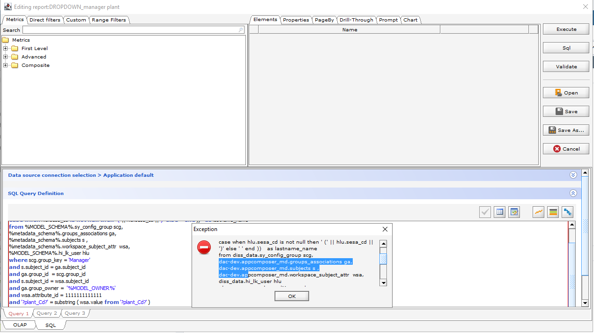

# Changes and migration notes of version 2022.1.2

## **Release Train** 

Following are the artefacts of this release:

* **Decisyon App Composer for Docker** [decisyon-dac-docker-prod.jfrog.io/com.decisyon.appcomposer-docker:2022.1.](http://decisyon-dac-docker-prod.jfrog.io/com.decisyon.appcomposer-docker:2021.3.0)2
* **Decisyon App Composer for Kubernetes** [decisyon-dac-docker-prod.jfrog.io/com.decisyon.appcomposer-k8s:](http://decisyon-dac-docker-prod.jfrog.io/com.decisyon.appcomposer-k8s:2021.3.0)[2022.1.](http://decisyon-dac-docker-prod.jfrog.io/com.decisyon.appcomposer-docker:2021.3.0)2
* **Dumbella Job Executor** [decisyon-dac-docker-prod.jfrog.io/com.decisyon.dumbella:](http://decisyon-dac-docker-prod.jfrog.io/com.decisyon.dumbella:2021.3.0)[2022.1.](http://decisyon-dac-docker-prod.jfrog.io/com.decisyon.appcomposer-docker:2021.3.0)2
* **Cornelius Configuration Server** [decisyon-dac-docker-prod.jfrog.io/com.decisyon.cornelius:](http://decisyon-dac-docker-prod.jfrog.io/com.decisyon.cornelius:2021.3.0)[2022.1.](http://decisyon-dac-docker-prod.jfrog.io/com.decisyon.appcomposer-docker:2021.3.0)2
* **Keycloak OIDC Server** [decisyon-dac-docker-prod.jfrog.io/com.decisyon.keycloak:](http://decisyon-dac-docker-prod.jfrog.io/com.decisyon.keycloak:2021.3.0)[2022.1.](http://decisyon-dac-docker-prod.jfrog.io/com.decisyon.appcomposer-docker:2021.3.0)2
* **Gertrude Flowable Back-end** [decisyon-dac-docker-prod.jfrog.io/com.decisyon.gertrude:](http://decisyon-dac-docker-prod.jfrog.io/com.decisyon.gertrude:2021.3.0)[2022.1.](http://decisyon-dac-docker-prod.jfrog.io/com.decisyon.appcomposer-docker:2021.3.0)2
* **Flowable Modeler** [decisyon-dac-docker-prod.jfrog.io/com.decisyon.flowable-ui-modeler-app:](http://decisyon-dac-docker-prod.jfrog.io/com.decisyon.flowable-ui-modeler-app:2021.3.0)[2022.0.0](http://decisyon-dac-docker-prod.jfrog.io/com.decisyon.appcomposer-docker:2021.3.0)

## **Configurable properties** 

| **Property**                                               | **Description**                                                                                                                                                                                                                                                                                                                                                       | **Mandatory**                                                                                                                                                                                                                                                                                                                                                                                       |
| ---------------------------------------------------------- | --------------------------------------------------------------------------------------------------------------------------------------------------------------------------------------------------------------------------------------------------------------------------------------------------------------------------------------------------------------------- | --------------------------------------------------------------------------------------------------------------------------------------------------------------------------------------------------------------------------------------------------------------------------------------------------------------------------------------------------------------------------------------------------- |
| **GENERAL SETTINGS**                                       |                                                                                                                                                                                                                                                                                                                                                                       |                                                                                                                                                                                                                                                                                                                                                                                                     |
| profiles.active                                            | 
Enables DAC features

 
                                                                                                                                                                                                                                                                                                                                   | YES: set its value to “prod”. You need to add “cornelius” if you want to use the configuration server or “monitoring” to enable metrics. For example spring.profiles.active=prod,cornelius,monitoring                                                                                                                                                                                               |
| appcomposer.discussions.fast-validation.enabled            | Enables fast validation for Discussion                                                                                                                                                                                                                                                                                                                                | NO: default value is false                                                                                                                                                                                                                                                                                                                                                                          |
| server.servlet.context-path                                | Sets the context path of the web application (e.g. “/dac”)                                                                                                                                                                                                                                                                                                            | NO: default value is “/”                                                                                                                                                                                                                                                                                                                                                                            |
| appcomposer.web.url                                        | Sets the url of the web application                                                                                                                                                                                                                                                                                                                                   | NO: this values is taken from the workspace’s property _decisyonWebUrl_                                                                                                                                                                                                                                                                                                                             |
| **HTTP SETTINGS**                                          |                                                                                                                                                                                                                                                                                                                                                                       |                                                                                                                                                                                                                                                                                                                                                                                                     |
| server.http2.enabled                                       | Enables http2                                                                                                                                                                                                                                                                                                                                                         | NO: default value is false                                                                                                                                                                                                                                                                                                                                                                          |
| **METADATA DATASOURCE**                                    |                                                                                                                                                                                                                                                                                                                                                                       |                                                                                                                                                                                                                                                                                                                                                                                                     |
| [service.metadata.name](http://service.metadata.name/)     | Name of the metadata service                                                                                                                                                                                                                                                                                                                                          | YES: its value must be “metadata”                                                                                                                                                                                                                                                                                                                                                                   |
| metadata.user                                              | Specify user to use to authenticate to the database                                                                                                                                                                                                                                                                                                                   | YES                                                                                                                                                                                                                                                                                                                                                                                                 |
| metadata.password                                          | `Password`                                                                                                                                                                                                                                                                                                                                                            | YES                                                                                                                                                                                                                                                                                                                                                                                                 |
| metadata.database                                          | Database name                                                                                                                                                                                                                                                                                                                                                         | YES                                                                                                                                                                                                                                                                                                                                                                                                 |
| metadata.schema                                            | Specify name of the schema to use for Postgres                                                                                                                                                                                                                                                                                                                        | This value is mandatory only if use Postgres                                                                                                                                                                                                                                                                                                                                                        |
| metadata.port                                              | Specify port of the database                                                                                                                                                                                                                                                                                                                                          | `YES`                                                                                                                                                                                                                                                                                                                                                                                               |
| metadata.host                                              | Specify hostname of the database                                                                                                                                                                                                                                                                                                                                      | `YES`                                                                                                                                                                                                                                                                                                                                                                                               |
| metadata.url                                               | Specify jdbc connection url of the database.                                                                                                                                                                                                                                                                                                                          | `YES`                                                                                                                                                                                                                                                                                                                                                                                               |
| metadata.minIdle                                           |                                                                                                                                                                                                                                                                                                                                                                       | NO: default value is 5                                                                                                                                                                                                                                                                                                                                                                              |
| metadata.maxPoolSize                                       | Maximum pool size                                                                                                                                                                                                                                                                                                                                                     | NO: default value is 100                                                                                                                                                                                                                                                                                                                                                                            |
| metadata.idleTimeout                                       | Maximum idle time for connectio                                                                                                                                                                                                                                                                                                                                       | NO: default value is 300000default value i                                                                                                                                                                                                                                                                                                                                                          |
| metadata.connectionTimeout                                 | Maximum number of milliseconds that a client will wait for a connection                                                                                                                                                                                                                                                                                               | NO: default value is 600000                                                                                                                                                                                                                                                                                                                                                                         |
| metadata.maxLifeTime                                       | Maximum lifetime in milliseconds of a connection in the pool after it is closed                                                                                                                                                                                                                                                                                       | NO: default value is 600000                                                                                                                                                                                                                                                                                                                                                                         |
| metadata.leakDetectionThreshold                            | Sets maximum time after which a jdbc connection may be considered unclosed and symptom of a potential leak, in milliseconds. It prints out, on the Decisyon.log file, the stack trace of the thread invoking the connection.                                                                                                                                          | NO: default value is 0 (disabled). The value MUSt be greater than 2000.                                                                                                                                                                                                                                                                                                                             |
| **SECURITY EXTENSIONS**                                    |                                                                                                                                                                                                                                                                                                                                                                       |                                                                                                                                                                                                                                                                                                                                                                                                     |
| appcomposer.keycloak.enabled                               | Enables the support for Keycloak                                                                                                                                                                                                                                                                                                                                      | NO: default value is false, set it true if use Keycloak.                                                                                                                                                                                                                                                                                                                                            |
| uaa.url                                                    | User Management Endpoint                                                                                                                                                                                                                                                                                                                                              | This value is mandatory if you use Keycloak.                                                                                                                                                                                                                                                                                                                                                        |
| appcomposer.azure.security.starter.enabled                 | Enables support for Azure AD                                                                                                                                                                                                                                                                                                                                          | NO: default value is false, set it true if use Azure AD.                                                                                                                                                                                                                                                                                                                                            |
| appcomposer.schneider.security.starter.enabled             | Enables support for Schneider IDMS                                                                                                                                                                                                                                                                                                                                    | NO: default value is false, set it true if use Schenider IDMS                                                                                                                                                                                                                                                                                                                                       |
| appcomposer.api-gateway.enabled                            | Enables support for Api Gateway                                                                                                                                                                                                                                                                                                                                       | NO: default value is false, set it true if use an Api Gateway                                                                                                                                                                                                                                                                                                                                       |
| [api-gateway.cookie.name](http://api-gateway.cookie.name/) | Name of the cookie holding the id-token                                                                                                                                                                                                                                                                                                                               | This value is mandatory if you use an Api Gateway.                                                                                                                                                                                                                                                                                                                                                  |
| api-gateway.url.logout                                     | Url to hit to logout and invalidate the token.                                                                                                                                                                                                                                                                                                                        | This value is mandatory if you use an Api Gateway.                                                                                                                                                                                                                                                                                                                                                  |
| api-gateway.id-token.uid.claim                             | Name of the claim that contains the identifier of the user                                                                                                                                                                                                                                                                                                            | This value is mandatory if you use an Api Gateway.                                                                                                                                                                                                                                                                                                                                                  |
| **SECURITY**                                               |                                                                                                                                                                                                                                                                                                                                                                       |                                                                                                                                                                                                                                                                                                                                                                                                     |
| 
appcomposer.security.debug

 
                  | Enables UI Toast to show any security alert due to param validation.                                                                                                                                                                                                                                                                                                  | 
NO: default is false

 
                                                                                                                                                                                                                                                                                                                                                                 |
| appcomposer.security.service.token.seed                    | Seed use to create a service token to enable secure communication with the other microservices.                                                                                                                                                                                                                                                                       | YES, in case you use any other DAC’s Microservices (e.g. Dumbella). It's must be a randomly generate 20-chars string.                                                                                                                                                                                                                                                                               |
| appcomposer.security.validation.string.big                 | Sets the max length for param values validation.                                                                                                                                                                                                                                                                                                                      | NO: default is 10000                                                                                                                                                                                                                                                                                                                                                                                |
| **WORKFLOW**                                               |                                                                                                                                                                                                                                                                                                                                                                       |                                                                                                                                                                                                                                                                                                                                                                                                     |
| appcomposer.workflow.enabled                               | This is mandatory if you use the workflow                                                                                                                                                                                                                                                                                                                             | NO: default value is false, set it to true if use the workflow                                                                                                                                                                                                                                                                                                                                      |
| flowable.task.url                                          | Gertrude url                                                                                                                                                                                                                                                                                                                                                          | This is mandatory if you use the workflow                                                                                                                                                                                                                                                                                                                                                           |
| flowable.task.url                                          | Flowable Modeler url                                                                                                                                                                                                                                                                                                                                                  | This is mandatory if you use the workflow                                                                                                                                                                                                                                                                                                                                                           |
| 
<strong>DUMBELLA JOB EXECUTOR</strong>

 
      |                                                                                                                                                                                                                                                                                                                                                                       |                                                                                                                                                                                                                                                                                                                                                                                                     |
| appcomposer.dubella.enabled                                | Enables Dumbella                                                                                                                                                                                                                                                                                                                                                      | NO: default value is false, set it to true if use Dumbella                                                                                                                                                                                                                                                                                                                                          |
| appcomposer.dubella.url                                    | NO: default value is 50000                                                                                                                                                                                                                                                                                                                                            | This is mandatory if you use the Dumbella                                                                                                                                                                                                                                                                                                                                                           |
| **NETWORKING SETTINGS**                                    |                                                                                                                                                                                                                                                                                                                                                                       |                                                                                                                                                                                                                                                                                                                                                                                                     |
| appcomposer.ws.heart-beat.timeout                          | NO: default value is 50                                                                                                                                                                                                                                                                                                                                               | NO: default value is 50000                                                                                                                                                                                                                                                                                                                                                                          |
| **THREAD SETTINGS**                                        |                                                                                                                                                                                                                                                                                                                                                                       |                                                                                                                                                                                                                                                                                                                                                                                                     |
| ppcomposer.ws.heart-beat.timeout                           | NO: default value is 50                                                                                                                                                                                                                                                                                                                                               | NO: default value is 50000                                                                                                                                                                                                                                                                                                                                                                          |
| **THREAD SETTINGS**                                        |                                                                                                                                                                                                                                                                                                                                                                       |                                                                                                                                                                                                                                                                                                                                                                                                     |
| appcomposer.task.execution.pool.core-size                  |                                                                                                                                                                                                                                                                                                                                                                       | NO: default value is 50                                                                                                                                                                                                                                                                                                                                                                             |
| appcomposer.task.execution.pool.max-size                   |                                                                                                                                                                                                                                                                                                                                                                       | NO: default value is 50                                                                                                                                                                                                                                                                                                                                                                             |
| appcomposer.task.session-content.delay                     | Delay, in millisec, of the session content thread                                                                                                                                                                                                                                                                                                                     | Delay, in millisec, of the session content thread                                                                                                                                                                                                                                                                                                                                                   |
| **WEB SOCKET SETTINGS**                                    |                                                                                                                                                                                                                                                                                                                                                                       |                                                                                                                                                                                                                                                                                                                                                                                                     |
| appcomposer.ws.reconnect.attempts                          | Numbers of attempts to reconnect on a closing connection.                                                                                                                                                                                                                                                                                                             | NO: default value is 2                                                                                                                                                                                                                                                                                                                                                                              |
| appcomposer.ws.reconnect.stomp-attempts                    | Numbers of attempts to reconnect using a brand new connection.                                                                                                                                                                                                                                                                                                        | NO: default value is 1                                                                                                                                                                                                                                                                                                                                                                              |
| appcomposer.ws.reconnect.delay                             | Delay, in millisec, between attempts of reconnecting.                                                                                                                                                                                                                                                                                                                 | NO: default value is 2000                                                                                                                                                                                                                                                                                                                                                                           |
| appcomposer.ws.heart-beat.client                           | STOMP heart-beat, in millisec                                                                                                                                                                                                                                                                                                                                         | NO: default value is 20000                                                                                                                                                                                                                                                                                                                                                                          |
| appcomposer.ws.heart-beat.server                           | STOMP heart-beat, in millisec                                                                                                                                                                                                                                                                                                                                         | NO: default value is 20000                                                                                                                                                                                                                                                                                                                                                                          |
| appcomposer.ws.heart-beat.master.client                    | STOMP heart-beat, in millisec of the main ws connection.                                                                                                                                                                                                                                                                                                              | NO: default value is 20000                                                                                                                                                                                                                                                                                                                                                                          |
| appcomposer.ws.heart-beat.master.server                    | STOMP heart-beat, in millisec of the main ws connection.                                                                                                                                                                                                                                                                                                              | NO: default value is 2000                                                                                                                                                                                                                                                                                                                                                                           |
| appcomposer.ws.ping-pong.timeout                           | Applicative ping/pong timing, in millisec.                                                                                                                                                                                                                                                                                                                            | NO: default value is 25000                                                                                                                                                                                                                                                                                                                                                                          |
| appcomposer.ws.session-max-idle.timeout                    | Web Socket connection idle timeout, in millisec.                                                                                                                                                                                                                                                                                                                      | NO: default value is 1800000 (30 min, should be equal to the http session timeout)                                                                                                                                                                                                                                                                                                                  |
| appcomposer.ws.message.buffer-size                         | Web Socket message buffer size, in byte (int value).                                                                                                                                                                                                                                                                                                                  | NO: default value is 524288. Set a bigger value only if you use big string as page’s parameters values.                                                                                                                                                                                                                                                                                             |
| 
<strong>CONTENT SECURITY POLICY</strong>

 
    | 
Reference: <a href="https://content-security-policy.com/">Content-Security-Policy Header ⟶ CSP Reference &#x26; Examples</a>

<strong>Warning</strong>: if you need to set your CSP, you must change the directives adding clauses to the default values, without removing any of them.
 |                                                                                                                                                                                                                                                                                                                                                                                                     |
| appcomposer.security.csp.script-src                        | 
CSP's script-src directive

 
                                                                                                                                                                                                                                                                                                                             | NO, default value is: _'unsafe-inline' 'unsafe-eval' 'self' ;_                                                                                                                                                                                                                                                                                                                                      |
| 
appcomposer.security.csp.img-src

 
            | 
CSP's img-src directive

 
                                                                                                                                                                                                                                                                                                                                | NO, default value is: _data:_ [https://\*.openstreetmap.org](https://decisyon.atlassian.net/wiki/spaces/~436823021/pages/2353430529/Changes+and+migration+notes+of+version+2022.1.0) _'unsafe-inline' 'unsafe-eval' 'self' ;_                                                                                                                                                                       |
| appcomposer.security.csp.font-src                          | CSP's font-src directive                                                                                                                                                                                                                                                                                                                                              | NO, default value is: _data:_ [https://fonts.gstatic.com/](https://fonts.gstatic.com/) _'unsafe-inline' 'unsafe-eval' 'self' ;_                                                                                                                                                                                                                                                                     |
| appcomposer.security.csp.style-src                         | CSP's style-src directive                                                                                                                                                                                                                                                                                                                                             | NO, default value is: [_https://fonts.googleapis.com/_](https://fonts.googleapis.com/) [Official CDN of Bootstrap and Font Awesome](https://maxcdn.bootstrapcdn.com/) [Bootstrap](https://getbootstrap.com/) _'self' 'unsafe-inline' ;"_ |
| appcomposer.security.csp.default-src                       | CSP's default-src directive                                                                                                                                                                                                                                                                                                                                           | NO, default value is: _'self' ;_                                                                                                                                                                                                                                                                                                                                                                    |
| appcomposer.security.csp.frame-ancestors                   | CSP's frame-ancestors directive                                                                                                                                                                                                                                                                                                                                       | NO, default value is: _'self' ;_                                                                                                                                                                                                                                                                                                                                                                    |
| appcomposer.security.csp.worker-src                        | CSP's worker-src directive                                                                                                                                                                                                                                                                                                                                            | NO, default value is: `blob: 'self' ;`                                                                                                                                                                                                                                                                                                                                                              |
| appcomposer.security.csp.form-action                       | CSP's form-action directive                                                                                                                                                                                                                                                                                                                                           | NO, default value is: _'self' ;_                                                                                                                                                                                                                                                                                                                                                                    |
| **DAC CLUSTER**                                            |                                                                                                                                                                                                                                                                                                                                                                       |                                                                                                                                                                                                                                                                                                                                                                                                     |
| appcomposer.cluster.leader-election.task-delay             | Leader Check interval rate, timing of the election of a new leader of the DAC cluster, in milliseconds                                                                                                                                                                                                                                                                | NO, default value is `30000`                                                                                                                                                                                                                                                                                                                                                                        |

## &#x20;Known issues

### Exception during query validation of a sql report

On postgresql environment system shows an exception during query validation of a sql report, this happens because %metadata\_schema% is translated with . and db has a name with “-“ character.

<figure><figcaption></figcaption></figure>

### Initialization of a page in the Tab Panel and Tab Selector

The initialization of a page (initialize-page or development-mode property) no longer initializes all the pages associated with a tab selector contained in the page.&#x20;

To initialize the pages contained in the tab selector, the initialize-page property must be activated for each page. This is to avoid massive initializations that for complex pages involve a much longer page opening time.

