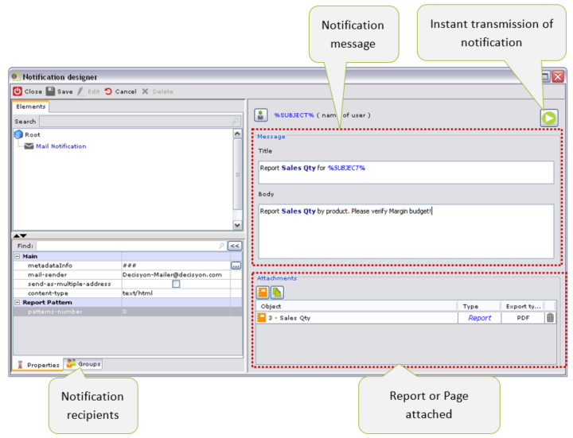

# Accessing Page from External Systems

Pages defined in DAC can be recalled: the system provides for the **automatic generation of a link**, including the desired parameters.

This makes it possible to dynamically link DAC Pages to external (web-type) applications, for example, by requesting the Page filtered by the parameters of the source application.

.png>)

You can display the links:

* To open DAC directly on a specific Page page,
* To open the Page only, to then be entered in an application; this method is embedded.

The operations are the following:

* Enables any command of the Action Bar of the mashboard
* From the Page, open the settings menu from the button and select **Share** (only visible to administrators)

* From _Share_ a pop-up opens with two links, shown in the figure.

the following is the syntax of the two URLs:

**https://**_**\<PORT>/\<CONTEXT>/content/Page/\<OWNER>\_\<PAGE ID**>_**embedView?token=\<token>\&tenant\_id**


\
**https://**_**\<PORT>/\<CONTEXT>/content/Page/\<OWNER>\_\<PAGE ID**>_**view?token=\<token>\&tenant\_id**

where:

_**\<HOST> -**_ Host name or IP of the Application Server

_**\<PORT>**_ _**-**_ port of the Application Server

_**\<CONTEXT**_> _**-**_ name of the Web Application DAC

_**\<OWNER>**_ _**-**_ ID of the application

<_**Page**_ ID

* **view** _**-**_&#x66;or direct opening
* **embed view** _**-**_&#x66;or embed opening

**\<Token>** it's pobbible to insert the user token (Optional). In this case the page is accessed with the user to whom the token belongs.

**\<tenant\_id> :** This is the id of tenant selected in the page. When the tenant id is passed in query string, the page opens and the specified tenant is automatically selected,assuming the user is associated to the tenant. If the tenant id is not referring to any existing tenant of DAC, an error message is displayed to the user stating that the specified tenant doesn’t exists and user’s last tenant is automatically selected. If the user is not associated to the passed tenant, an error message is displayed to the user stating that the he/she is not authorized to the tenant and user’s last tenant is automatically selected.

For access to the Page already authenticated, enter the part shown below in the previous link:

_http://\<HOST>:\<PORT>/\<CONTEXT>/content/Page/\<OWNER>\_\<PAGE\_ID>/_\[view or embedView]_?**csUsrn=\<USER ID>\&csPass=\<PASSWORD>\[\&crypted=1]**_

where:

* **csUsrn:** user id
* **csPass:**&#x70;assword of the user clear or encrypted
* **crypted:** if the value 1 is set the password is encrypted. If you do not want to enter an encrypted password, the variable is not entered in the link.

The encrypted password for a specific user can be retrieved by the system administrator inside the SUBJECT table of the db. In this case the _CsPass_ variable will have the encrypted password associated

In the case where you want to enter the preselected parameters add the following syntax to the link:

_http://\<HOST>:\<PORT>/\<CONTEXT>/ content/Page/\<OWNER>\_\<PAGE ID>/_\[view or embedView]_?_ _**pNames=\<PARAMETER>\&pValues=\<VALUES>**_

where:

* _**\<PARAMETER>**_ is the list of the parameters

The parameters are listed separately from %23\_%23\_%23, so _n_ parameters have the following syntax:

_Param&#x31;**%23\_%23\_%23**Param&#x32;**%23\_%23\_%23**…Paramn_

* _**\<VALUE>**_ the corresponding values to be assigned to the parameters. The values of each parameter are always separated by the same separator _**%23\_%23\_%23**_.

So if _Param1_ has the value _Val1, Param2_ has the value _Val2, Paramn_ has the value _Valn_ the correct syntax is the following:

_Val&#x31;**%23\_%23\_%23**Val&#x32;**%23\_%23\_%23**…Valn_

In case one or more parameters must be assigned more values, the separator between the multivalue is _**%23%23%23%23%23**_

So if _Param1_ assumes three values _Val11, Val12 and Val13_ the syntax becomes:

_Val1&#x31;**%23%23%23%23%23**Val1&#x32;**%23%23%23%23%23**Val1&#x33;**%23\_%23\_%23**Val&#x32;**%23\_%23\_%23**…Valn_

&#x20;**Note:** _for operation on browsers IE8/IE10, often cleaning the cache is not sufficient to correctly use the direct access links, rather you must perform the following operations:_

1. _enable the “Always update from server” option, which is in “Development tools (F12)” -> Cache;_
2. _system “logout”;_
3. _access the system with one of the direct access links;_
4. _system “logout”;_
5. _disable the “Always update the server” option;_
6. _access with one of the direct access links._

Example of a Link to a Page

Step 1: Page link

.png>)

_Access a dashboard page in debug mode. Select the parameters, for example the following were selected:_

* _Area -> CENTER_
* _Region -> Lazio_
* _Business Unit -> Business Unit 01._

_Reload the page (click on the Sales Analysis tab). The parameters set are displayed in the debug window, page parameter value section._

Step 2: Page link

.png>)

_From the Action Bar select the button shown in the figure and choose the Share menu item._

_A window opens with two links_

* _Direct Link to the Page. Provides direct access to the Page page. Authentication is automatic and any page parameters are set automatically._
* _Direct link to DAC. To access DAC, placing it directly on the Page. The authentication mode is automatic._
* _The link with the passage of the parameters is as follows:_

_http://192.168.2.102:8080/Decisyon450MANUAL/content/Page/RTQDANB\_216381316292328/view?pNames=AREA\&pValues=2\&pNames=Region\&pValues=714\&pNames=Business\_Unit\&pValues=0_

_Note that in pName and pValue, the parameters exported from Page found in the debug window have been entered_

#### Predefined JavaScript Functions

DAC provides some Javascript functions accessible from the properties of the components which use this code, such as the JavaScript, Image or Execute button component.

The Javascript code entry window is a real Javascript text _Editor_ and the code commands are shown in a different color.

The code entered does not require the opening and closing _commands "<_&#x73;cript>\</script>" since the system enters them automatically during execution. If these were entered, they will be ignored.

JavaScript functions can also be used where it is possible to enter free text, such as in text objects of the Page or in the custom functions for the reports (_Presentation Administrator,_ _Custom functions for reports section_).

The **f(x)** button (top right) opens a window where you can select one of the _JavaScript functions_ shown by DAC that are directly applicable to Pages and Reports.

This window also shows other particularly useful functions.

.png>)

**Page Management Functions**

In the _Page_ folder functions are gathered which may be applied to the Pages.

The reference to the Page is defined in _**object-id**_ property (_**metadataInfo**_, property _Advanced_ folder, _Advanced_ group).

.png>)

Below are the functions to be applied to the Pages:

* **extDshExportToExcel(**_**id**_**)** and **extDshExportToPdf(**_**id**_**)**

the functions export a specific Page in Excel and PDF format (_**id**_:_object-id_ id of the Page)

* **extSendParamChanged(**_**pName**_**,&#x20;**_**pValue**_**)**

Value a pName _**parameter**_ in the current Page, with the value specified in _**pValue**_

* **extSendCheckListParamChanged(**_**pName**_**,&#x20;**_**pValue**_**,&#x20;**_**type**_**,&#x20;**_**checked**_**)**

the value of a checklist is changed in the current Page, identified with _**pName parameter**_::

the value specified in _**pValue**_ is selected or not depending on whether _**0**_ or 1 is checked.

The _**type**_ indicates whether the value is numeric (_type: 0_) or a string (_type: 1_).

* **extReLaunchCurrentPage()**

Run the current Page (by possibly updating data and objects, regardless of the configuration of the update properties)

* **extRedirectToDsh(id) and extRedirectToDsh(id,params)**

It redirects the page to a specific Page (_**id**_:_object-id_ id of the Page). In the function the parameters may be indicated, to be used as filters for the specific Page.

* **extOpenDshDialog, extOpenDshModalDialog and extOpenDshModalDialogParam**

similar to the previous group, only that in this case a Page is opened.

.png>)

* _**extExecuteButton**_**&#x20;(**_**custom-js-id**_ **)**

carries out the action associated with an _Execute button_ and includes, as a single parameter in input, the one defined in the _custom-js-id_ property of the Execute button.

* _**extRefreshObject (custom-js-id**_ _**)**_

The function runs the update of a specific component with a report, a graph or any form type report associated with it. The only parameter provided as input is the one defined in the _custom-js-id_ property of the component.

* _**extRefreshPagePage**_

The function allows for updates to be carried out for a specific component that has an associated report, or for those types of forms (i.e. under the file form in the Page Designer section).

**extRedirectToDsh with or without parameters**

It redirects the page to a specific Page (_**id**_:_object-id_ id of the Page). In the function the parameters may be indicated, to be used as filters for the specific Page.

The execution of the Page is preceded by an initial repost on a loading page, in which the repost to the desired Page page is subsequently carried out.

The function includes as parameters in input the ID of the Page page and possibly the list of the parameters to be sent, defined in the following format:

_\[{"name": "parameter\_name1", "value": ?parameter1?}, { "name": "parameter\_name2", "value ?parameter1?}, { "name": "parameter\_nameN", "Value ?parameterN?}]._

where "parameter\_name1", "parameter\_name2" and “parameter\_nameN” are the names of the parameters expected and imported in the called page.

**In the example below create Page “A” for the selection of parameters, which will then be passed to Page “B”**, using the _extRedirectToDsh_ function, entered in the code of a JavaScript object.

Step 1: Page with a Redirect ExtRedirectToDsh

_In the Page called “A” a Text Field object named Year, a Text Field object named User, a multiselection type Styled Selector object (e.g. Checkbox) associated with the MONTH level, an Execute button and finally a JavaScript type object with the code shown in the figure are entered. In the code indicate that the redirection function is active upon clicking execute button._

Step 2: Page with a Redirect ExtRedirectToDsh

.png>)

_In the Page called “B”, with id '684350310331296' ("metadataInfo" property), a Crosstab associated with a report with the Year and Month levels is entered and with the following filters: MONTH@ID IN ('?\_month?') and YEAR@ID = '?\_year?'._

_By selecting and valuing the parameters Year, User and MONTH in Page A, the system updates the JavaScript object containing the parameters to be sent._

_By selecting the Execute button, the system will redirect to Page '684350310331296', passing all the parameters correctly._

**extOpenDshDialog, extOpenDshModalDialog and extOpenDshModalDialogParam**

The functions _**extOpenDshDialog**_ and _**extOpenDshModalDialog**_ open a window containing a particular Page.

The function _**extOpenDshDialog**_ opens a NON MODAL type window; access to the other windows is therefore permitted.

For the function _**extOpenDshModalDialog,**_ the opening of the window is of the MODAL type: i.e., access is blocked to the other windows until the modal one is not closed.

The function _**extOpenDshModalDialogParam**_ has the same behavior as the previous one, with the possibility of sending a list of the parameters to the Page.

The parameters of the functions are as follows:

* **dshID**: Id of the Page (mandatory)
* **title**: Title of the window (by default no title)
* **wiDSh**: wiDSh of the window in pixels or percentage (default 800)
* **height**: height of the window in pixels or percentage (default 600)
* **resizable**: flag to resize, maximize and iconize the window (default true)
* **top**: position from the top margin of the dialog (default center)
* **left**: position from the left margin of the dialog (default center)
* **idDialog**: ID of the window (random value by default)

.png>)

For the function _**extOpenDshModalDialogParam**_ the parameters to be sent to the Page are defined in the following format:

_\[{"name": "parameter\_name1", "value": ?parameter1?}, { "name": "parameter\_name2", "value ?parameter1?}, { "name": "parameter\_nameN", "Value ?parameterN?}]._

**Example of a Page with an extOpenDshDialog type pop-up**

Step 1: Page with pop-up type extOpenDshDialog

.png>)

_Enter the text type object in the Page. Enter the Javascript code from the test property main section._

_The following code is entered:_

_\_

**Window with information message and confirm and cancel buttons**

.png>)

_\<script>_

_extConfirmDialog('Text Message',Info, 'alert(“Message on YES button”)', 'alert(“Message on NO button”)', '1', 'OK','CANCEL','300',110,'MyDialog' )_

_\<script>_

**Window with information message and confirm and cancel buttons**

.png>)

_\<script>_

_extConfirmDialog('Text Message',Warning,'alert(1)','alert("2")','2','OK','CANCEL','300',110,'MyDialog' )_

_\</_**\<script>**

**Window with error message and confirm and cancel buttons.**

.png>)

_\<script>_

_extConfirmDialog('Text Message',Error,'alert(1)','alert("2")','3','OK','CANCEL','300',110,'MyDialog' )_

_\<script>_

**Window with question type message with confirm and cancel buttons**

_\<script>_

_extConfirmDialog('Text Message',Question,'alert(1)','alert("2")','4','OK','CANCEL','300',110,'MyDialog' )_

_\<script>_

Step 1: Page with pop-up type ExtConfirmDialog

.png>)

_In this example, you want to open a warning pop-up when opening a Page. The pop-up will be of the modal type, with confirm or cancel keys. For the creation, a text object is entered inside the Page. In the text property enter the Javascript function:_

_\<script>_

_extConfirmDialog ('You are about to save this item. It cannot be restored at a later time continue?', 'Warning','alert("Data have been saved")','alert("Reselect date")','2','OK','CANCEL','300',null,'MyDialog' )_

_\<script>_

_In detail:_

* _extConfirmDialog Function for the pop-up_
* _‘You are about to save this item…’ Text of the message_
* _'Warning' Title of the pop-up_
* _'alert("Data have been saved")' Action associated with the confirm key_
* _'alert("Reselect date")' Action associated with the cancel key_
* _2 Warning icon type_
* &#x20;_‘OK’ Confirm key_
* _‘CANCEL’- Cancel key_
* _300,null- WiDSh and height of the pop-up_
* _'MyDialog'->Id of the Pop-up._

Step 2: Page with pop-up type ExtConfirmDialog

_Access DAC. The underlying page is obscured and browsing remains locked as long as the user does not press one of the two buttons._

_If you select the confirm button the alert associated with it is displayed. The same thing for the cancel key._

**extOpenDialog, extOpenModalDialog and extOpenModalDialogParam**

The **extOpenDialog** type function opens a NON MODAL window, containing a page of a specific URL.

The **extOpenModalDialog** type function also opens a window with the content of a URL, though the opening is of the MODAL type. Thus browsing the underlying page will be locked until the window is closed by the user.

The **extOpenModalDialogParam** function has the same behavior as the previous function (therefore MODAL), but includes the possibility of sending a list of parameters.

.png>)

The parameters of the three functions are:

* **src**: URL (mandatory)
* **title**: Title of the window (by default no title)
* **wiDSh**: wiDSh of the window in pixels or percentage (default 800)
* **height**: height of the window in pixels or percentage (default 600)
* **resizable**: flag to resize, maximize and iconize the window (default true)
* **top**: position from the top margin of the dialog (default center)
* **left**: position from the left margin of the dialog (default center)
* **idDialog**: ID of the window (random value by default)

For the function **extOpenModalDialogParam** the parameters to be sent to the URL are defined in the following format:

_\[{"name": "parameter\_name1", "value": ?parameter1?}, { "name": "parameter\_name2", "value ?parameter1?}, { "name": "parameter\_nameN", "Value ?parameterN?}]._

**Example of a Page with an extOpenDialog Type Pop-up**

Step 1: Page with Pop-up Type extOpenDialog

.png>)

_Enter the text type object in the Page. Enter the Javascript code from the test property main section._

_The following code is entered:_

_\<script>_

_extOpenDialog('http://www.decisyon.com','Decisyon','800','600','true','center','center','MyDialog')_

_\<script>_

_In detail:_

* _‘‘http://www.decisyon.com’ -> Real link to the Web page._
* _'Decisyon'-> Title of the pop.up._
* _800,600-> WiDSh and height of the pop-up._
* _' true '-> Automatic resize popup._
* _' center ', ' center '-> position compared to the top and left margin._
* _'MyDialog'->Id of the Pop-up._

Step 2: Page with pop-up type extOpenDialog

_Access DAC. When accessing for the first time, the pop-up is shown which displays the web page specified in the code. The window is non-modal; this lets you browse the underlying page, even if the pop-up is not closed._

**Example of a Page with an extOpenModalDialog type pop-up**

Step 1: Page with pop-up type extOpenModalDialog

.png>)

_Enter the text type object in the Page. Enter the Javascript code from the test property main section._

_The following code is entered:_

_\<script>_

_extOpenModalDialog('http://www.decisyon.com','Decisyon','800','600','true','center','center','MyDialog')_

_\<script>_

_In detail:_

* _‘_[_‘_](http://www.decisyon.com/)[_http://www.decisyon.com_](http://www.decisyon.com/)_’ -> Real link to the Web page._
* _'Decisyon'-> Title of the pop.up._
* _800,600-> WiDSh and height of the pop-up._
* _' true '-> Automatic resize popup._
* _' center ', ' center '-> position compared to the top and left margin._
* _'MyDialog'->Id of the Pop-up._

Step 2: Page with pop-up type extOpenModalDialog

.png>)

_Access DAC. When first accessed, a window is shown containing a page defined in the link, which will be opened in modal mode. In this case browsing the underlying page will be locked until the window is closed by the user._

#### Notification Designer

The notification service is a complete contact management system which lets companies optimally manage their communication with user groups or single users. A management system allows users to create, review and send notification messages, without requiring users to always be connected to the application.

The type of notification is:

* Mai&#x6C;**,** where the notification is sent by e-mail;

From the **Application>> Notification Designer** menu, open the window that manages the notification service.

In the Mail notification we define the send mode, the recipients and the message with the title.

**Notification Transmission**

Notifications can be sent instantly, by clicking the .png>) button.

During execution, the system displays the dialog window _Execution log_ which displays the different steps, detailing the instructions which are carried out.

The steps are highlighted in red if there are errors such as missing privileges, reports not found, etc. The figure shows an example where a user does not have the license to receive notifications.

Notifications can be also sent through:

* a schedule defined with the _Scheduler_ modul&#x65;_._
* via a command in a Page . In this case, the recipients can be set dynamically: we can select recipients on the Page, in addition to those set in the notification itself.
* SQL commands, when a JOB is created .

**Notification Recipients**

You can select **Notification recipients** in the **Groups** section; you can choose them by groups or individually. To send the notification, DAC takes the information from user configuration, shown in the figure, which indicates the data used for each type of notification.

.png>)

### Task

DAC offers a solution to manage activities and to assign tasks to users.

You can manage tasks in DAC through reports or Page components enabled for this purpose. You can assign tasks:

* on the report cells
* on some Page components (Graph, Indicator, Table)

Tasks can be notified to recipients through e-mails which give direct access to the task. Therefore, in order to access the task, the mail server and DAC server must be configured (see next paragraph).

**Configuring Task Notifications for E-mail**

The mail server for sending notification e-mails must be defined in the _Server Designer_ module and then associated in the system properties _**associated–SMTP-server**_ (_Tools preference_, _E-mail_ sectio&#x6E;_, System Emails_ group)_._

The e-mails contain a link for directly accessing the assigned Tasks; the reference to DAC must therefore be defined in the system properties:

_**decisyonWebURL**_ (_Tools properties_, _Web section,_ _Connection group_) enter the DAC link.

**Enabling Task on the Report**

You will need to set the properties in the _Body_ section for reports that have to be used in the task assignment process:

_**activateCellsTask**_ allows you to enable the insertion of the new task on the report cells

_**viewCellinfoTask**_ to display, on the metric cells, information about the percentage deviation between the metric and set target

.png>)

**Enabling Tasks on Page Components**

The Page components used during the task assignment process are:

* Tables
* Crosstabs
* Graphs
* Indicators

You can enable components for the assignment of tasks in the following way:

* enable the component title with the _**show-Title**_ property of the **Title** group
* enable the _**activate-Task**_ property, always in the **Title** group.

Example: Displaying Tasks on a Component - GRAPH

.png>)

_From Page Designer, we enter the graph-type component and in the TITLE section we enable the property activate-task. The graph in DAC will display the task button_ .png>) _next to the title. Clicking the button opens the window for inserting the new task._
