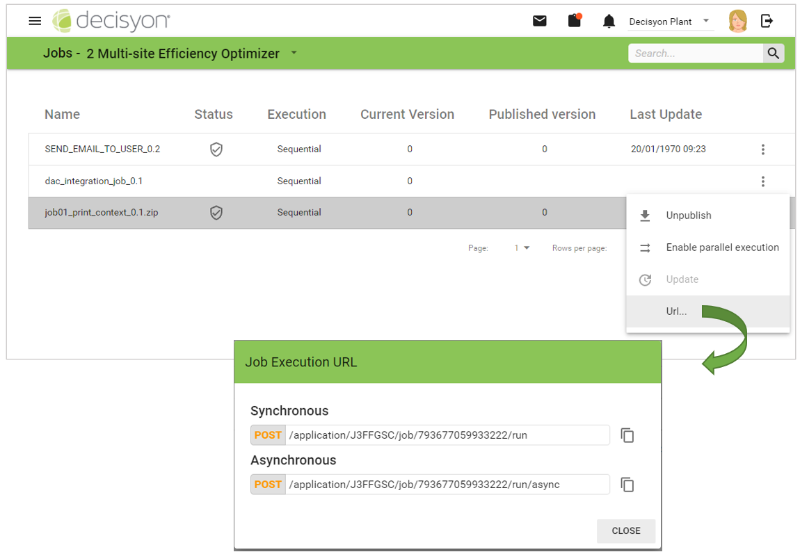
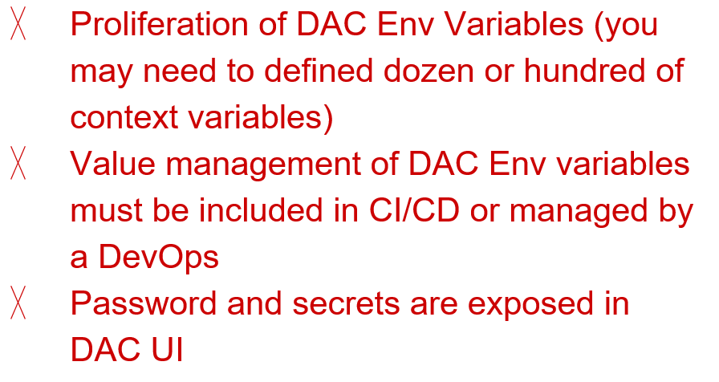

# Jobs

## Introduction <a href="#howtousedumbellaservice-introduction-whatisdumbella" id="howtousedumbellaservice-introduction-whatisdumbella"></a>

Dumbella is a service in the stack of "App Composer" and its role is to execute ETL / Data Integration jobs built with [Talend Open Studio](https://www.talend.com/products/talend-open-studio/). It exposes REST API to execute and manage the jobs. Jobs are executed by assigning values to context and context variables of the job in the body of the request. Thanks to the integration of Talend Studio Data Integration services with the AppComposer, you have the possibility to manage Talend Jobs resources in terms of updating, deleting and publishing.

#### Architecture <a href="#howtousedumbellaservice-architecture" id="howtousedumbellaservice-architecture"></a>

Dumbella is a service specific to the Decisyon Inc. and is built and maintained by the Decisyon Inc. team. It requires its own database/schema to do its job. Communication between App Composer and Dumbella takes place using the REST API.&#x20;

A job exported from Talend can be uploaded, published, executed, upgraded and deleted from App Composer user interface.

Dumbella requires a **persistent** or **ephemeral storage volume** and the security is granted by the token seed.&#x20;

Dumbella service does not have a user interface and the requests can be executed by external applications or users directly on Dumella or via App Composer. Within a Kubernetes cluster, Dumbella must be exposed to be accessible from outside the cluster.

<figure><figcaption></figcaption></figure>

**Jobs** can be executed via REST API in **synchronous** or **asynchronous** mode.

<figure><figcaption></figcaption></figure>

The top diagram shows the **Synchronous** - **Sequential** execution process of a Dumbella Job.

When you run a job in **Synchronous** mode, you must wait for the Job to be completed before getting the response of the job execution.

<figure><figcaption></figcaption></figure>

The top diagram shows the **Asynchronous -Sequential** execution of a Dumbella Job.

**Asynchronous** execution implied that the job is executed and you immediately get a response from the request, without having to wait for the Job to completed before executing the next one.

Once the Job (2) is executed, Dumbella takes it on (3) and keeps it until the execution ends.

When you excute the Job, Dumbella returns a JSON containing the Job ID and URL in the Jobs section (4) to get the result of the API execution. The execution result will be available for a configurable period of time on Dumbella.


The environment variable name to configure the amount of time the execution results must be available is **“dumbella.job.result.availability". Please see the**[ **Dumbella Installatin Guide** ](https://dac-documentation-1.gitbook.io/installation-guides/dumbella/service-properties)


By default, the job is configured as sequential execution it means that if another instance of the same job is already running, the next instance must wait the previous one to completed before starting.

<figure><figcaption></figcaption></figure>

The top diagram shows the **Sequential Execution of** a Dumbella Job.

<figure><figcaption></figcaption></figure>

The top diagram shows the **Parallel Execution of** a Dumbella Job. You can configure job for parallel execution more than one job instance can be execute.

Parallel execution could be resource consuming if not well designed.

When working with parallel executions, be careful about files that could be locked from the jobs (i.e. Excel files or other): the first execution could lock the file and the second execution could be affected by this lock. Make sure to design the jobs such in a way that they can really work in parallel.

<figure><figcaption></figcaption></figure>

The App Composer manage Dumbella operation using a Dedicated UI.

<figure><figcaption></figcaption></figure>

The .zip file of the job exported from Talend Studio must be uploaded in the resource catalog of DAC. When the job is published from the UI, the .zip file is copied from the resource to the persistent volume and expanded. Dumbella executes the .sh file of the job. Dumbella “wraps” the execution in a REST API.

Do not change the name of the .zip file before uploading in the App Composer.

App Composer manages Dumbella operation using a Dedicated UI. The link to UI ( **Administrations --> Jobs** ) is available only if services configuration in the stack is correct.

Please see the [Dumbella Installation Guide](/broken/pages/WpqhfwheciNIAXkEHwxJ).

## Managing Jobs <a href="#howtousedumbellaservice-managingjobs" id="howtousedumbellaservice-managingjobs"></a>

Now let's see how to manage Dumbella's Jobs inside the App Composer.

The list of Jobs is imported into the DAC resources catalog, and is available in the _**Administration --> Jobs**_ section of App Compose&#x72;_**.**_

<figure><figcaption></figcaption></figure>

The panel shows the lists of imported Jobs in the system.

<figure><figcaption></figcaption></figure>

For each Job the following information is given:

* **Name**: Job Name
* **Type:** It indicates whether the job has been published as Job , Job si Service or **NONE** in case of Job not yet published.
* **Status**: Job status.
  * When the Job is not published the status is DISABLED .
  * When the Job is published as Job the status is ENABLED.
  * When the Job is published as a service the status is STOPPED Job automatically started after a crash have status RESTARTED.
  * If a Job goes wrong the sato will be ERROR and you will have the detail of the error..
* **Execution**: Shows the type of job execution which can be Sequential or Parallel. This is set from the context menu.
* **Current version**: Show the job version imported into the Design Studio. Every time the job is modified and re-imported, the version number changes.
* **Published Versions:** Show the version number of the job published on the RunTime
* **Last Update:** Date and time of the last update.

Only published jobs, in their published version, can be used and then run from DAC.

The side menu items change according to the job status.

### **Publish Job**

All Jobs available in the Jobs section must be published before using them. To publish a job, click on the three dots icon and run the “Publish” command.

<figure><figcaption></figcaption></figure>

### **Unpublishing Job**

All published Jobs can be unpublished. To unpublish a job, click on the three dots icon and run the "Unpublish" command. Unpublisheds are not deleted from the App Composer resource catalog.

<figure><figcaption></figcaption></figure>

If the job is Published, the side menu will allow you to:

* **Unpublish**: unpublish the selected job
* **Enable Parallel Execution**: This lets you run the job in parallel with other jobs. To disable the parallel execution mode, simply select the Disable Parallel Execution item from the side menu.
* **Update**: update the version of the Job. Versions are misaligned when the current version differs from the published one.

Only published jobs, in their published version, can be used and then run from DAC.

* **URL:** the system generates the URL to be used for example in the API. The provided endpoint is the one that can be used to run the Job in Synchronous or Asynchronous mode.

<figure><figcaption></figcaption></figure>

### **Delete Jobs**

When a job is deleted, the JOB id is lost and thus all the requests on that job will raise an error.

If a job is published, you have to delete the job from the Resource catalog and then click on the three dots icon and run the “**Remove**” command. If a job is not published, you have to delete the job from the Resource catalog but no action is required on the App Composer, refreshing the Jobs section will automatically remove all deleted jobs.

<figure><figcaption></figcaption></figure>

### Publish Job as Services <a href="#howtousedumbellaservice-publishjobasservices" id="howtousedumbellaservice-publishjobasservices"></a>

When you need to have a Job running constantly, the DAC offers the possibility of creating a Job as a Job Service. This type of Job according to its function, is constantly listening to new messages from the application without ending its execution.

The Service Jobs has a **Sequential-Asynchronous** execution type is configured as such at the time of publication.

<figure><figcaption></figcaption></figure>

To publish a Job as a service, select **Publish as services** from the menu on the right of the Job.

<figure><figcaption></figcaption></figure>

Jobs configured as a service are recognizable because they have the Type set as Service. Just published the Job is in a STOPPED state. This means that it is not yet running.

<figure><figcaption></figcaption></figure>

To start the Job select START from the menu on the right of the Job.

The status of the Job is updated in STARTED which means that the job is running.

<figure><figcaption></figcaption></figure>

We can notice that near the state of the Job of **Service** there is an icon Info that shows a tooltip in which the date and time of departure of the Job is visualized. When you want to stop the Job from running, select the **Stop** menu item.

<figure><figcaption></figcaption></figure>

If the Service fails, the status will be **ERROR** and the Info icon will open a window showing the error generated by the service.

<figure><figcaption></figcaption></figure>


While running a Service Job if the Dumbella instance crashes, another instance will take over the execution of the service. The Job will be restarted automatically and will have RESTARTED (see Managing JOBS) status.


### Job Context Parameters

It's possible to set context parameters for the[ Job Services](jobs.md#howtousedumbellaservice-publishjobasservices).

The configuration of the context parameters takes place when you run the Job Start.

<figure><figcaption></figcaption></figure>

Before starting the Job (start) the DAC shows a panel in which to set the parameters.

<figure><figcaption></figcaption></figure>

Once the parameters are configured, the Job will run by pressing the STAR button on the panel.

To know which context parameters are configured on a Job select the side menu Context parameters.

<figure><figcaption></figcaption></figure>

If the parameters are changed later, the old ones will be overwritten with the new ones.

#### Example - How to configure context parameters

The Job used in this example prints in the Dumbella log the context parameters of the Job.

**Step 1 Job**

<figure><figcaption></figcaption></figure>

In the figure in the other we can see that the job we will run as a service has 3 contexts: Default , Prod and Dev.

**Step 2. Selecting the context**

<figure><figcaption></figcaption></figure>

When you start the Job, you can select among the available contexts. In this example we will select the Default context and click on START.

**Step 3. Dumbella Log**

<figure><figcaption></figcaption></figure>

We can notice that the Job has printed in the log the values of the defaul context.

**Step 4. Modify context parameters value**

<figure><figcaption></figcaption></figure>

To change the context parameters of a running service Job you need to stop and restarted.

We modified context parameters setting different values and run the Job (Start).

<figure><figcaption></figcaption></figure>

In the image we can see how the Job printed for the context Default the values set by the DAC


### Job Manager <a href="#howtousedumbellaservice-jobsmanager" id="howtousedumbellaservice-jobsmanager"></a>

To know which Jobs are currently running on Dumbella click the button on the top right to open the **Job manager.**

<figure><figcaption></figcaption></figure>


The list will not display Service Jobs.


<figure><figcaption></figcaption></figure>

It is possible to display the latest update date and you can refresh data cliking on the UPDATE button. For each running Job you can see the following information:

* **Start date:** timestamp when the job started
* **Name:** name of the job in execution
* **Id:** Identification code of the running Job
* **Execution:** unique ID assigned to the current execution

### Kill a job <a href="#howtousedumbellaservice-howtokilljob" id="howtousedumbellaservice-howtokilljob"></a>

To stop a job from running, select the Trash icon on the right of the job.

<figure><figcaption></figcaption></figure>

Once stopped the execution of the Job the icon changes status.

If you refresh the list of running jobs cliking on the **UPDATE** button (or the **Job Manager** dialog is closed and reopened), killed jobs will no longer be visible in the list.

<figure><figcaption></figcaption></figure>

## Executing jobs <a href="#howtousedumbellaservice-executingjobs" id="howtousedumbellaservice-executingjobs"></a>

The Dumbella service exposes the APIs for managing and executing Jobs. You can use the REST API Client of the Composer APP or Postman, cURL or any other HTTP client to run the API of a Job.

### REST API Client <a href="#howtousedumbellaservice-composerrestapiclientappcomposerrestapiclient" id="howtousedumbellaservice-composerrestapiclientappcomposerrestapiclient"></a>

When you run the API via the **App Composer REST API Client**, the reference URL is the one in the Job section.

<figure><figcaption></figcaption></figure>

When you query the API in front of the URL you will need to enter the Dumbella URL.

Example URL API for running a Job in Synchronous mode:

```http
<http://{dumbella_host}:{port}/api/rest/application/{application}/services/jobs/{id}/run
```

Same example executed in Asynchronous mode:

```http
<http://{dumbella_host}:{port}/api/rest/application/{application}/services/jobs/{id}/run/async
```

In the **Jobs** page, the “**Url**” button shows the **relative** path used to run the selected job.

<figure><figcaption></figcaption></figure>

You can configure your request by copying the relative path and using the POST method. Then you can configure the Headers and the Body of the request. In the header, you need to configure the Authorization using the bearer token.

For more datails please see the document [Rest API Client](../sdk-and-api/rest-api-client.md).

### Generic HTTP Client <a href="#howtousedumbellaservice-altriclienthttpaltriclienthttp" id="howtousedumbellaservice-altriclienthttpaltriclienthttp"></a>

If the API is executed through a client external to the DAC, please refer to the documentation in the section **Online Help --> REST API Documentation**

<figure><figcaption></figcaption></figure>

The documentation provides all the APIs for operations on Dumbella and these include those for synchronous or asynchronous execution of the JOB.

<figure><figcaption></figcaption></figure>

In this case when running the API you will need to add the DAC URL to the initial part of the string

Example API for running a Job in synchronous mode

```http
https://{DAC host}:{port}/api/rest/application/{application}/services/jobs/{id}/run
```

Same example in asynchronous mode

```http
https://{DAC host}:{port}/api/rest/application/{application}/services/jobs/{id}/run/async
```

In the **body** of the request, you can select the job’s context and assign values to the context using JSON. The “**jobContext**” and “**jobParams**” keys must be used to pass values when executing the job. You can use only the "jobContext" key or only the jobParams key or both, it depends on the use cases.

```json
{
  "jobContext": "{{context_name}}",
  "jobParams": {
    "param1": "{{param1}}",
    "param2": "{{param2}}"
  }
}
```

<figure><figcaption></figcaption></figure>

### Executing **Asynchronous Jobs** <a href="#howtousedumbellaservice-risultatoesecuzionerisultatodellesecuzionediunjobasincrono" id="howtousedumbellaservice-risultatoesecuzionerisultatodellesecuzionediunjobasincrono"></a>

When you run a Dumbella **Asynchronous** Job in the **Body** of the **Response** the URL is provided to invoke the API that will return the JOB execution result.

The API will return the running status of the Job that can be **running**, **done** or **error**.

Let’s see how.

**Step 1 - Run an asynchronous JOB.**

<figure><figcaption></figcaption></figure>

After running the API, to know the result of the execution you will need to copy the URL in the body of the Response and add the URL of Dumbella.

```http
http://{dumbella host}:{port}/execution/{executionId}/result
```

In the API Header you must configure the keys and values of the call as shown in the figure below.

<figure><figcaption></figcaption></figure>

In this example you are using the DAC clip so in the Authorization key variable we will select the `Bearer %DAC_ACCESS_TOKEN%` value . In case you are using a different client, you need to generate the token from the [user profile.](../user-management/user-profile-and-change-password.md)

**Step 2- Invoke the execution result**

<figure><figcaption></figcaption></figure>

We invoke the API via the DAC’s Rest API Client. Once the request is executed, in the response body the result of the execution will be visible. In this example the status is 200 and DONE.

### Widget Execute Button <a href="#howtousedumbellaservice-executethejobsinappcomposer-widgetexecutebuttonwithtalendintegration" id="howtousedumbellaservice-executethejobsinappcomposer-widgetexecutebuttonwithtalendintegration"></a>

Execute button widget can be configured to execute Talend Integration.

The Input-params-context property allows you to set the context that will be used during execution. You can choose between page parameters or job contexts (list of available contexts name defined in the job)

<figure><figcaption></figcaption></figure>

The `Input-params-mapping` property shows you the list of available context variable defined in the Talend job. You can bind page parameters to job's context variable.

<figure><figcaption></figcaption></figure>

### Widget Execute Button with REST API Client <a href="#howtousedumbellaservice-executebuttonwidgetcanbeconfiguredtoexecuterest_api." id="howtousedumbellaservice-executebuttonwidgetcanbeconfiguredtoexecuterest_api."></a>

The api-params-mapping property allows you to map variables defined in the rest api client request with pre-selection parameters or parameter defined in the page itself.


<figure><figcaption></figcaption></figure>

<figure><figcaption></figcaption></figure>

### Execute the jobs passing context and context params <a href="#howtousedumbellaservice-executethejobspassingcontextandcontextparams" id="howtousedumbellaservice-executethejobspassingcontextandcontextparams"></a>

It’s possible to execute a job by sending the execution Context and Context Params in the body of the Rest API Request. Context and Context Params can be:

* Static
* Dynamic

<figure><figcaption></figcaption></figure>


Variable values use the \{{ **mustache** \}} notation.

Those \{{params\}} elements can be associated with the parameters defined in the App Composer page.

<figure><figcaption></figcaption></figure>

### Logs and output <a href="#howtousedumbellaservice-logsandoutput" id="howtousedumbellaservice-logsandoutput"></a>

Execution logs can be analyzed using the Dumbella service logs from the hosting environment.


Adding the query string parameter “output=true” the console output of the log will be displayed both in the response body and in the service log.

<figure><figcaption></figcaption></figure>

Adding query string parameter “output=true” the console output of the log will be displayed both in the response body and in the service log.

<figure><figcaption></figcaption></figure>

Dumbella’s schema has few tables. The Job execution are logged in a table.

<figure><figcaption></figcaption></figure>


Please note that Dumeblla execution log table is not the same execution log table created by Talend


<figure><figcaption></figcaption></figure>

## Organizing contexts <a href="#howtousedumbellaservice-organizingcontextstoleverageappcomposeranddumbella" id="howtousedumbellaservice-organizingcontextstoleverageappcomposeranddumbella"></a>

There are several ways to manage contexts in Talend to leverage at best App Composer and Dumbella capabilities, each of which has advantages and disadvantages.

* One context per environment using App Composer environment variable
* Single context passing App Composer environment variable
* Single context passing Dumbella environment variable
* Context variables loaded from database table

#### **One context per environment using App Composer environment variable**

In the Talend job, you define one context per environment, will all its context variables.

<figure><figcaption></figcaption></figure>

In App Composer you define and [environment variable](/broken/pages/TBg4edwIfWndTvfhM2j1) with the name of the context to be applied in that environment.


When creating the JOB request using App Composer REST Client, use theApp Composer Env variable to pass the context name.

<figure><figcaption></figcaption></figure>

For more details on environment variables see: [General Information](/broken/pages/Z11vnQKECZlPpKVc4o7e)

When using the job from a page, capture the App Composer Env variable in a parameter and pass it to the “Execute object” widget.

| Advantages | Disadvantages                         |
| ---------- | ------------------------------------- |
|            |  |

#### **Single context passing App Composer environment variable**

In the Talend job, you define only one context, the “default” one, with all its context variables

In App Composer you define an environment variable for each context variables you need to pass accordingly to the environment.

<figure><figcaption></figcaption></figure>

When creating the JOB request using App Composer REST Client, use the App Composer Env variable to pass the value to each context variables.

.png>)

When using the job from a page, capture each App Composer Env variable corresponding to a context variable in a parameter and pass it to the “Execute object” widget.When using the job from a page, capture each App Composer Env variable corresponding to a context variable in a parameter and pass it to the “Execute object” widget.

| Advantages                            | Disadvantages                         |
| ------------------------------------- | ------------------------------------- |
|  |  |

#### **Single context passing Dumbella environment variable**

When creating the JOB request using App Composer REST Client, you don't need to assign context variable.

When using the job from a page you don’t need to assign context variables.

The job will read them from the environment variables of Dumbella.

Talend Java components allows you to capture env variables during execution.

<figure><figcaption></figcaption></figure>

| Advantages                                   | Disadvantages                         |
| -------------------------------------------- | ------------------------------------- |
| .png>) |  |

#### **Context variables loaded from database table**

In the database, you can create a table that has all the context variables and their name. In the Talend job, you define only one context, the “default” one.The job is designed to load variables from the table. In App Composer Dumbella you need to configure only the connection string to the database since it changes by environment.

| Advantages                                   | Disadvantages                                |
| -------------------------------------------- | -------------------------------------------- |
| .png>) | .png>) |

