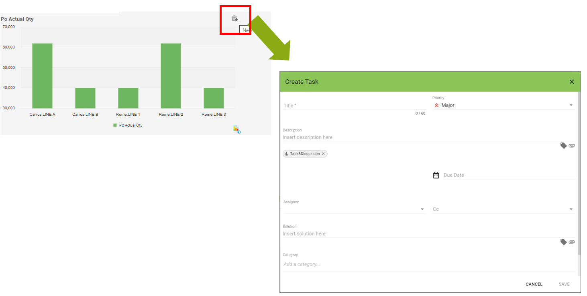

# Task

DAC offers an activity management solution, which lets you assign tasks to users on the cells of a report.

Task processing involves the following statuses:

* NEW, the user (author) creates and assigns a task to another user (assignee)
* IN PROGRESS , the task is accepted by the assignee
* CLOSED, the task is resolved by the assignee
* PAUSED: the task is put on hold.

When a task is assigned, the recipient receives a message in his Incoming mail and a notification e-mail, which allows the recipient to access it directly. The author and assignee can exchange comments and attach files. The users concerned with controlling the evolution of a task may be entered in the list of recipients of the notification e-mail. This way they can access the task exclusively from the link in the e-mail received.

<figure><figcaption></figcaption></figure>


When the task icon is gray, it indicates that you do not have permission to view the content of the Task. To view a Task either you are the assignee or the applicant.


To enable a report to create a task on your cells, navigate to the **Collaboration** Group **Propreties** tab

<figure><figcaption></figcaption></figure>

* **activateCellsTask** enables the Attach Task item in the pop-up menu to the cells of the report in DAC. This property enables the following:
  * **viewCellinfoTask** displays, on the cells of the report, the information relating to the task
  * **visualizationMode** provides two task display methods **inline** or **new-line** (respectively in relation to the value of the cell or below it)
*

    **shared-context** enables the sharing of a context with other reports, so that the tasks opened in it may be used not just on the same report, but also on other reports

    <figure><figcaption></figcaption></figure>

**Note:** In the Tasks created in reports where this property is activated, users may comment on or change discussions if they have the permissions on at least one of these reports.

– **context-id** identification of the shared context

If, for example, two reports have the same context-id when a discussion is submitted on a certain level (such as product), this will also be visible on the second report. Please see the Example

**Note:** Users can comment on or change the Tasks on all the reports that share the context, if they have the permissions on at least one of the reports.

### How to create a new task 

After activating the tasks on the report via when you access from the web you go to the report cell to open the task and from the menu that is activated by right-clicking select **Attach Task.**

<figure><figcaption></figcaption></figure>

The interface for creating the new Task will open.

<figure><figcaption></figcaption></figure>

To know in detail the fields in the window please see the documentation


[task.md](../task.md)


### Task Details 

When you select an open task on a report or any other object, the task details window opens.

<figure><figcaption></figcaption></figure>

You can insert messages in the Conversations section.

<figure><figcaption></figcaption></figure>

### Content Menu 

When you open the detail of an open task on a DAC widget, a window opens showing the detail of the Task.

<figure><figcaption></figcaption></figure>

There are three dots in the upper right. If selected, they open the menu that offers the following options:

* **Edit**: Edit the Task
* **Delete**: Permanently delete the task
* **Archive**: Archive the task
* **Invalidate**: Invalidates the task

#### Enabling Page Components 

The Page components on which task can be used are:

* Table
* Crosstabs
* Graph

You can enable the use of task on these components in DAC by enabling the **activate-task** property in the **Title** group.

This will allow DAC users to enter task. The icon identifying the task appears on the title of the component, and from this users can enter their messages.

**Step 1: Enabling Task Page component**

<figure><figcaption></figcaption></figure>

Enable a graph component to use annotations. Create a Page with a graph component.

* Enable yask : activate-task property of the Title group

**Step 2: Using Task on DAC**

<figure><figcaption></figcaption></figure>

Access the Page created in step 1. The Task icon will be on the graph title. Move to the icon and click it to open the callout and insert a message.

### How to work a task 

When a user is assigned a Task will receive an email like the one in the image below.

In the email is shown the detail of the task and the links to access it.

<figure><figcaption></figcaption></figure>

In addition to the email when the user accesses from the Web he will receive a notification in the Incoming Mail section and the task will also be present in the taskboard.

<figure><figcaption></figcaption></figure>

If you want to have more details like Close a task, please read the Documentation&#x20;


[task.md](../task.md)

