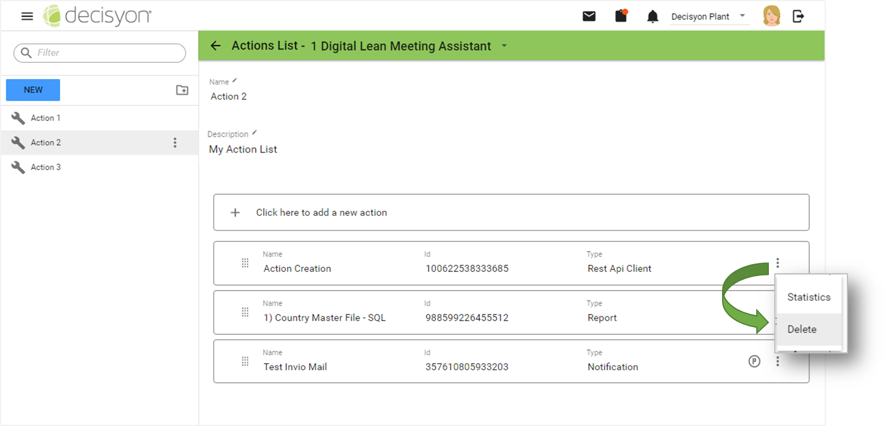
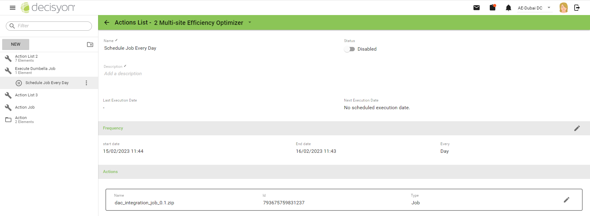

# Action List

## Introduction 

**Action List** is a an object of App Composer that can be used to execute sequentially a list of other objects, called **Actions**.&#x20;

The actions/object that could be included in the Action List are:

* [Report](../../report/report-1/)
* [Notification](../untitled.md)
* [REST API Client](../../sdk-and-api/rest-api-client.md)
* [Rule](../alert-and-rules/rule-setup.md)
* [Job](../jobs.md)

The execution of an Action List can be triggered by:

* a widget "Execute Button" used in a page
* REST API
* Schedule based: in this case they are called **Scheduled Action List.**&#x20;

These are some use case where Action Lists could be used:



I need to send an email to the cyber security team and another separate email to the system administrator every day at 8:00 AM. The email contains the list of active users.



When the user click a button in a page, I need to send a request to a simulator service passing to it the parameters in the page and I need to send also an email to the service administrator.



When there is a downtime on the line, I want the line gateway to trigger via API the execution of a specific App Composer job and the execution on a rule that verify if the downtime is greater than 20 minutes. If yes, send an email to the shift supervisor.



Scheduled Action List can be configured in the same page where the Action List is defined: select the menu item **Administration -->Action List** from the **Side Navigation Menu**.

<figure><figcaption></figcaption></figure>

It is possible to schedule the execution of an Action List using the menu item and clicking on **Create Schedule.** See the [following chapter](./#schedule-action-list) for more details.

<figure><figcaption></figcaption></figure>

For each Action List you can execute several actions from the contextual menu.

<figure><figcaption></figcaption></figure>

**Create schedule:** To create a new scheduled execution of the selected Action list. A dedicated dialog will open to input the settings of the scheduling

**Delete:** To permanently delete the Action List.

**Change folder:** To move the Action List in another subfolder in the action list catalog.

**Show info:** To show the actions list details

The details provided are:

* **id:** unique code assigned to the action list
* **Owner:** Identification code of the application to which the action list belongs to
* **Type:** name of the App Composer internal type
* **Type id:** unique code of the App Composer internal type
* **Created by:** username of the user who created the action list
* **Created:** Date and time of creation
* **Edited By:** Name of the user who last modified the action list
* **Edited:** Date and time of last modify

<figure><figcaption></figcaption></figure>

## Action List 

To create a new **Action List** click the new button.

<figure><figcaption></figcaption></figure>

The dialog requirs to input:

* **Name**: the name of the action list
* **Folder**: the folder to save the new Action List to. If no folder is selected, the Action List will be saved in the root of the catalog.

Once you create the new action list you can input a description.

<figure><figcaption></figcaption></figure>


Both the description and the name of the Action List can be later modified


### Actions

After creating the Action List it's possible to add the single actions to the action list.

<figure><figcaption></figcaption></figure>

To add an action select the button "Click here to add a new action" and then select the **type** of object and then select the object that will be associted as **action**

<figure><figcaption></figcaption></figure>

After selecting the action click the ADD button and the new action appears on the main screen.

<figure><figcaption></figcaption></figure>

For each action you activate a menu that you enable by selecting the icon with the three dots on the side.

<figure><figcaption></figcaption></figure>

**Statistics:** It's possible to display the execution statistics of each single action in the action list. See the [dedicated chapter](./#actionlist-executionlogexecutionlog) for more info.

**Delete:** remove the association of the action from the action list.

### Actions execution order 

The actions in the actions list are executed in the same order defined in the user interface, from top to bottom. To change the execution order it's possible to drag\&drop the action to the desired position.


If during the execution of an Action List one of the associated Action fails, the system will still continue the execution of the remaining Actiona and will shows in the execution log the errors raised during the failed execution.


In the image we can see that the order of execution of the actions is as follows:

* Report
* Rest API Client
* Notification

If you want to reverse the execution order, simply drag the desired position of the action.

<figure><figcaption></figcaption></figure>

### Action with parameters 

The **P** icon indicates that the object associated as action contains parameters that can be configured when executing it.&#x20;

<figure><figcaption></figcaption></figure>

When an Action List is associated to the "Execute Button" widget, it's then possible to use the property `action-list-params-mapping` to assign to the parameter of each single action one of the parameters available in the page.

<figure><figcaption></figcaption></figure>


Remember that parameters can be mapped from the "Execute Object" widget or in a [Scheduled Action List](./#actionlist-modificadeiparametridiunaschedulazione), but not in a simple Action List.


If you do not map the parameters, the object associated to the action will be executed without a value for the selected parameter and the bevahviour depends on the type of objects. I.e. if you are executing a report with a parametri direct filter, the filter will not be considered in the execution; if you are executing a REST API, the parameter will be an empty string, resulting in a possible error in the request.

### **Execution Logs and Statistics** 

Each execution of an action list is logged by App Composer and it's possible to disaply the details of each execution.&#x20;

<figure><figcaption></figcaption></figure>

For each execution, the following information are recorded:

* **Invoker**: name of the object that invoked the execution, i.e. widget "Execute Button" or a Scheduled Action List.
* **ID**: unique code of the single execution&#x20;
* **Start at** : start time of execution of the object
* **Duration**: the duration of the execution
* **Status**: the status of the execution


Please note that the execution of the actions in the action list continutes even if one single execution raised an error.&#x20;


When the Action List is **completed** it means that all the association actions were executed successfully. When the Action List is in **error** it means that at least one of the associated action raised an error during the execution. To know the execution status of each single action associated to a specific action list you can click on the arrow icon on the left.

<figure><figcaption></figcaption></figure>

In the picture above, you can see that one action is completed with additional information .png>) and one action raised an error .png>). You can click on the icon to display the details

In this example, the action "notification" is completed but some emais where not delivered because users have invalid email address. It's not a blocking point to execute the notification, but it's a kind of error what the administrator should be aware of.

<figure><figcaption></figcaption></figure>

It's possible to display the execution statistics generated by the Action List or by a single action.

* **Average duration** : average duration of the historical execution of the action list
* **Total execution count**: total number of executions (both successfull and in error)&#x20;
* **Total execution error count**: total number of executions with status "error".

<figure><figcaption></figcaption></figure>


When you edit the action list e.g. by adding/removing an action, the statistics are restored.


<figure><figcaption></figcaption></figure>

## Schedule Action List

When an Action List is scheduled, it is defined **Scheduled Action List.** One Action List may have one o more schedules, but each schedule belong to only one action list. Once the Action List is created, to create the schedule:

1. Open the contextual menu of the Action List and click _Create Schedule_
2. Set name and description (optional) in the **details** tab
3. Set **frequency**
4. **Enable** the schedule

<figure><figcaption></figcaption></figure>

<figure><figcaption></figcaption></figure>

<figure><figcaption></figcaption></figure>

* **Name:** Insert name the schedule
* **Description**: optionally aìinsert a  description.
* **Start Date:** select the start date and time when the schedule starts
* **End Date:** select the start date and time when the schedule ends
* **Every:** defines each time the schedule is repeated. The value is a numeric.
* **Period:** the period of execution (day, month etc).png>)

For example if you set Every= 1 and Period= Day, the execution is scheduled 1 time per day. The action list is executed only between the defined start date and end date, after the end date it will be set as expired.

**Enable Cron Time String :** if enable&#x64;**,**  it is possible to define a more complex scheduling using a [crontab expression](https://en.wikipedia.org/wiki/Cron). Below some examples crontab expressions. 

| Expression                 | Example                                                                                                          |
| -------------------------- | ---------------------------------------------------------------------------------------------------------------- |
| `0 0 12 * * ?`             | At 12:00 (AM) every Day                                                                                          |
| `0 15 10 ? * *`            | At 10:15 every Day                                                                                               |
| `0 15 10 * * ?`            | At 10:15  every Day                                                                                              |
| `0 15 10 * * ? *`          | At 10:15 every Day                                                                                               |
| `0 15 10 * * ? 2005`       | At 10:15  every Day in 2005                                                                                      |
| `0 * 14 * * ?`             | Every minute from 14:00 and ends at 14:59, every day                                                             |
| `0 0/5 14 * * ?`           | Every 5 minutes from 14:00 and ends at 14:55, every day                                                          |
| `0 0/5 14,18 * * ?`        | Active every 5 minutes from 14:00 and ends at 14:55, and every 5 minutes from 18:00 and ends at 18:55, every day |
| `0 0-5 14 * * ?`           | Active every minute from 14:00 and ends at 14:05, every day                                                      |
| `0 10,44 14 ? 3 WED`       | Active at 14:10 and 14:44 every Wednesday in March.                                                              |
| `0 15 10 ? * MON-FRI`      | Open at 10:15 every Monday, Tuesday, Wednesday, Thursday and Friday                                              |
| `0 15 10 15 * ?`           | Active at 10:15 on the 15th of each month                                                                        |
| `0 15 10 L * ?`            | Active at 10:15 on the last day of each month                                                                    |
| `0 15 10 L-2 * ?`          | Active at 10:15 on the penultimate last day of each month                                                        |
| `0 15 10 ? * 6L`           | Open at 10:15 on the last Friday of each month                                                                   |
| `0 15 10 ? * 6L`           | Open at 10:15 on the last Friday of each month                                                                   |
| `0 15 10 ? * 6L 2002-2005` | Active at 10:15 every last Friday of each month in the years 2002, 2003, 2004 and 2005                           |
| `0 15 10 ? * 6#3`          | Open at 10:15 on the third Friday of each month                                                                  |
| `0 0 12 1/5 * ?`           | Active at 12:00 (noon) every 5 days every month, starting from the first day of the month.                       |
| `0 11 11 11 11 ?`          | Every November 11th at 11:11.                                                                                    |

When a schedule is created by default it is disabled and you need to manually enable it using the button highlighted in the figure.


Using the Disabled/Enabled button is very useful if scheduling is to be disabled for a period of time. This avoids deleting and recreating the schedule.


<figure><figcaption></figcaption></figure>

When a schedule is enabled again after being disabled, App Composer will show the last execution date and next execution date.

### Excution Status 

The icon next to the Scheduled Action List shows the status of the schedule and it is refreshed in real time.

<figure><figcaption></figcaption></figure>

The status that can assumed by the Scheduled Action List are the following:

<table><thead><tr><th width="100">Icon</th><th width="170">Status</th><th>Description</th></tr></thead><tbody><tr><td></td><td>Running</td><td>Currently in execution</td></tr><tr><td></td><td>Enabled</td><td>Ready to be executed</td></tr><tr><td></td><td>Disabled</td><td>It will not be excuted at the defined scheduling</td></tr><tr><td></td><td>Expired</td><td>It is expired because the end date has been reached</td></tr><tr><td></td><td>Error</td><td>The last execution raised an error</td></tr><tr><td></td><td>Unkown Status</td><td>System failed to recover the status of the scheduling</td></tr></tbody></table>

### Assign parameters values 

If the object used as action has been configured to use parameters, it is possible to assign a value to the parameter so that it will be used during the scheduled execution. Click on the pencil icon and input the parameter's value in the dialog.

<figure><figcaption></figcaption></figure>

### Managing Schedule Action List

For each Schedule Action List you can open the contextual menu to execute some operation.

<figure><figcaption></figcaption></figure>

**Delete**: To permanently delete a Schedule Action List.

**Execution Log:** shows the execution log of the selected schedule. For more details see the [Execution Log](./#actionlist-executionlogexecutionlog) chapter of the Action List.

**Show Info:** shows the details

The pencil icon.png>) shows the fields that can be modifed. Once you click the enter button, the new value is saved.

<figure><figcaption></figcaption></figure>

To change the frequency of execution of the schedule, select the pencil icon, as shown in the figure below.

<figure><figcaption></figcaption></figure>

### Add Job as Action 

[Jobs](../jobs.md) can be added as Actions within the an Action List and thus it's possible to execute and schedule them together with others actions.

When a job initially published and associated with an action list is later unpublished, the single action will raise an execution error.


When a job is included in the action list it is executed synchronously.


To add a job, select type "job" and then select the job from the list.

<figure><figcaption></figcaption></figure>

Create a new Schedule Action List.

<figure><figcaption></figcaption></figure>

When scheduling a job, the job's context and context variables are configures as parameters and it is possible to assign a value that will be used when the job is executed.

<figure><figcaption></figcaption></figure>


Remember that the parameters are configurable only from the Schedule Action List.


If the the zip file of an already published job is modified, any Action List and Schedule Action List that use it as Action will be automatically refreshed after the version will be refreshed in the [jobs section](../jobs.md#howtousedumbellaservice-managingjobs).

If the modified job and the previous version had values assigned to parameters and those parameters are still present in the new version of the job, the value that was initially set will be retained. If the new job version includes new parameters, they will be displayed among the configurable ones. Parameters that no longer exist in the job will no longer be displayed.

When a job version is updated, the status of the associated Schedule Action List will be maintained.

## Synchronization of Action Lists and Scheduled Action Lists

Action Lists can be synchronized between App Composer instances, in example between a development and a production environment.&#x20;

All the objects used as actions in the Action List will be synchronized as dependencies of the Action List, if the dependency calculation is selected in the synchronization dialog in Design Studio.

In the target environment, the Actions list is imported in the same catalog path as the source environment, overwriting any different folder tree available in the catalog of Action List of the target environment.

Any page containing **Execute Buttons** configured to use an Action List will have the associated action list as a dependency in the synchronization.

Schedule Action Lists can be synchronized between App Composer instances, in example between a development and a production environment.

When executing the synchronization of the Schedule Action List:&#x20;

* will have as dependency the Action List to which it is associated
* will keep the state Enabled/Disabled that has in the source environment.

When you sync a Dumbella job associated to an Action List, then in the target environment the jobs resource version in Dumbella will be the same as the synchronized one.


When the job is synchronized because associated to an Action List, only the zip file of the job available in the resource catalog is copied from the source environment to the target environment. In the target environment, you need to refresh the version of the job from the Jobs user interface. Please refere to "[Job](../jobs.md)" for more details.

