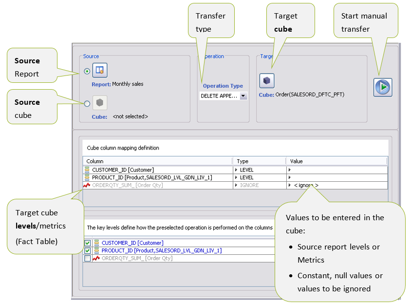

# DLR - Data Load via Report

The DLR Designer module (Report Data Transfer) defines a data transfer operation from one or more source Cubes to a target Cube.

The source for data retrieval can be a report or a Cube.

The report is created so it meets the needs of loading data into the target Cube.

You define the data to be transferred **from the report to the target Cube** by mapping between the columns in the Fact Table of the target Cube and the levels/Metrics of the report. Null or constant values can also be assigned, or the field can be ignored. In the latter case, the default value will be assigned as defined for the table.

You also define the data to be transferred from the **source Cube to the target Cube** by **mapping** between the columns in the Fact Table of the target Cube and the levels (also those hierarchically higher) and first level Metrics of the source Cube. However, it is fundamental for the source Cube data to be transferred just as they are, without being manipulated.

Data transfer operations are:

* entering new events in the target Cube
* updating events in the target Cube
* deleting events in the target Cube
* deleting/entering (in the same transaction) updates the events in the target Cube by deleting the events to be updated beforehand, and then makes the entry
* delete/entry (in the same transaction) for an update of the events of the cube and subsequent entry of the new ones, in order to obtain an update which also considers the simultaneous entry of any new records (possibly not duplicated).

The data transfer process provides tools for tracking the operations [performed in relation](/broken/pages/-MjTNXjnwPHcZLMAYWdz#_Registrazione_operazioni_di) to the entries or modifications made in the target Cubes or to failed entries.

To define a data transfer, access the **DLR Designer** module from the **Application** menu item.

Use the .png>) button to select the _**SOURCE REPORT**_.

Use the .png>) button to select the _**SOURCE CUBE**_.

Use the .png>) button to select the _**TARGET CUBE**_ (next to the name of the cube chosen, the name of the related fact table is reported).

_**DATA TRANSFER TYPE**_ is selected from the _Operation Type_ menu, where the different modes are listed:

* [APPEND](data-load-via-report-dlr.md#dlr-in-append) for a new entry
* [UPDATE](data-load-via-report-dlr.md#dlr-in-update) for a direct update, with preventive deletion of the events to be updated
* [DELETE](data-load-via-report-dlr.md#dlr-in-delete) to delete events
* [DELETE APPEND](data-load-via-report-dlr.md#dlr-in-delete-append) preventive cancelation of the events to be updated and subsequent entry
* [APPEND UPDATE](data-load-via-report-dlr.md#dlr-in-append-update) to update and make entries in the same transaction

In the DLR creation phase, the system automatically maps the levels after you have selected the target Cube and the source report/Cube. The default system displays all common levels between the two objects.

In the central section, the **mapping** is defined on the values to be assigned to the columns of the fact table of the target cube (in short _column of the cube_).

* On the left, the columns in the Fact Table of the target Cube (_Column_) are listed with the respective reference to the levels and Metrics mapped on them (indicated between square brackets). Columns may exist on which both Metrics and levels are mapped. In this case, the names of both are indicated.
* In the central section (_Type_) and to the right (_Value_) set the type of mapping:
  * _Type_ is a LEVEL or METRIC, for the mapping on the levels and metrics of the source report; in Value the levels or metrics in the report are listed
  * _Type is_ a _CONSTANT_, to assign a constant value to the column of the cube; _in_ Value enter the value
  * IGNORE, to ignore the field in the data transfer; _Value_ is not applicable and reports the name of the mapping type
  * NULL, to assign a _null_ value to the field; _Value_ is not applicable and reports the name of the mapping type.

.png>)

If in the source report a level in page-by is set to "Total", this is not available for mapping operations, since it is totaled with respect to this element.

In addition, the levels of the report usable in the mapping are only the visible ones: therefore if in the report the levels are grouped, only the hierarchically superior level will be available for the mapping.

**Note:** _In the DLR creation phase, the common levels are automatically mapped after you have selected the target Cube and source repor&#x74;**.**_

If a level or Metric is deleted from the source report, the DLR is invalidated. In the _Value_ section the removed level/metric is highlighted in red.

.png>)

However, if you remove a column in the Fact Table of the target Cube, it will no longer appear in the mapping of the DLR (and there will be no consequences in the validation of the same DLR process).

After you have created a DLR, you can perform it in the following modes:

* Manual mode, through the **Execute DLR** button
* Scheduled mode, through a rule defined with the _Scheduler module._

In manual mode, a progress window monitors the transfer operation and also interrupts it, when necessary.

.png>)

**Note:** During the execution of the DLR, the system verifies that the source report and the target Cube reside on the same data source.

## DLR in APPEND

This type of operation enters new records in the table of the target cube.

The value set in each column is defined through the mapping set in the DLR.

Configure it as follows:

* In _**Operation Type**_ select the item _**APPEND**_
* In the **mapping** define the data to be entered in each column of the target cube, choosing among the possibilities below:
  * The value associated with the level or metric (_Type_ is a _LEVEL_/_METRIC_) of the source cube or report
  * a constant value (_Type_ is a _CONSTANT_), entered in _Value_
  * a null value (_Type_ is a _NULL)_
  * no value (_Type_ is an _IGNORE_); if a default value is set in the table of the database, this will be applied instead of the null value.

.png>)

From the _**append-where-not-exist**_ property, the entry of a row in the Cube is only enabled if it does not already exist. If you want to duplicate rows, disable the property.

## DLR in UPDATE

The transfer of data to update the events of the target cube is applied by selecting _**UPDATE**_ in the transfer type, which replaces of the events of the cube, with those of the source report.

Events to be updated are identified by the join conditions between:

* the columns of the target cube, chosen in the bottom pane (key columns)
* the values set in the mapping section, for these same columns. In the mapping section, the values to be assigned to the key columns of the Cube may be:
  * levels or metrics of the source report (_Type_ a _LEVEL_//_METRIC_), chosen in _Value_
  * a constant value (_Type_ a _CONSTANT_), entered in _Value_
  * a null value (_Type_ a _NULL)_

.png>)

_**–**_**Note:** _All key fields of the common levels between the target Cube and the source report are selected by default._

The updated data relates to the remaining columns of the cube, i.e. those not defined as key.

**Note:** _An exception is generated if the source report has a higher number of rows to be updated than the target Cube._

In the DLR execution phase:

* The lines associated with the level keys, present in the source report, but not in the target cube, are ignored.
* If duplicate lines with respect to the level key are not present in the source report, the system does not execute the update operation, generating an exception.

## DLR in DELETE

This type of operation allows you to eliminate the rows from the Fact Table of the target Cube:

* select as transfer type the _**DELETE**_ item
* in mapping the events to be deleted are defined, identified by the join conditions between:
* the columns of the target cube
* the respective values set between:
  * levels or Metrics of the source report,
  * constant or null values

The columns where Type is set _to_ IGNORE _will_ not be considered in the _**join**_ _conditions_.

.png>)

## DLR in DELETE APPEND

The DLR being deleted and subsequently entered define the data transfer process involving the preventive deletion of the events to be updated and the new entry.

The configuration of the process is as follows:

* select **DELETE APPEND** as transfer type
* define the join conditions to identify the events to be deleted, using the same modes as the update DLRs (join conditions for the events to be updated)

All the rows of the target Cube are deleted by default (no check is performed to verify whether or not they are in the source report) for subsequent replacement. When you enable the **delete-where-exist** property (_Delete_ group), only the rows in the source report are deleted.

.png>)

The data to be entered is defined with the same modes defined for the [entry DLR](/broken/pages/-MjTNXjnwPHcZLMAYWdz#_Mapping);

**Note:** _All key fields of the common levels between the target Cube and the source report are selected by default._

## DLR in APPEND, UPDATE

The update/entry DLRs define both an update and entry data transfer on the target Cube.

Configure it as follows:

* select as transfer type the _**APPEND UPDATE**_ item
* set the events to be UPDATED using the same modes defined for the [update DLRs](/broken/pages/-MjTNXjnwPHcZLMAYWdz#_RDT_in_aggiornamento);

The updated data relate to the columns of the _**Cube with UPDATE checked**_. The columns with the flag deselected are ignored during the update, and are only considered for the entry phase

.png>)

* Set the events to be ENTERED with the same modes defined for the [entry DLR](/broken/pages/-MjTNXjnwPHcZLMAYWdz#_Mapping); the flag UPDATE and the section of the key fields are ignored

The execution sequence of the APPEND-UPDATE first includes the updating of the rows and then the entry of the new ones. This way, you avoid unnecessarily updating the rows just entered.

In addition the selection of the _**append-where-exist**_ property enables the entry of a row in the cube, only if this is not already present, thus avoiding duplicating the rows, set in the mapping for the update only.

Therefore the system first updates the target cube according to what is established and subsequently enters the new rows still using the same type of mapping.

## DLR Registration Operations

During the execution of the DLR processes it is possible to track the operations performed by the system by enabling the properties:

* **data-tracing** (_Main_ group) to register the operations carried out, which are saved in a specific table, whose name is the result of the concatenation of the Fact Table of the target Cube, with the suffix _**\_LOG**_
* **records-unmatching** (_Main_ group) to keep the rows which the DLR process is unable to update

The registration takes place in a column of the fact table of the target cube; the column is the LAST\_COMMIT\_SEQ. If you also want to use this registration for the BI Cubes, you first have to create the column in the respective Fact Table.

## Examples of DLR Between Source and Target Cube

Some data transfer cases are represented below, from a SOURCE cube to a TARGET cube. For each example a description is provided on how to build the source report and how to define the mapping on the target cube, so that the data transfer is successful. Here are the cases:

* **EXAMPLE 1** the source Cube has less aggregated dimensional levels than the target Cube
* **EXAMPLE** **2** the source Cube has an extra level compared to the target Cube, in addition to less aggregated dimensional levels
* **EXAMPLE 3** the source Cube has fewer levels than the target Cube and the source Metric is repeated internally for the missing level
* **EXAMPLE** **4** the source Cube has fewer levels than the target Cube and the source Metric is divided on the missing level by using the division of the previous year as driver
* **EXAMPLE 5** in the data transfer, you only want to translate the value of the Metric on a different month
* **EXAMPLE 6** the source cube and the target cube coincide. The transfer operations will only affect calculating a Metric, starting from the others in the same Cube.

EXAMPLE 1 - Target with Aggregated Levels

SOURCE TARGET with aggregated levels

.png>)

_In this example the source cube has fewer aggregated levels compared to the target cube (Product in the source, while in the target cube there is the Family aggregate, with the same considerations between the month and year levels)_

_The report will be built with aggregated levels in the TARGET cube._

_In the mapping of the Target cube, choose the same LEVELS and METRICS of the source report_

_In the case of UPDATE with key fields on the Target levels (Family and Year), the Metric Quantity is updated._

_In case of ENTRY or DELETE, all the elements in the report are entered/deleted._

EXAMPLE 2 - Target with Missing Level

**SOURCE TARGET with missing level**

.png>)

_In this example the source cube has an extra level compared to the target cube (Region in the source, while in Target it is absent)._

_The report will be built with aggregated levels in the Target cube and without the Region level: the data will be aggregated compared to the missing level._

_In the mapping of the Target cube, choose the same LEVELS and METRICS of the source report._

_In case of UPDATE with key fields on the Target levels (Family and Year), the Metric Quantity is updated. In case of ENTRY or DELETE, all the elements in the report are entered/deleted._

EXAMPLE 3 - Source with missing level (same value of the metric on the Target)

SOURCE TARGET with more levels

.png>)

_Example of source Cube with fewer levels than the target Cube._

_The source has a level produced with the related price (measure), to be reported in a target cube._

_In addition to the product level, the target has customer and month levels. It has quantity and price for the measures._

_The report is only built with the levels and Metrics in the source._

_When you are performing the mapping, select the same levels and Metrics of the source report, and ignore the extra levels of the target Cube._

_Only the case of UPDATE is envisaged, where the key field is the global level with the source (Product): this assignment reports the value of the Price metric repeated for all the customers and months associated with the same product._

EXAMPLE 4 - Source with missing level (driver LY for the metric on the Target)

SOURCE TARGET with more levels and driver on LY

.png>)

_In this example, you have two source Cubes, where the first Cube (SOURCE A) has fewer levels than the target Cube (SOURCE A with quantity of the products ordered by month). The ordered quantity in the target is also divided by region._

_The aim is to transfer the ordered quantity of SOURCE A to the TARGET Cube by allocating this quantity to the regions according to the proportions of the previous year, which are provided by the SOURCE B Cube. To obtain the regional percentages of the previous year, the following Metrics are defined on the Order Qty B measure of SOURCE B:_

1. _Ordered quantity of the previous year Order Qty B (LY): the LY function is applied_
2. _Total quantity ordered the previous year for all the regions Order Qty B (LY, Total ):_

* _the LY function is applied_
* _the Sum Metric function is applied by deleting the partitioning on the region (Default = Partition and Region = No Partition), or you dimension the region and deselect the Group by property_

_The percentage to be applied to the SOURCE A ordered quantity will be:_

_Therefore, the Metric is defined for the division of the ordered quantity by product and month (Order Qty A), according to the regional percentages of the previous year:_

.png>)

The source report will be built with the levels of the target and with the metrics defined previously, even if only the latter would suffice and will be assigned in mapping to the _Order Qty_ metric of the Target cube. Instead of the levels, the mapping 1 to 1 is performed with the respective levels of the source report, which will also constitute the key fields.

EXAMPLE 5 - Value Translation on a Level

SOURCE TARGET with translation

.png>)

_In this example the source and target cube have the same levels, but in the data transfer you only want to translate the value of the metric on a different month (the quantity of a particular product, sold in January that you want to move to March). The months, on which to translate the values, are saved in a table (Level Dimension in the figure), where for each product the month of the SOURCE cube and the translation correspondent are indicated (Month Trans)._

_A dimensional level is defined to be added to the Month dimension, defined as parent of Month and mapped on the Month Trans field. The source report is defined with the Product and Month Trans levels, while the metric is Quantity._

_In the mapping of the month on the Target cube, choose the Month Trans level just created, while for the product and metric set a mapping 1 to 1 with the source report._

_The key fields will be all those of the levels of the Target (Product and Month)_

EXAMPLE 6 - Coinciding Data Transfer

SOURCE TARGET coinciding

.png>)

_In this example the source cube and the target cube are the same. The transfer operations will only affect the calculation of the Value Metric, obtained as the product of the other two Metrics of the Cube (Quantity and Price)._

_For this purpose, the Value (calc) Composite Metric is created and entered in the source report, together with the Cube levels._

_In the mapping of the Target cube, the same LEVELS of the source report are chosen, while for the metrics it is possible to ignore them, except for the Value metric, which will be valued with the new compound metric Value (calc)._

_The key fields will be all those of the levels of the Target (Product and Month)._
