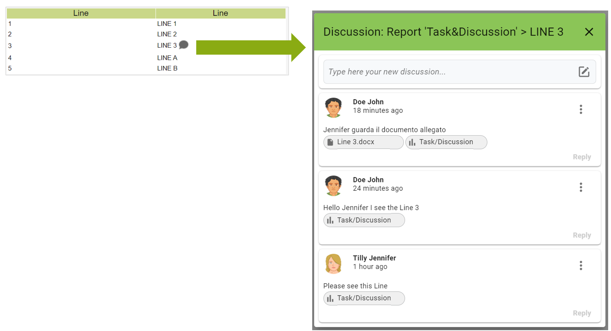

# Discussion

DAC provides a Collaboration solution to associate comments, production notes or other information to the data available in the reports. The users are given the ability to reply and initiate a discussion.

<figure><figcaption></figcaption></figure>

To enable report discussion, select the **Collaboration** property group from the **Properties** tab.

<figure><figcaption></figcaption></figure>

* **activateCellsDiscussion** enables the Attach Discussion item in the pop-up menu of DAC report cells. This property enables the following:
  * **shared-context** enables context sharing with other reports, so that discussions in it can be useful not only on the report itself, but also on other reports.
  * **context-id** is the shared context identifier if, for example, two reports have the same context-id when a discussion is submitted on a certain level (such as product), this will also be visible on the second report. Please see **Share the context**

**Note:** Users can comment on or change Discussions on all the reports that share the context, if they have the permissions on at least one of the reports.

### Content Menu 

For each message there is a menu on the right with the following items:

* **Edit**: to edit the message
* **Remove**: permanently removes the message
* **I’m not interested** / **I’m interested** : you can decide whether or not to receive notifications for a discussion

### Edit Message 

To edit a message, select Edit from the menu. You can edit both the text of the message and remove any attached documents.

<figure><figcaption></figcaption></figure>

### **Remove message** 

To remove a message, select **Remove** from the side menu.

<figure><figcaption></figcaption></figure>

Both the message and any attachments will be permanently removed. The message will be removed from the discussion but there is still a trace of it.

<figure><figcaption></figcaption></figure>

### How to follow or not a discussion 

When you are interested in following a discussion opened by another user you can activate from the side menu of the discussion the option **I’m interested.**

<figure><figcaption></figcaption></figure>

The DAC will send a notification ([**Notification section**](../../app-functionality/untitled.md)) every time new messages are inserted for the discussion you are interested in.

<figure><figcaption></figcaption></figure>

If you are not interested in the discussion you can select the option **I’m not interested**

<figure><figcaption></figcaption></figure>

### How to reply to a message 

To reply to a message, select the replay item at the bottom right and enter a new message and any attachments.

<figure><figcaption></figcaption></figure>

#### Enabling Page widget  

The Page widget on which discussions can be used are:

* Table
* Crosstabs
* Graph

You can enable the use of discussions on these components in DAC by enabling the **activateDiscussions** property in the **Title** group.

This will allow DAC users to enter discussions. The icon identifying the discussions appears on the title of the component, and from this users can enter their messages.

**Step 1: Enabling Discussion Page component**

<figure><figcaption></figcaption></figure>

Enable a graph component to use annotations. Create a Page with a graph component.

* Enable annotations: activateDiscussion property of the Title group

**Step 2: Using Discussions on DAC**

<figure><figcaption></figcaption></figure>

Access the Page created in step 1. The Discussion icon will be on the graph title. Move to the icon and click it to open the callout and insert a message.

### Share the context 

Open discussions on one level of a report can be shared on all reports that have that level. To do this, it will be enough to activate the **shared-context** property for all the reports that will share the context and associate the same context identifier in the **Constex-id property**.

In the example below we have the Report A and the Report B. Both have selected the **shared-context** property and inserted the same context identifier Context-id.

* **shared-context** is active
  * **context-id** : ID01

<figure><figcaption></figcaption></figure>

When we go from Web to create a discussion for example on a Plant, after updating the page, the same discussion will be displayed on the same plant of the report B.

