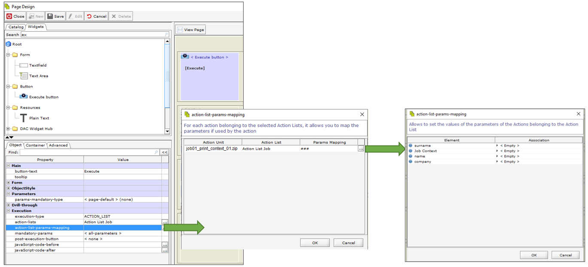

# Action List Examples

### How to execute an Action list using the widget Execute Button 

&#x20;**GOAL**: run an Action List through Execute Button where the execution of a Notification is scheduled.

&#x20;**Introduction**: The example will be taken from the fields of a form.

* You will define the First Name and Last Name and the selection of a Material.
* When you select the Save button you will run the Action List where you schedule the sending of an email.
* The recipient of the email will receive the first name and last name of the user in the body of the email. Let’s see how.


To know in detail the properties of the Widget Execute Button please read the documentation [https://widgets.decisyon.com/button-1/](https://widgets.decisyon.com/button-1/) .


**Step 1. Action List**

<figure><figcaption></figcaption></figure>

Create an Action List with an associated Notification type action.

As can be seen in the figure, the Associated Action is of the Notification type. (vedi **How to create a New Action List**)

The notification will send an email in which the values entered by the user in the form will be passed.

**Step 2 Page Designer**

<figure><figcaption></figcaption></figure>

The image shows the page structure and the result from the web. In this case the Form template explained in the chapter has been taken as a reference [**Pattern Composite**](https://documentation.decisyon.com/documentation/design-studio/page-designer/page-layout/commons-patterns/pattern-composite)**.** The only difference from the Form tempalte are the buttons at the bottom. Instead of Button widgets we use the Execute Button widget to be able to run an Action List.

**Step 3 - Configure Execute button**

<figure><figcaption></figcaption></figure>

Let’s now see how to configure the Execute Button to run the Action List.

Group of Properties Execution:

1. **action-list:** select the Action List created in the Run Time Action List module
2. **action-list-params-mapping:** mapping between the parameters of the Action and the parameters of the page. 3. The parameters of the Notification Action are mapped respectively with the values from the Widges of the page .

**Step 4 - Show result on web**

<figure><figcaption></figcaption></figure>

When the user accesses the form and values the fields, then press the enter key that will execute the Action List with the Email notification. The Email shows the values set in the Form.

<figure><figcaption></figcaption></figure>

### How to execute the Action List with Action as JOB using the Execute Button 

Goal: Run an Action List with a Job action using the Execute Button Widget.

**Step1. Create an action list**

<figure><figcaption></figcaption></figure>

From the Action List module, create an Action List and associate an Action such as Job Dumbella

**Step 2. Create a page with an execute button**

<figure><figcaption></figcaption></figure>

Create a page containing a Widget Type Execute Button.&#x20;

Set the following properties:

* execution-type: ACTION\_LIST
* action.list: Select the action list created in the previous step.
* If the Job has parameters that need to be enhanced then map.
  * action-list-param-mapping: For each action belonging to the selected Action Lists, it allows you to map the parameters if used by the action.
  * Allows to set the values of the parameters of the Actions belonging to the Action List.

When the button clicked, the JOB is executed.
