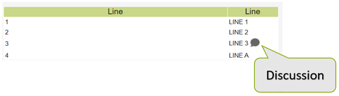

# Contextual collaboration

DAC offers functionalities for Collaboration related to the data.

It is possible to start [discussions ](discussion.md)on the individual cells of the report.

&#x20;

<figure><figcaption></figcaption></figure>

DAC users can use these functions only on the reports enabled by the administrator.

The following figure highlights the collaboration menu items enabled on the report .

<figure><figcaption></figcaption></figure>

You can also define a shared context between reports, so that multiple reports can share the Discussions :

For example, when a discussion on a certain level (such as product) is added, this will also be visible on the second report if the two reports share the same context.

The **Discussion** on the report is enabled by the property (Collaboration group)&#x20;

<figure><figcaption></figcaption></figure>

### Discussion 

To enable report discussion , select the **Collaboration** property group from the **Properties** tab.

<figure><figcaption></figcaption></figure>

<figure><figcaption></figcaption></figure>

* **activateCellsDiscussion** enables the Attach Discussion item in the pop-up menu of DAC report cells. This property enables the following:
  * **shared-context** enables context sharing with other reports, so that discussions in it can be useful not only on the report itself, but also on other reports.
  * **context-id** is the shared context identifier

If, for example, two reports have the same context-id when a discussion is submitted on a certain level (such as product), this will also be visible on the second report.

**Note:** Users can comment on or change Discussions on all the reports that share the context, if they have the permissions on at least one of the reports.

**Discussion Enabled on the Report Cells**

<figure><figcaption></figcaption></figure>


