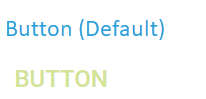
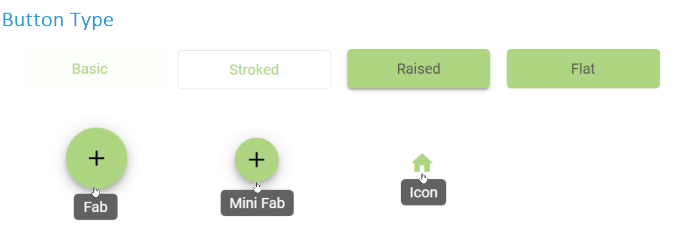
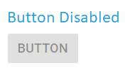
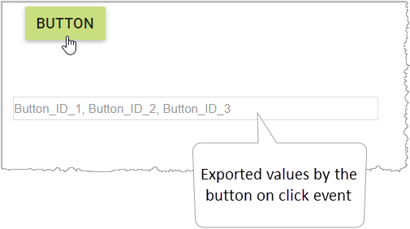
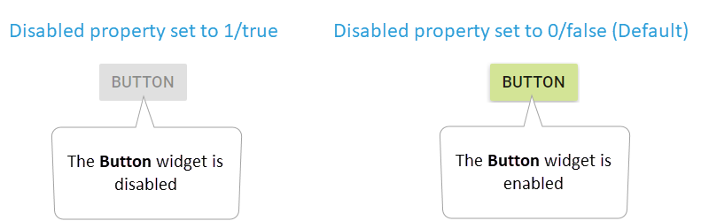
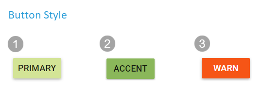
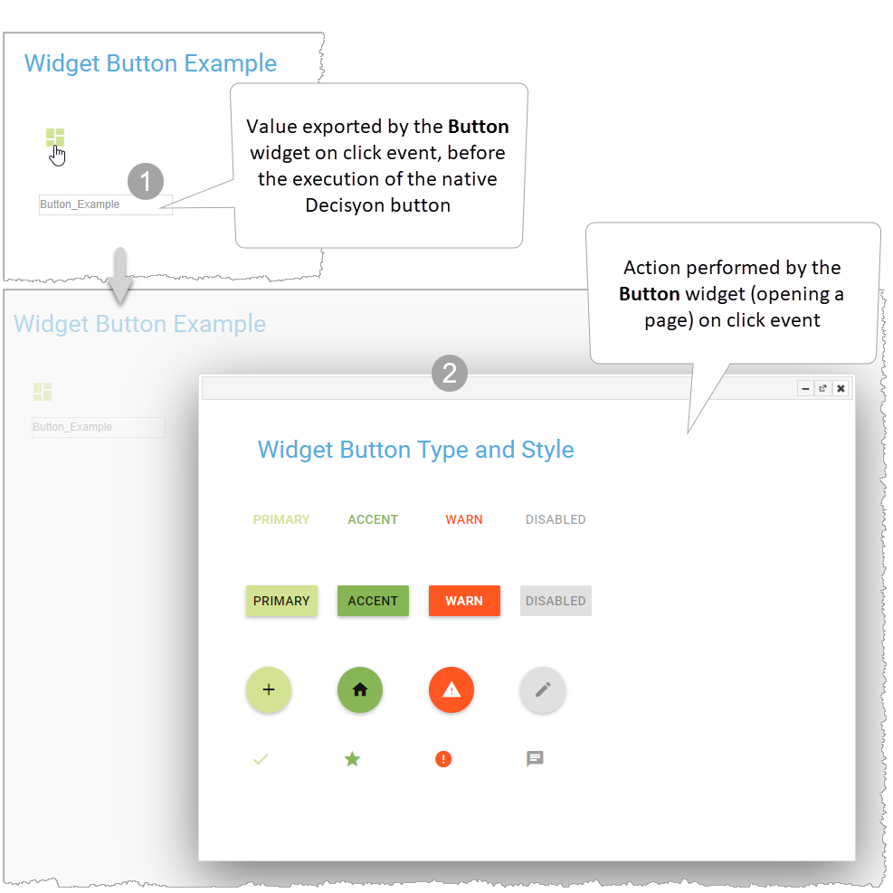

---
metaLinks:
  alternates:
    - https://app.gitbook.com/s/h9Knuj2BfqZwIB5BI7sj/documentation/button-3.0
---

# Button 3.1

## Overview 

Use the **Button** widget to easily design different types of controls that perform actions with a single tap. The widget will export values or a parameter on click events.



The picture shows different predefined types and styles of **Button** widget designed with minimal configuration. You can associate custom actions to the buttons and export values on click events as parameters on the page.

<figure><figcaption></figcaption></figure>

The **Button** is a widget where execution is run on a user click. It is possible to associate custom actions to the button, for example, a SQL statement, call a stored procedure, open pages, execute custom code, etc… The widget will export value/s on click events.

By default, the **Button** widget is a **Basic button.** It is a button that uses a label and does not have visible borders and a filled background.

You can easily customize the widget appearance and design different buttons based on your application scenarios. It has several built-in features as support for icons, tooltips, predefined styles, different button types, different button sizes, and color customization.

You can choose from built-in button **types**, such as **Basic,** **Stroked**, **Raised**, **Flat**, **Fab**, **Mini Fab**, and **Icon**.

<figure><figcaption></figcaption></figure>

You can choose from predefined **styles** for coloring, such as **Primary**, **Accent**, and **Warn**.

You can also set the button as **disabled.** The button is rendered in gray and the user cannot interact with the control.

The widget exports on the page the value/s or the parameter configured in the **button id** property on click events.

It is possible to customize its appearance and behavior, using the specific configuration properties in the Page Design.

See the **Properties** section for all applicable configurations.

## Properties 

The properties that are specific for the configuration of the **Button** widget on **Decisyon App Composer** are listed below:

<table data-full-width="true"><thead><tr><th width="211">Group</th><th width="150">Name</th><th width="436">Description</th><th width="187" align="center">Type</th><th width="190" align="center">Default Value</th><th data-type="checkbox">Allow Page Parameters</th></tr></thead><tbody><tr><td><strong>Content (Layout/Form)</strong></td><td><strong>Label</strong></td><td>Allows you to define the text label in the <strong>Button</strong>. It usually communicates the action that will be performed when the user clicks it. When the <strong>Button type</strong> property is set to <strong>Icon</strong>, the widget will use only the icon</td><td align="center">TEXTFIELD</td><td align="center">Undefined</td><td>true</td></tr><tr><td><strong>Content (Layout/Form)</strong></td><td><strong>Tooltip</strong></td><td>Specifies the hint text when the cursor hovers over the widget, without clicking it</td><td align="center">TEXTFIELD</td><td align="center">Undefined</td><td>true</td></tr><tr><td><strong>Content (Layout/Form)</strong></td><td><a href="./#disabled"><strong>Disabled</strong></a></td><td>When it is set to <strong>1/true</strong>, the <strong>Button</strong> widget is disabled</td><td align="center">SELECT</td><td align="center">0</td><td>true</td></tr><tr><td><strong>Content (Layout/Form)</strong></td><td><a href="./#button-style"><strong>Button style</strong></a></td><td>Sets a theme based on the context of your application</td><td align="center">SELECT</td><td align="center">Primary</td><td>false</td></tr><tr><td><strong>Content (Layout/Form)</strong></td><td><a href="./#button-type"><strong>Button type</strong></a></td><td>Sets a type based on the context of your application</td><td align="center">SELECT</td><td align="center">Flat</td><td>false</td></tr><tr><td><strong>Content (Layout/Form)</strong></td><td><strong>Icon</strong></td><td>Sets the icon element to display within the button. To set it, enter the name of the icon by referring to the website <a href="https://material.io/icons/">https://material.io/icons/</a>                       </td><td align="center">TEXTFIELD</td><td align="center">Undefined</td><td>true</td></tr><tr><td><strong>Content (Layout/Form)</strong></td><td>

<strong>Use custom colors</strong>

</td><td>Enables/disables the ability to use custom colors for the button. You can set custom colors through the <strong>Button color</strong> and <strong>Font color</strong> properties.</td><td align="center">SWITCH</td><td align="center">0</td><td>false</td></tr><tr><td><strong>Content (Layout/Form)</strong></td><td>

<strong>Button color</strong> 

</td><td>Sets the background color for the button.</td><td align="center">COLOR</td><td align="center">rgb(197,225,165)</td><td>false</td></tr><tr><td><strong>Content (Layout/Form)</strong></td><td>

<strong>Font color</strong>

</td><td>Sets the custom colors for the label and the icon</td><td align="center">COLOR</td><td align="center">rgb(255,255,255)</td><td>false</td></tr><tr><td><strong>Content (Layout/Form)</strong></td><td>

<strong>Button id</strong>

</td><td>Assigns a unique button ID value, exported on click event, before the execution of the native Decisyon button. You can set a value or a parameter</td><td align="center">TEXTFIELD</td><td align="center">Undefined</td><td>true</td></tr><tr><td><strong>Content (Layout/Form)</strong></td><td><strong>Decisyon button</strong></td><td>Sets the native Decisyon button ID. It is necessary to execute any action</td><td align="center">TEXTFIELD</td><td align="center">Undefined</td><td>true</td></tr></tbody></table>

### **Disabled**

When the property is set to 1/true, the Button widget is disabled. The user cannot interact with the control (it is rendered in grey). By default, the widget is enabled.                                         &#x20;

The property allows page parameters.

&#x20;                                                                                                                                                                                                                                                                                                                                                                      &#x20;

### **Button style**

The property sets a theme based on the context of your application. You can choose from 3 styles of buttons:

1. **Primary (Default):** If custom colors are not enabled, the button inherits the **Primary color** set on the Web Application (Logo and Colors settings).
2. **Accent:** If custom colors are not enabled, the button inherits the **Secondary color** set on the Web Application (Logo and Colors settings).
3. **Warn:** It does not use custom colors even if enabled. This button style can be used to represent an action with caution.

### **Button type**

The property allows you to set a type based on the context of your application. You can choose from 7 types of buttons:        &#x20;

<table data-full-width="true"><thead><tr><th>Button Type</th><th>Description</th><th>Use Cases</th><th data-type="checkbox">Label</th><th data-type="checkbox">Icon</th><th align="center">Result</th></tr></thead><tbody><tr><td><strong>Basic (Default)</strong></td><td>Default button style, simple and minimalistic.</td><td>Suitable for most use cases where a minimalistic approach is desired.</td><td>true</td><td>true</td><td align="center"></td></tr><tr><td><strong>Stroked</strong></td><td>Button with a thin border.</td><td>Ideal for scenarios where buttons must stand out slightly without being too apparent.</td><td>true</td><td>true</td><td align="center"></td></tr><tr><td><strong>Raised</strong></td><td>A button with a shadow for a lifted appearance.</td><td>Perfect for primary actions that require the user's attention.</td><td>true</td><td>true</td><td align="center"></td></tr><tr><td><strong>Flat</strong></td><td>A simple button without additional styling (shadows and borders).</td><td>Suitable for less prominent actions, such as those in dialog boxes or inline with text.</td><td>true</td><td>true</td><td align="center"></td></tr><tr><td><strong>Fab</strong></td><td>Floating action button with a circular shape.</td><td>Use for most important action on applications, such as adding or creating new content. </td><td>true</td><td>true</td><td align="center"></td></tr><tr><td><strong>Mini Fab</strong></td><td>A smaller version of the Floating action Button (Fab)</td><td>Use when screen space is limited or when a less prominent action is needed. </td><td>true</td><td>true</td><td align="center"></td></tr><tr><td><strong>Icon</strong></td><td>A button containing an icon</td><td>Navigation, toolbars, compact button needs.</td><td>false</td><td>true</td><td align="center"></td></tr></tbody></table>

## Widget Parameters 

**Exported Parameters**

The following parameter is exported by the button widget on the click event:

| Name        | Description                                   | Note                                                                                        |
| ----------- | --------------------------------------------- | ------------------------------------------------------------------------------------------- |
| \<baseName> | Exports the identification code of the button | It is necessary to set the identification code of the button in the **Button id** property. |

## Example  

**Configuration:** Using the following specific properties:&#x20;

**Button type, Icon, Button id, Decisyon button.**

**Description:** The example shows how to configure the **Button** widget for opening a page on a user click and export a value as a parameter on the page. It is assumed the page that the button will open has already been created.

* Create a new Page in the Page Design and use the **Button** widget.
* Configure the parameter exported by the widget when the user clicks the button:                                  - In the **Button** properties (**Parameters** group) enter the **base name**. In this example “wdgbutton”;                                                                                                                                                         - Add the **Textfield** widget on the page. Specify the **\<baseName>** parameter exported by the   **Button** widget when the user clicks the button (see the picture below):
* Add the **Execute button** widget on the page to bind an action to your **Button** widget and configure the following properties:                                                                                                 **Object tab:                                                                                                                                                                                            -** In the **button-text** property, enter a name for the execute button (i.e., “Open Page”);                                     - In the **Execution-type** property, specify the action type by selecting “DRILL\_THROUGH”;                   - In the **OpenActionType** property, select “Page” to set the object that you want to open via the drill\_through;                                                                                                                                                           - In the **Page** property, select a page previously created.                                                                     **Advanced** **tab:**                                                                                                                                                                  - In the **custom-js-id** property, enter the identifier of the button (i.e., “Open”). This will be set in the **button id** property of your **Button** widget to trigger the execute button when the user clicks the **Button** widget.                                                                                                                          **Container tab:**                                                                                                                                                - In the **visibility** property, set the visibility of the execution button to “none”.                                                                                                                                                                                                                                                                                        &#x20;

.png>)

* Configure the following specific properties for the **Button** widget:                                                                                                                  - **Button type:** set the type of the button to “Icon”;                                                                                       - **Icon:** Enter the name of the icon you want to set (i.e., “dashboard”). Refer to the website [https://material.io/icons/](https://material.io/icons/) for all applicable icons;                                                                                                  - **Button** **id:** Specify the value to be exported (i.e., “Button\_Example”);                                                 - **Decisyon button:** Set the identifier of the **Execute button** previously configured in the **custom-js-id** property (in this example, “Open”).
* Display the **Button** widget on the Web Application. Click the **Button** widget to open the page and export the value configured.

