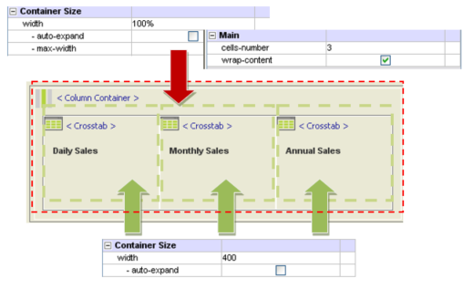

# Column and Row Container

The **Column Container** and **Row Container** are objects that, when used in a combined mode, create Pages that re-adapt to the resolution of the screen.

In the _Row Container,_ the components contained in them may be hidden (collapsed), to have a cleaner view of the page.

The characteristic of the _Column container_ is that the components contained in it will automatically be wrapped in case the wiDSh is outside the wiDSh of the same container.

For example, if you restrict the browser window containing the Page, and the dimensions of the objects of the column container are too big compared to the overall space of the page, these will be wrapped.

.png>)

The specific properties for the **Column Container** are (_Object_ group):

* **cells-number:** number of container columns
* **wrap-content:** if active, in case the wiDSh of the contained objects is outside the wiDSh of the same container, these will be wrapped.

## Column Container Properties 

Following is a list of the main properties for configuring the **Row Container** widget in the **Decisyon App Composer**.&#x20;

<table><thead><tr><th width="267">Group</th><th width="236">Name</th><th width="347">Description</th><th width="173" align="center">Type</th><th width="186" align="center">Default Value</th><th data-type="checkbox">Allow Page Parameters</th></tr></thead><tbody><tr><td><strong>Object</strong>/<strong>Main</strong></td><td><a href="./#cells-number-property"><strong>cells-number</strong></a></td><td>Allows you to set the number of container columns</td><td align="center">NUMERIC</td><td align="center">3</td><td>false</td></tr><tr><td><strong>Container</strong>/<strong>ContainerStyle</strong></td><td><strong>wrap-content</strong></td><td>If enabled, if the contained object's width exceeds the container's width, these will be wrapped.</td><td align="center">SWITCH</td><td align="center">False</td><td>false</td></tr><tr><td><strong>Container</strong>/<strong>ContainerStyle</strong></td><td><strong>preconfigured-style</strong></td><td>Allows you to select a preconfigured style for the container. Selecting the "Card" option, the empty margin will be automatically set to (4,4,4,4)</td><td align="center">SELECT</td><td align="center"></td><td>false</td></tr></tbody></table>

#### Cells-number property

The example shows how the components contained in the Column Container will be repositioned in the page if the window changes wiDSh and height size.

**Step 1: Column Container using the wrap-content**

* Enter the Column Container object
* Set the number of cells Cells-number
* Enable the property to wrap the components \<wrap-content>
* Set the size of the container. In this case it will take up 100% of the page.
* Enter the reports which will all have a wiDSh equal to 400 pixels.

**Step 2: Page - Column Container**

.png>)

Access DAC. Restrict the wiDSh of the window of the browser (from right to left)

The reports are automatically wrapped since their size is too big for the page which contains them.

## Row Container Properties 

Following is a list of the main properties for configuring the **Row Container** widget in the **Decisyon App Composer**.&#x20;

<table><thead><tr><th width="267">Group</th><th width="236">Name</th><th width="347">Description</th><th width="173" align="center">Type</th><th width="186" align="center">Default Value</th><th data-type="checkbox">Allow Page Parameters</th></tr></thead><tbody><tr><td><strong>Object</strong>/<strong>Main</strong></td><td><strong>cell-number</strong></td><td>Allows you to set the number of container rows</td><td align="center">NUMERIC</td><td align="center">3</td><td>false</td></tr><tr><td><strong>Container</strong>/<strong>ContainerStyle</strong></td><td><strong>preconfigured-style</strong></td><td>Allows you to select a preconfigured style for the container. Selecting the "Card" option, the empty margin will be automatically set to (4,4,4,4)</td><td align="center">SELECT</td><td align="center"></td><td>false</td></tr></tbody></table>
