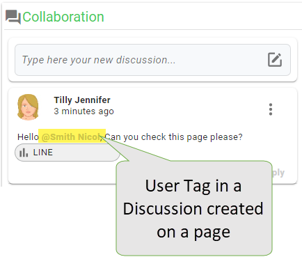

# Tagging and Notifications

## Tagging

The Business user can enable the **Tagging** feature both using the **Add a tag** button or typing the **@** symbol in the input box of the Discussion. A dialog box listing all linkable objects and users (reports, pages, and documents) published inside the platform will appear.

<figure><figcaption></figcaption></figure>

**Tagging** feature creates a direct link to access the object.

<figure><figcaption></figcaption></figure>

## Notifications

Users who are tagged in a Discussion may be notified with an e-mail notification

<figure><figcaption></figcaption></figure>

The e-mail notification will contain different information about the Discussion:

* A label that informs if the message is a new discussion, a discussion edited, or if is new a comment
* The link to the author of the Discussion
* The link to the page where the Discussion is created or edited


Only the users belonging to the TENANT may display the linked page.

The page will be shown with all parameters applied when the discussion is created/edited.


* The user tagged and the message of the Discussion

<figure><figcaption></figcaption></figure>

The Business users will receive an e-mail notification when mentioned in a Discussion only if have been previously done the following configurations:

* The Page developer has configured the **SMTP server** in Design Studio and linked it to the **associated-SMTP-server** property:

**Tools-->Manage Services & Servers**

<figure><figcaption></figcaption></figure>

**Tools-->Preferences-->Email**

<figure><figcaption></figcaption></figure>


Refer to [**Manage Services & Servers**](https://documentation.decisyon.com/documentation/instance-configuration/tools/manage-services-and-servers) documentation for more details about this configuration.&#x20;


* The Business users have turned on the **Email Notifications** in the **Settings** group of the **User Profile** page in the Web Application.

<figure><figcaption></figcaption></figure>

