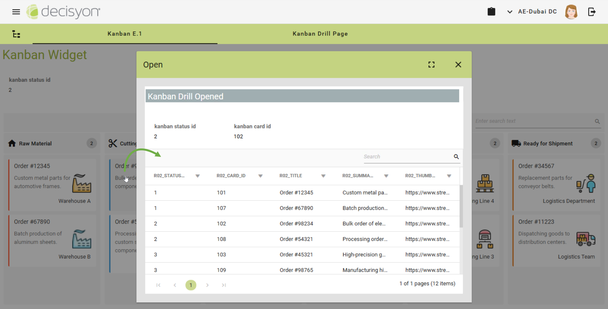

# E.1 Configuring an Interactive Kanban Widget

The widget lets business users double-click on a card and navigate to a specific page. Before beginning, ensure the target page has been created.

## 🔧Prerequisites

Before configuring the Kanban Widget, ensure you have:

* **Database Access**: You need a database where you can create and populate a table for storing data.
* **SQL Execution Rights**: You must be able to run SQL scripts to:
  * Create the necessary table structure.
  * Insert sample data.
* **Content Security Policy (CSP) Configuration**: Since this setup uses external URLs in the thumbnail field, CSP must be configured in advance.


Please refer to the App Composer installation guide to configure the CSP policies for App Composer: [https://dac-documentation-1.gitbook.io/installation-guides/](https://dac-documentation-1.gitbook.io/installation-guides/). By default, App Composer CSP policies do not allow embedding third-party websites, and thus you need to configure the services to enable it.


### Create the Database Tables and Insert the Data

**SQL Script for Table Creation**

Execute the following SQL script to set up the required database table. Adjust the script (e.g., by adding a schema name) to fit your database structure.

```sql
-- Create table for Kanban Columns (Board Statuses)
CREATE TABLE IF NOT EXISTS "schema_name".kanban_status_ex1
(
    r01_status_id integer NOT NULL,
    r01_status character varying(255) COLLATE pg_catalog."default",
    r01_status_icon character varying(50) COLLATE pg_catalog."default",
    CONSTRAINT kanban_status_ex1_pkey PRIMARY KEY (r01_status_id)
)

TABLESPACE pg_default;
```

```sql
-- Create table for Kanban Cards 
CREATE TABLE IF NOT EXISTS "schema_name".kanban_cards_ex1
(
    r02_status_id integer,
    r02_card_id integer NOT NULL,
    r02_title character varying(255) COLLATE pg_catalog."default",
    r02_summary character varying(255) COLLATE pg_catalog."default",
    r02_thumbnail character varying COLLATE pg_catalog."default",
    r02_priority character varying(255) COLLATE pg_catalog."default",
    r02_card_color character varying(255) COLLATE pg_catalog."default",
    r02_assignee character varying(255) COLLATE pg_catalog."default",
    CONSTRAINT kanban_cards_ex1_pkey PRIMARY KEY (r02_card_id)
)

TABLESPACE pg_default;
```

**SQL Script for Data Insertion**

Insert data into the table using the following script:

```sql
-- Insert data for Kanban Columns (Board Statuses)
INSERT INTO "schema_name".kanban_status_ex1 (
    r01_status_id, r01_status, r01_status_icon
) VALUES 
    (1, 'Raw Material', 'home'),
    (2, 'Cutting', 'content_cut'),
    (3, 'Assembly', 'build'),
    (4, 'Quality Check', 'check_circle'),
    (5, 'Packaging', 'inventory'),
    (6, 'Ready for Shipment', 'local_shipping');
```

```sql
-- Insert data for Kanban Cards
INSERT INTO "schema_name".kanban_cards_ex1 (
    r02_status_id, r02_card_id, r02_title, r02_summary, 
    r02_thumbnail, r02_card_color, r02_assignee
) VALUES 
    (1, 101, 'Order #12345', 'Custom metal parts for automotive frames.', 
     'https://www.streamlinehq.com/icons/download/water-dam--20279', '#FF5733', 'Warehouse A'),
     
    (2, 102, 'Order #98234', 'Bulk order of electronic components.', 
     'https://www.streamlinehq.com/icons/download/clamp-expand-1--20023', '#3498DB', 'Cutting Machine 01'),
     
    (3, 103, 'Order #45321', 'High-precision gears for machinery.', 
     'https://www.streamlinehq.com/icons/download/equipment-safety-mask--20026', '#27AE60', 'Welding Station B'),
     
    (4, 104, 'Order #76543', 'Assembly kit for industrial equipment.', 
     'https://www.streamlinehq.com/icons/download/multiple-actions-check-2--19825', '#F1C40F', 'Quality Assurance Team'),
     
    (5, 105, 'Order #87654', 'Large batch of plastic casings.', 
     'https://www.streamlinehq.com/icons/download/warehouse-package--19735', '#8E44AD', 'Packaging Line 3'),
     
    (6, 106, 'Order #34567', 'Replacement parts for conveyor belts.', 
     'https://www.streamlinehq.com/icons/download/warehouse-cart-worker--19735', '#E67E22', 'Logistics Department'),
     
    (1, 107, 'Order #67890', 'Batch production of aluminum sheets.', 
     'https://www.streamlinehq.com/icons/download/water-dam--16433', '#FF5733', 'Warehouse B'),
     
    (2, 108, 'Order #54321', 'Processing order for custom steel components.', 
     'https://www.streamlinehq.com/icons/download/clamp-expand-1--8686', '#3498DB', 'Cutting Machine 02'),
     
    (3, 109, 'Order #98765', 'Manufacturing high-precision machine parts.', 
     'https://www.streamlinehq.com/icons/download/equipment-safety-mask--16179', '#27AE60', 'Welding Station C'),
     
    (4, 110, 'Order #24680', 'Final quality inspection before packaging.', 
     'https://www.streamlinehq.com/icons/download/job-search-team-woman--19710', '#F1C40F', 'QA Department'),
     
    (5, 111, 'Order #13579', 'Packing completed items for shipment.', 
     'https://www.streamlinehq.com/icons/download/warehouse-packages--19735', '#8E44AD', 'Packaging Line 4'),
     
    (6, 112, 'Order #11223', 'Dispatching goods to distribution centers.', 
     'https://www.streamlinehq.com/icons/download/delivery-truck-cargo--19739', '#E67E22', 'Logistics Team');

```

## Tutorial Steps <a href="#tutorial-steps" id="tutorial-steps"></a>



## 🛠Step 1: Create the First Data Source for the Kanban Columns (Board Statuses)

### 1. Create a New SQL Report:&#x20;

* Open the **Report Design**  and create a new SQL report.

<figure><figcaption></figcaption></figure>

### 2. Enter the SQL Query:&#x20;

* Navigate to the SQL tab and enter the following SQL query to retrieve the data from your newly created table:

```sql
select
r01_status_id as r01_status_id,
r01_status as r01_status,
r01_status_icon as r01_status_icon
from "schema.name".kanban_status_ex1
```

### 3. Configure the OLAP View:

In the OLAP tab, drag and drop the necessary fields to create rows for visualization.

<figure><figcaption></figcaption></figure>

### 4. Execute the Report:

* Run the report to verify the data visualization.

<figure><figcaption></figcaption></figure>

### 5. Save the Report:

* Save your report and name it something relevant (e.g., "_Kanban\_status\_ex1_").

## 🛠 Step 2: Create the Data Source for the Kanban Cards

### 1. Create a New SQL Report:&#x20;

* Open the **Report Design**  and create a new SQL report.

<figure><figcaption></figcaption></figure>

### 2. Enter the SQL Query:&#x20;

* Navigate to the SQL tab and enter the following SQL query to retrieve the data from your newly created table:

```sql
select
r02_status_id as r02_status_id,
r02_card_id as r02_card_id,
r02_title as r02_title,
r02_summary as r02_summary,
r02_thumbnail as r02_thumbnail,
r02_assignee as r02_assignee,
r02_card_color as r02_card_color
from multi_site_data.kanban_cards_ex1
```

### 3. Configure the OLAP View:

In the OLAP tab, drag and drop the necessary fields to create rows for visualization.

<figure><figcaption></figcaption></figure>

### 4. Execute the Report:

* Run the report to verify the data visualization.

<figure><figcaption></figcaption></figure>

### 5. Configure Drill-Through Functionality&#x20;

1. Open the Report Editor  and navigate to the **Drill-Through** tab to enable navigation from the widget:
2. **`activate drill-through 1`**: Enable this property.
3. **`show-on`**: Select the `contextual rendering type`.
4. **`drill-through-position`**: Select the `R02_card_id`  column from the report to identify the clickable area.

<figure><figcaption></figcaption></figure>

1. **`openActionType`**: Select `Page` to open a new page upon interaction.
2. **`page`**: Select a pre-created target page.

### 6. Save the Report:

* Save your report and name it something relevant (e.g., "_Kanban\_cards\_ex1_").



## 📊Step 2: Create a New Page in Page Design

### 1. Create a New Page:

* Open the Page Design, create a new page, and give it a name (e.g., "Kanban E.1").

### 2. Add the Widgets:

* Drag the **Kanban** and two **Plain Text** widgets onto the page.

<figure><figcaption></figcaption></figure>



## ⚙️Step 3. Configure the Widgets' Properties

Once the widgets are placed on the page, you need to configure their properties.

### 1. Configure the Kanban properties: <a href="#configure-the-text-field-properties" id="configure-the-text-field-properties"></a>

**Main**

* `report data source number`: Type "2"
* `report datasource (1)`: Associate the "_Kanban\_status\_ex1_" created in the first step.
* `report datasource (2)`: Associate the "_Kanban\_cars\_ex1_" created in the second step.

**ObjectStyle**

*   `fields association:` Map the following report columns to their respective fields in the widget:

    * `R01_status_id` →Unique identifier for the status.&#x20;
    * `R01_status` → The name of the status (e.g., "Raw Material", "Cutting").
    * `R01_status_icon` →The associated icon name used to visually represent the status in the UI.
    * `R02_status_id` → key referencing `r01_status_id` in `kanban_status_ex1`, indicating the current status of the card.
    * `R02_card_id` → Unique identifier for the Kanban card.
    * `R02_title` → Title of the Kanban card. A short identifier for the work item.
    * `R02_summary` → A brief description of the work item represented by the card.
    * `R02_thumbnail` → A URL pointing to an image with the Kanban card.
    * `R02_card_color` → The color associated with the Kanban card, stored as a HEX color code (e.g., `#FF5733`).
    * `R02_assignee` → The name of the person, team, or department responsible for the card's task.

    <figure><figcaption></figcaption></figure>

**Paramaters**

* `base name`: Specify a unique identifier to compose the widget parameters. In this example, the default value "**Kanban**" is kept.&#x20;

**Container Size**

* `height`: Set the height of the widget container to "**100%**".

<figure><figcaption></figcaption></figure>

### 2. Configure the Plain Text 1 properties: <a href="#configure-the-text-field-properties" id="configure-the-text-field-properties"></a>

**Main**

* `text:` Configure the parameter to export the card ID status when the business user clicks a card.&#x20;


The parameter name must respect the syntax **{baseName}\_selected**, according to the value set in the [`base name` property](e.1-configuring-an-interactive-kanban-widget.md#id-3.-paramaters) of the Kanban widget (e.g., `?Kanban_status_id?`).


<figure><figcaption></figcaption></figure>

### 2. Configure the Plain Text 2 properties: <a href="#configure-the-text-field-properties" id="configure-the-text-field-properties"></a>

* `text:` Configure the parameter to export the card ID when the business user clicks a card.&#x20;

<figure><figcaption></figcaption></figure>

### &#x20;3. Save the Page:

* Save your newly configured page (e.g., "Kanban E.1").



## ✅Step 4: Test the Widgets

Test the widget to ensure everything is working as expected.

### 1.  Access the Page:

* Open the page "Kanban E.&#x31;_"_ in the web application.

<figure><figcaption></figcaption></figure>

### 2.  **Test Interactions**:

* Double-click a card to ensure drill-through navigation works and the target page loads.

<figure><figcaption></figcaption></figure>

* Confirm that the exported parameter corresponds to the `R01_status_id` and `R02_card_id`fields.

<figure><figcaption></figcaption></figure>



