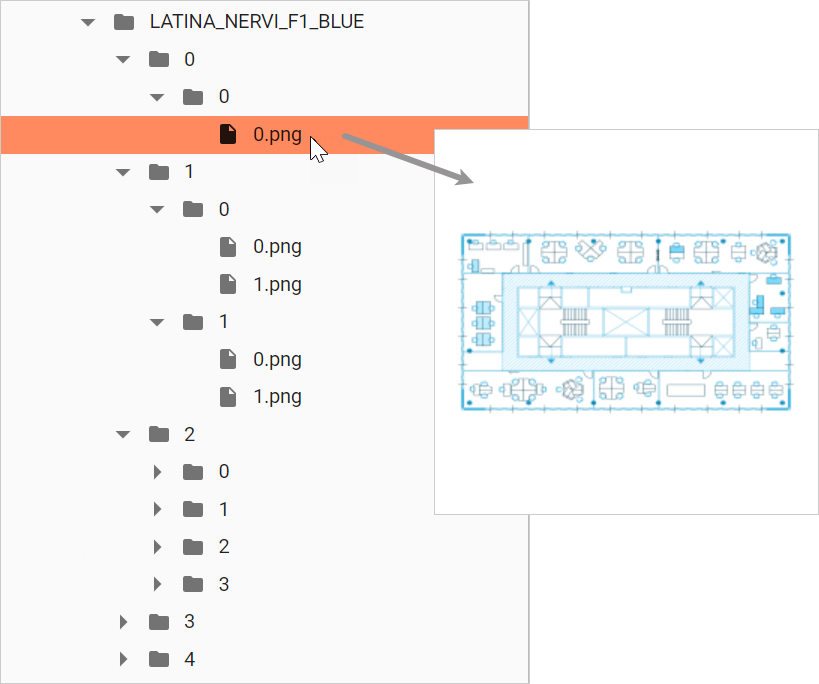

# Map Source

### Map provider

The **Map provider** property allows you to set the tile provider by choosing among the following options:

* **OSM**: OpenStreetMap is one of the tile/image providers which can be used free of cost. It allows you to visualize geographic data from anywhere on Earth using latitude and longitude.&#x20;
* **Tiles Server**: It supports and renders tile requests from any of the tile providers using the unique URL for the respective tile providers.
* **DAC Library:** It allows to use a DAC shared library as a tiler server for custom maps.


When using a custom map, the creation of the map tiles must be created with third parties applications or services.


### Server URL

The **Server URL** property allows you to specify the URL of the map provider set in the **Map provider** property:


The OSM map provider does not require any URL. Go to the [example](examples/e.1-how-to-configure-a-geographical-map-using-osm-provider.md) for more detail how to configure a Geographical Map using the OSM Provider.


When using an external tile server, the URL format should be similar to the following one:

```
https://example_provider/{z}/{x}/{y}.png
```

where:

* **”{z}”** - It represents the zoom (level)
* ”**{x}”** - It indicates tile image x-position (tileX)
* **”{y}”** - It indicates tile image y-position (tileY)

When using a DAC share library, the URL format should be similar to the following one:

```
<SharedLibraryLogicalName>/optionalFolder/<file name text>{z}{x}{y}.png
```

Example:

```
smart_building/maps_2023/new/IMAGE_TILE{z}{x}{y}.png
```

where:

* **”smart\_building”** -  It is the logical name of the Shared Library&#x20;
* **”maps\_2023/new”** -  They are the custom folders and subfolders inside the Shared Library&#x20;
* **”IMAGE\_TILE”** -  It is the custom file name

<figure><figcaption></figcaption></figure>

In the Shared Library, the tiles are organized in folders by zoom level and the x and y coordinates corresponding to the tile's position for that zoom level. For example:

At zoom level 0, the entire map fits on a single tile:&#x20;

<div align="left"><figure><figcaption></figcaption></figure></div>

Zoom level 1 uses 4 tiles to render the map:

<figure><figcaption></figcaption></figure>


Go to the [example](examples/e.2-how-to-configure-a-custom-map-using-dac-library.md) for more detail how to configure a Custom Map using the DAC Library Provider.

