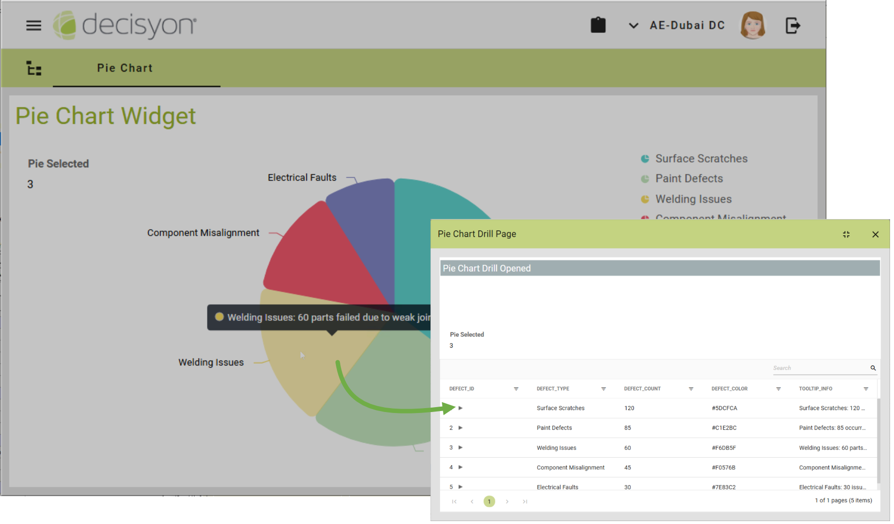

# Interactive Pie Chart: Drill-Through Configuration

## **User Interaction & Data Exploration** &#x20;

The **Pie Chart** widget enables business users to interact with individual chart slices by clicking on them to open a **detailed page in a new window**, providing deeper insights into the selected data point.

<figure><figcaption></figcaption></figure>

## Configuration

This interaction is powered by the **Drill-Through feature**, which is configured directly in the data source associated with the widget. It is accessible within the **Report Editor**  under:

**Report Properties** > **Drill-Through** tab

### Key Configuration Guidelines:

1. **Single Drill-Through Support**

* The widget supports only **one drill-through action** per configuration.
* If multiple drill-through actions are defined, **only the first activated one** will be applied.

2. **Drill-Through Positioning**

* The **drill-through must be enabled on** the `R01_data_id` **column** of the report.
* If the **drill-through position** (`drill-through-position` property) is set to a dimensional level other than the **ID**, the interaction will not work.

<figure><figcaption></figcaption></figure>

3. **Contextual Rendering Options:**

The widget supports **contextual rendering types** for drill-through actions (`show-on` property), ensuring the appropriate display of linked data.


Refer to[ Example 1](examples/e.1-configuring-an-interactive-pie-chart-widget.md) for a detailed, step-by-step configuration guide.


