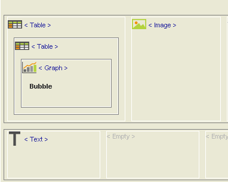

# Plain Text

The **Text** object enters the free text, particularly useful to enter HTML code in the Page page, unlike the one managed by the system.

The specific property is the following

* _**text**_: sets the text contained in the element

The following example shows an advanced use of the Text component, together with the publication of an image.

Step 1: Using Text and Image components

.png>)

_The example shows a Page page that contains a bubble graph. In addition to the Graph component, Image and Text components were also inserted. The first displays the Decisyon logo while the Text object was associated with an image that will serve as a button. Clicking on it will open another page (this is also an image) that displays detailed information about the type of graph. These operations are linked with each other through the HTML code._

Step 2: Using the Image component

_A Page page is created that contains:_

_A Graph object, in this example a bubble graph is displayed._

_An Image object that will display the Decisyon logo._

_In the resource property, the name of the file ‘logoDcy.jpg’ was entered. This file is located in the DAC_

_customization/IMG folder._

Step 3: Using the Text component

.png>)

_The Text object will display the_ .png>)_icon from which a second image can be accessed, that will display the detailed information on the bubble graph._

_Two images are inserted in the DAC customization/IMG folder, one relating to the icon named "1297265268\_info.png" and one relating to the detailed information on the graph, named "Info Bubble.jpg"_

_The HTML code for creating the link is inserted in the window that is enabled from the text property._

_The code is as follows:_

**\<a href="#images" onclick="window.open('../../customizations/img/Info Bubble.JPG','','wiDSh=1024,height=480')">**

**\**

**\</a>**

_The first link opens the detailed image ‘Info Bubble.JPG'. The dimensions of the window will be 1024x480._

_The second link displays the icon_ .png>)_((\)_
