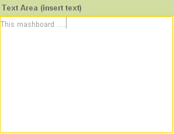

# Text Area

The Text Area component is a text field consisting of multiple rows and columns, where you can enter unlimited free text.

The specific properties of the component are (Form _Group_):

* _**enable-validation**_ enables the following properties for validation through _Pattern_
* **objectInputPattern** Lets you define a text format that respects a regular expression

_For example, A{3}\[0-9]{8} defines the rule that the text entered is to contain the letter A repeated 3 times, followed by an 8-digit numerical code: a valid code can be AAA12345678._

* **objectInputPatternError:** Specifies the message to be shown in the case of an invalid code. The error messages of the PATTERN support the multilanguage (see similar property for Text Filed)

The height of the Text Area is a few pixels lower than the height defined in the container.

**Note:** _The border turns yellow when writing._

