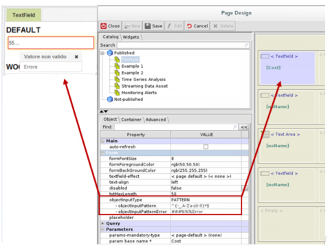

# Text Field (Legacy)

### Text Field (Legacy)

The Text Field component is a text field on a single line, where you can type text that matches the rules set up on the component, as explained later in this manual.

The specific properties of the component are (Forms _Group_):

* _**txtMaxLength**_ maximum length of the text (while the wiDSh is defined by the _wiDSh_ and _height_ property of the _ContainerStyle_)
* **text-align:** alignment of the text inside the Text Field. The values available are: left(default), center, right.

.png>)

* _**objectInputType**_ field format:
* _STRING_ simple text
* _NUMBER_ numeric text
* _DATE_ date format;
* _PATTERN_ text on a regular expression

&#x20;**Note:** _The border turns yellow when writing._

.png>)

#### Text Field of the DATE type

A Text Field of the date type is defined with the property (_Form_ group):

* _**objectInputType**_ with selection of the _**DATE item**_

The field configured in this way will show, on DAC, a calendar for the date selection.

.png>)

This selection enables:

* _**inputDateFormat**_, date field format, defined via a configuration pop-up

The format of the date field is the one admitted for the parameter associated with the text field, used on any filter.

This format must also be respected in case there is a field population through loading queries.

* **selection-start-date** and **selection-end-date**: establish the time range within which the date may be set.

These properties can also be managed by using a parameter and must comply with the format specified by the _inputDateFormat_ property. In this case the date range which may be selected will be conditioned by the value assumed by the parameter.

Example: DATE type Text Field with date range

.png>)

_The days in the calendar of the Date text field are managed by the values entered in the Start Date and End Date text fields_

#### Text Field of the PATTERN type

A Text Field of the PATTERN type is defined with the property (_Form_ group):

* _**objectInputType**_ with selection of the _**PATTERN**_ _item_

In this case the field is subject to a validity check of the entered text, which must respect a specific format. This selection enables:

* _**objectInputPattern**_ regular expression that must respect the field

&#x20;_For example A{3}\[0-9]{8} defines the rule that the text entered is to contain the letter A repeated 3 times, followed by an 8-digit numerical code: a valid code can be AAA12345678._

* _**objectInputPatternError**_ customized message in case an invalid code is entered. An error pop-up is opened by default, which reports the text validity rule.

The error messages of the PATTERN support the Multilanguage.

By entering the ID of a label in the ML\_LANGUAGE\_STRINGS table (ID\_STRING field) in the property mentioned above, and having it precede by the sequence of characters "**###%%%**", the system will display, DAC, the message associated with the specified label translated according to the language of the connected user.

The selection of values, which can be used to filter Page components, is defined using the following components:

* PageBy Selector for selections on a list via a rather similar object to the page-bys of the reports
* StyledSelector for selections on checklist type lists through customized command keys

Other selectors are the page-by of the crosstabs and images.
