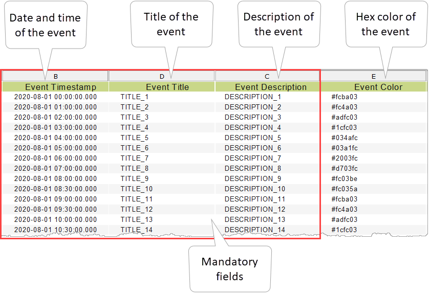
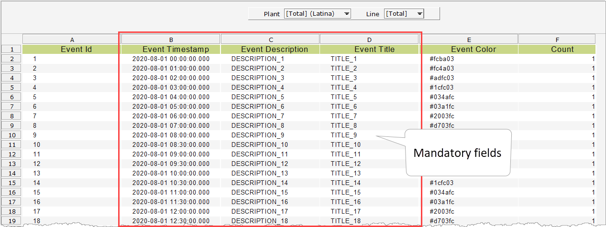
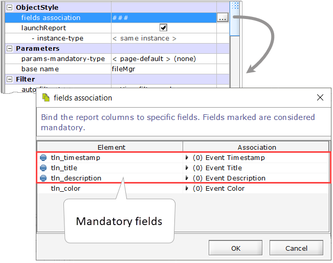
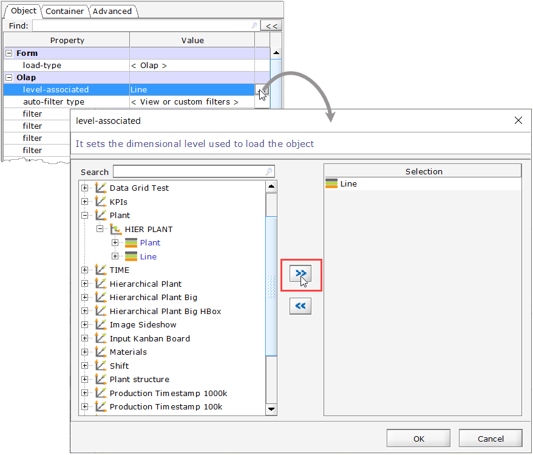
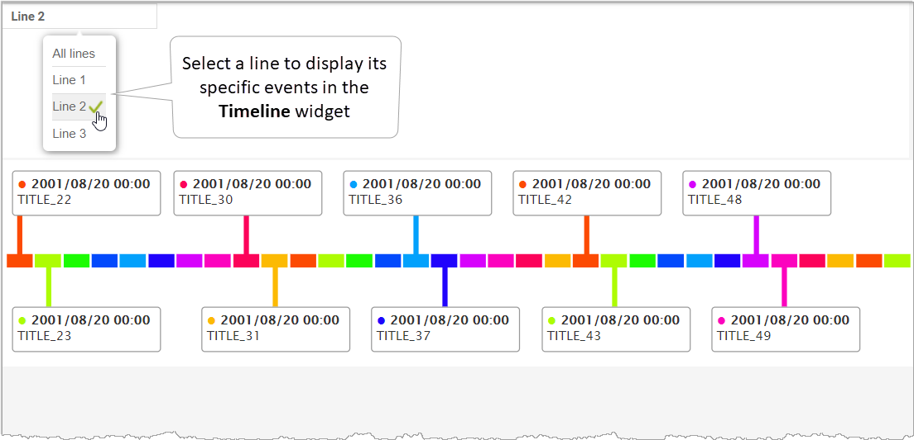

# Timeline 2.0.1

## Overview 

Use the **Timeline** widget to show a sequence of important events in chronological order starting from a simple report.



.png>)

In the picture, the **Timeline** widget is built with a simple report. You can easily see and understand important events in time through flags with the details and colors used to represent events.

The **Timeline** widget is a line chart to visualize important events in chronological order in a time span. You can use the **Timeline** widget to show how a value changes over time. It is especially useful when working with large time series. It can also be used to show a list of project tasks and deadlines. For each event defined in the timeline series, a flag is placed with a title and descriptive text. You can optionally assign different colors to the events so you can quickly identify the different types of events in your timeline.

.png>)


The widget automatically chooses for reasons of readability where to place the flags with labels event.


The widget also includes a configurable **Event Spacing Mode**, which determines how events are distributed along the timeline. Page developers can choose between two options, each affecting the visual layout of events:

* **Fixed spacing**: Events are displayed at regular intervals, regardless of the actual time elapsed between them. This mode is useful for providing a clean and uniform layout, especially when events are close together in time or when you want to highlight the sequence rather than the time gap.

<figure><figcaption></figcaption></figure>

* **Proportional spacing**: Events are positioned according to their timestamps. The greater the time gap between two events, the wider the distance between their flags on the timeline. This mode provides a more accurate visual representation of the chronology.

<figure><figcaption></figcaption></figure>

## Report Mapping 

The **Timeline** widget is a Data Presentation type widget. Its data source consists of one report that requires **three** **mandatory fields (Timestamp, Title, and Description)**:

1. **EVENT TIMESTAMP:** Indicates date and time when the event occurred.
2. **EVENT TITLE:** The title of the event.
3. **EVENT DESCRIPTION**: Descriptive information about the event.
4. **EVENT COLOR:** Hexadecimal color for representing the event.

The widget only supports one report.

## Properties 

The properties that are specific for the configuration of the **Timeline** widget on **Decisyon App Composer** are listed below:

<table><thead><tr><th width="229">Group</th><th width="244">Name</th><th width="427">Description</th><th align="center">Type</th><th></th><th width="315" align="center">Default Value</th><th data-type="checkbox">Allow Page Parameters</th></tr></thead><tbody><tr><td><strong>Appearance (Timeline/Settings)</strong></td><td><code>event spacing mode</code></td><td>Defines how events are spaced on the timeline: evenly or based on timestamp values. </td><td align="center">SELECT</td><td><ul><li><strong>Fixed:</strong> Events are distributed at regular intervals, regardless of their timestamp.</li><li><strong>Proportional:</strong> Events are positioned according to their timestamps: the greater the time gap between two events, the greater the distance between their bars.</li></ul></td><td align="center">Fixed</td><td>false</td></tr><tr><td><strong>Timeline plug-in config data (Timeline/Configuration)</strong> </td><td><code>connector Width</code></td><td>Allows specifying the width of the line connecting the data label to the timeline</td><td align="center">NUMERIC</td><td></td><td align="center">2</td><td>false</td></tr><tr><td><strong>Timeline plug-in config data (Timeline/Configuration)</strong> </td><td><code>data Labels Distance</code></td><td>Indicates the pixel value defining the distance between the data label and the timeline block</td><td align="center">NUMERIC</td><td></td><td align="center">9999</td><td>false</td></tr><tr><td><strong>Timeline plug-in config data (Timeline/Configuration)</strong></td><td><code>date/time Format IN</code></td><td>Allows selecting the date/time format that must match with the format used in the specific column of the report (e.g. yyyy-MM-dd HH:mm:ss.SSS)</td><td align="center">TEXTFIELD</td><td></td><td align="center">yyyy-MM-dd HH:mm:ss.SSS</td><td>true</td></tr><tr><td><strong>Timeline plug-in config data (Timeline/Configuration)</strong></td><td><code>date/time Format viz</code></td><td>Allows setting the date/time format which should be displayed in the event’s label. For example, this setting lets you show or not the time on the date</td><td align="center">TEXTFIELD</td><td></td><td align="center">yyyy-MM-dd HH:mm</td><td>true</td></tr></tbody></table>

## Widget Parameters 

In the `base name` widget's property, it is possible to specify a baseName to identify the widget's parameters and compose them uniquely.

**Exported Parameters**

The following parameters are exported by the widget:

<table><thead><tr><th width="302.6363525390625">Name</th><th>Description</th></tr></thead><tbody><tr><td><code>{baseName}</code></td><td>It is the baseName of the widget. Set it in the<code>base name</code> property, Parameters group (the default base name is "Timeline"). </td></tr><tr><td><code>{baseName}_timestamp_selected_id</code></td><td>Exports the <code>idVal</code> of the selected timestamp level.</td></tr><tr><td><code>{baseName}_timestamp_selected_val</code></td><td>Exports the <code>viewVal</code> of the selected timestamp level.</td></tr><tr><td><code>{baseName}_title_selected_id</code></td><td>Exports the <code>idVal</code> of the selected title level.</td></tr><tr><td><code>{baseName}_title_selected_val</code></td><td>Exports the <code>viewVal</code> of selected the title level.</td></tr><tr><td><code>{baseName}_desc_selected_id</code></td><td>Exports the <code>idVal</code> of the description level</td></tr><tr><td><code>{baseName}_desc_selected_val</code></td><td>Exports the <code>viewVal</code> of the selected description level.</td></tr></tbody></table>

<figure><figcaption></figcaption></figure>

## Example 

**Configuration:** Using the following specific properties:

**Connector Width, Date/time Format IN, and Date/time Format viz.**

**Description:** The example shows the use of the **Timeline** widget for scheduling important tasks to be sequenced in the production lines of a manufacturing plant. It is assumed that data, dimensions, metrics, and cubes have been already created.

* Create the data source report of the widget. The report must have three mandatory fields **(Event Timestamp, Event Title, and Event Description).**

* Create a new Page in the Page Design and use the **Timeline** widget. Associate the report created in the first step to the widget.
* Map the columns of the report in the **fields association** property of the widget.

* Configure the following specific properties of the widget:

**Connector Width:** Set the value “**5**” to define the width of the line connecting the data label to the timeline.

**Date/time Format IN:** Select the date/time format “**yyyy-MM-dd HH: mm: ss.SSS**”. It must match the format used in the “Event Timestamp” column of the report.

**Date/time Format viz:** Set the date/time format “**yyyy-MM-dd HH: mm**”. This format will be displayed in the event’s label of your timeline.

* Add to the page a **Styled Selector** widget and configure the following properties:

**Load-type:** Set the **\<Olap>** option for selecting list values from a dimensional level. This selection enables the property:

**level-associated:** Select the **“Line”** dimension.

* **Style:** Select the option **Tooltip Selector.** This selection enables the property:

**Custom-label-noSelection:** Add the label “**All lines**”.

* Display the **Timeline** widget in the Web Application.

