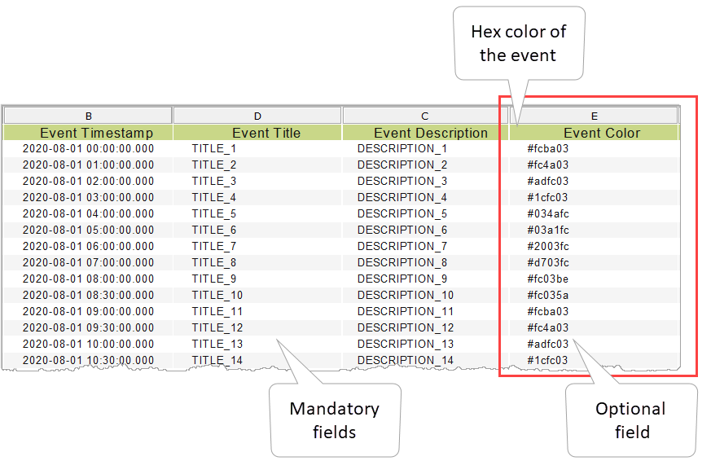

# What's New

## Version 2.0.1 

### Clearer Tooltips for Better Readability

The Timeline widget now features improved tooltips with an opaque background to ensure optimal readability. Previously, transparent tooltips could blend with underlying event descriptions, making it difficult for users to view key information.&#x20;

<figure><figcaption></figcaption></figure>

This visual enhancement eliminates such issues, especially in cases with long or dense content. Users can now rely on always-clear tooltip information, even in compact timeline views or when hovering over detailed events.

## Version 2.0 

### Export Timeline Selections as Parameters

The **Timeline** widget now allows exporting user selections as parameters, making it easier to synchronize data across multiple widgets. When a user selects a timestamp, title, or description on the timeline, the corresponding values (both `idVal` and `viewVal`) are exported using a customizable `baseName`. This enhancement empowers page developers to build dynamic pages where other widgets can react to Timeline interactions without additional configuration logic.

<figure><figcaption></figcaption></figure>

### New Event Spacing Mode for Visual Accuracy

With the new `event spacing mode` setting, page developers can now define how timeline events are spaced:

* **Fixed**: Events are distributed evenly, regardless of the actual time interval.

<figure><figcaption></figcaption></figure>

* **Proportional**: Events reflect the actual timestamp gaps, enhancing the visual accuracy of time-based patterns.\
  This feature gives more control over the layout, making the timeline adaptable to both structured schedules and irregular event distributions.

<figure><figcaption></figcaption></figure>

## Version 1.1 

### Use different colors in your Timeline 

Now you can assign different colors to the events in the widget so you can quickly identify the different types of events in your timeline. You can assign colors to the events by a dedicated report's column that can be mapped in the widget. You can optionally add this column to the data source report.

